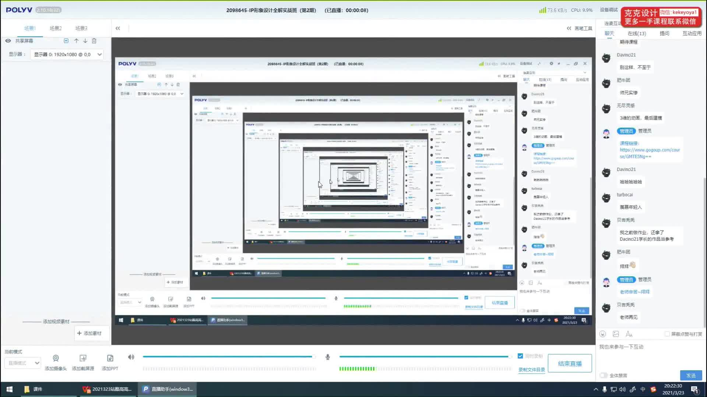
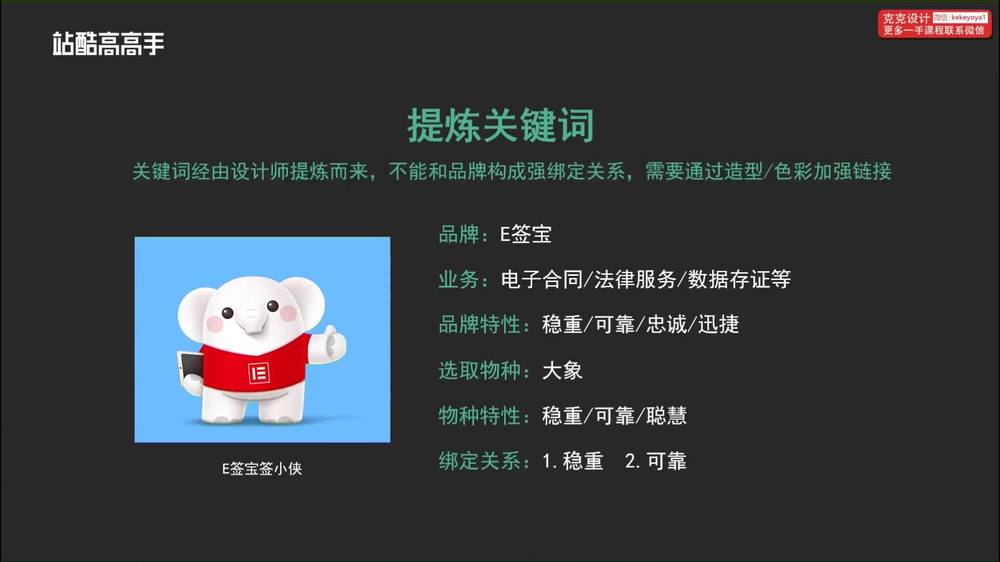
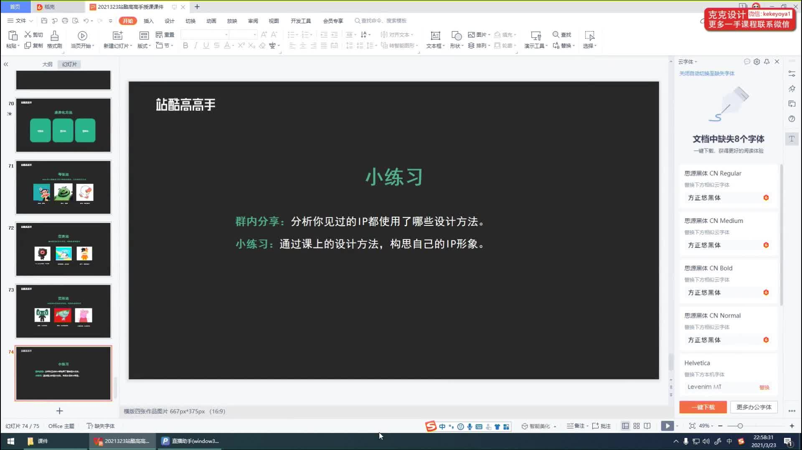

### 00:00:01.630  ~  00:00:02.440
明天在吗

### 00:00:07.030  ~  00:00:10.610
稍等一下我去灯号

### 00:00:46.800  ~  00:00:49.080
为什么看不到呢
### 00:01:00.340  ~  00:01:00.870
有没有
### 00:01:08.180  ~  00:01:10.560
要怎么做
### 00:01:14.120  ~  00:01:14.850
明天要吗
### 00:01:32.730  ~  00:01:34.310
啊你们都在听我说话
### 00:01:34.410  ~  00:01:37.940
那我怎么看不到那个也没有那你们在哪看到的那个页面啊
### 00:01:38.710  ~  00:01:43.510
吃了就尴尬了
### 00:01:46.070  ~  00:01:49.480
就是点那个观看回放地里就可以看到吗
### 00:01:49.540  ~  00:01:54.700
好像不行
### 00:02:06.470  ~  00:02:12.950
我好像想起来了我好想你
### 00:02:17.420  ~  00:02:18.630
首尔塔
### 00:02:26.930  ~  00:02:27.740
好好好
### 00:02:27.800  ~  00:02:29.000
害我昨天
### 00:02:35.110  ~  00:02:36.300
哈囉大家好喔
### 00:02:45.260  ~  00:02:46.690
手切到这个
### 00:02:46.820  ~  00:02:47.790
好笑这个课
### 00:02:52.110  ~  00:02:53.850
我们先是这样的

### 00:02:54.050  ~  00:03:03.260
因为可能还有一些人没有一些同学好像还有几个同学啊说是还没有加到小皇朝
### 00:03:03.610  ~  00:03:07.280
所以需要扫一下吗加一下不然你进步了班级群啊
### 00:03:14.520  ~  00:03:15.470
什么经一下
### 00:03:16.670  ~  00:03:19.230
看得不模糊吧这个这个画面的话
### 00:03:21.480  ~  00:03:23.850
声音ok画面不模糊就可以了
### 00:03:24.570  ~  00:03:26.180
对要加一下小黄桃
### 00:03:27.180  ~  00:03:29.160
要去那你亲班级群
### 00:03:36.480  ~  00:03:39.800
去请你们帮我叫救人我也去请你们教人开始上开始
### 00:03:39.830  ~  00:03:40.340
开始啦
### 00:03:41.300  ~  00:03:41.800
为什么
### 00:03:41.880  ~  00:03:43.150
今天第一节课
### 00:03:43.220  ~  00:03:44.450
第一节课
### 00:03:44.640  ~  00:03:46.280
没有实操的内容
### 00:03:46.340  ~  00:03:48.400
低血可是讲一些
### 00:03:48.590  ~  00:03:50.540
设计师路
### 00:03:51.270  ~  00:03:55.620
是我觉得表重要的第一节会第二节是我觉得表重要的人杰克
### 00:04:03.990  ~  00:04:04.880
晚上好
### 00:04:11.910  ~  00:04:13.320
准备好了吗
### 00:04:14.850  ~  00:04:16.340
准备好要
### 00:04:17.600  ~  00:04:18.670
努力
### 00:04:18.910  ~  00:04:21.300
努力干一波了吗
### 00:04:22.020  ~  00:04:26.760
这两个月辛苦一点这两个月出来以後就会很强今天下午还有一个
### 00:04:26.970  ~  00:04:29.230
天下午还有
### 00:04:29.290  ~  00:04:31.840
好像是HR的公司HR
### 00:04:31.960  ~  00:04:35.090
来跟我讲说有两个学员去面试
### 00:04:35.260  ~  00:04:36.650
他说都还挺好的
### 00:04:37.400  ~  00:04:39.010
那我也还挺高兴的
### 00:04:39.830  ~  00:04:42.700
有学过发了一下图是一个
### 00:04:42.820  ~  00:04:44.310
上一期
### 00:04:44.520  ~  00:04:48.440
每一次作业都很认真完成的一个非常努力的演学生我觉得
### 00:04:48.790  ~  00:04:49.660
还是很好看
### 00:04:50.860  ~  00:04:52.180
希望大家以後
### 00:04:52.520  ~  00:04:53.520
都可以
### 00:04:54.180  ~  00:04:56.990
都可以有有能力去找到好的工作
### 00:05:05.070  ~  00:05:06.610
我们在收益等一下啊
### 00:05:08.050  ~  00:05:10.190
你再说一等一下等大家都上线
### 00:05:10.590  ~  00:05:13.420
然後我们到8点半就开始
### 00:05:20.240  ~  00:05:21.580
你们都下班了没有啊
### 00:05:23.670  ~  00:05:24.970
有还在加班了吗
### 00:05:44.090  ~  00:05:45.330
读小班了不错啊
### 00:05:48.230  ~  00:05:49.760
你要那些还没有下班的
### 00:05:50.260  ~  00:05:51.490
都不好意思说话了
### 00:05:58.840  ~  00:05:59.510
好啦
### 00:05:59.630  ~  00:06:05.260
那他有一些上一次有有的人一边加班一边听课
### 00:06:05.370  ~  00:06:05.960
也有
### 00:06:13.210  ~  00:06:16.750
我是觉得不清楚加班老板不收是你吗
### 00:06:17.860  ~  00:06:19.470
还是你就自己就是老板
### 00:06:26.280  ~  00:06:31.430
我刚进来的同学说一下就是如果还没有加黄涛的微信的
### 00:06:31.770  ~  00:06:32.510
嘉义侠
### 00:06:32.720  ~  00:06:34.270
要静一下班级群
### 00:06:34.400  ~  00:06:37.150
现在还是少人的状态吧
### 00:06:38.110  ~  00:06:43.550
应该有200多个人里面现在是刚刚200很生应该少了几个人
### 00:06:46.080  ~  00:06:52.270
你不进班机群怎么吹你就说越南是不是大家怎么互相激励呢
### 00:07:03.620  ~  00:07:04.840
有回应吗
### 00:07:07.670  ~  00:07:09.390
对还少了五六个孩子
### 00:07:09.420  ~  00:07:10.520
还少肉瘤个
### 00:07:11.400  ~  00:07:12.060
乐乐
### 00:07:12.130  ~  00:07:16.520
敬小如果你不是主队来的通知你们的同学也经一下
### 00:07:20.430  ~  00:07:23.470
不要以为不进班机群英就不衰你作业啦
### 00:07:23.630  ~  00:07:28.490
虽然我们吹不到我但是最後你结业的时候我要属那个交作业处暑的
### 00:07:36.050  ~  00:07:37.540
还是有回吗
### 00:07:37.760  ~  00:07:39.240
大家都听到有回音吗
### 00:07:40.630  ~  00:07:41.640
应该啊
### 00:07:52.560  ~  00:08:00.430
你再你再确认一下你的那个你再去一下你的声音大家听的是没有的你再看一下可能是你那边一直插著再把他解释
### 00:08:01.390  ~  00:08:05.190
书房
### 00:08:05.260  ~  00:08:06.550
那个
### 00:08:06.800  ~  00:08:08.080
我们现在
### 00:08:08.710  ~  00:08:11.480
等一下开始了吧现在已经8点半了我们就不动了

### 00:08:12.210  ~  00:08:15.320
我们去71个理论可姐姐可爱
### 00:08:15.480  ~  00:08:18.360
而是IP设计理论与创作方法
### 00:08:18.560  ~  00:08:24.780
那前先讲一些理论的就是讲一些大环境啊什么的这些东西呢就是大家听一下就可以了
### 00:08:24.900  ~  00:08:28.130
可是後面的你的创作方法的是非常非常重要的
### 00:08:28.300  ~  00:08:31.300
所以那也是让大家一定要认真听了
### 00:08:31.450  ~  00:08:33.960
如果我个人是觉得就是後面的你写
### 00:08:34.030  ~  00:08:35.890
有教你怎么上数操作你下
### 00:08:36.010  ~  00:08:38.060
读书後面天花垃圾
### 00:08:38.220  ~  00:08:41.510
那前面去两节课就今天和中午的这两节课
### 00:08:41.530  ~  00:08:43.510
非常非常重要的两节课
### 00:08:45.340  ~  00:08:47.240
这个是个人家他就不说啦

### 00:08:47.590  ~  00:08:49.650
这个也不说了我们看到目录

### 00:08:49.860  ~  00:08:52.440
喔那我这个地方就写的是一个
### 00:08:52.530  ~  00:09:00.650
我明天有三个要讲第一段的是IP的产生与发展趋势就是我说我我刚才说的大环境
### 00:09:01.130  ~  00:09:04.140
这就是IP的一个设计流程
### 00:09:04.270  ~  00:09:08.800
因为没有接触过IP的话可能对这个设计流程都还不是很清晰
### 00:09:08.930  ~  00:09:11.020
那这个地方我也是给大家处理一下
### 00:09:11.590  ~  00:09:17.920
最後一个那就是一个IP的设计方法就是你怎么样从什么地方开始通过哪些步骤
### 00:09:17.980  ~  00:09:19.570
711出来
### 00:09:21.230  ~  00:09:22.400
你现在看一下

### 00:09:23.410  ~  00:09:25.930
第一个IP的产生和发展趋势
### 00:09:28.120  ~  00:09:30.360
产生主要是两个点

### 00:09:30.500  ~  00:09:34.480
一个人使用户的消费分期因为现在就是说
### 00:09:34.640  ~  00:09:36.720
後龙起来了吗
### 00:09:36.940  ~  00:09:46.930
他们的消费已经不单单是吃饱穿暖了因为以前困难是会有我们以前就是匮乏的时候呢我们就是买那个合适的呢
### 00:09:46.940  ~  00:09:48.860
自然人有满足自己就可以啦
### 00:09:48.920  ~  00:09:55.270
现在来就是不但要就是满足自己已经是最低要求那现在就是要买的自己比较喜欢了
### 00:09:55.310  ~  00:10:00.740
啊所以呢这个也是应这个为什么炒饭忙和现在特别火的一个地方
### 00:10:01.180  ~  00:10:05.510
泡泡玛特的那个亡灵在采访的时候他提了一个
### 00:10:05.800  ~  00:10:08.590
他说大家都以为泡泡玛特是在
### 00:10:09.050  ~  00:10:09.930
卖玩具
### 00:10:10.370  ~  00:10:13.850
但是呢他说他们觉得他们应该是卖的一种心情
### 00:10:13.960  ~  00:10:16.250
大家其实买了也是一种心情
### 00:10:16.470  ~  00:10:18.350
就是你在拿到这个盒子
### 00:10:18.390  ~  00:10:20.420
等一下你的期待
### 00:10:20.710  ~  00:10:25.880
合力打开盒子的开心有没有抽到了隐藏款的开心你拿去炫耀
### 00:10:25.920  ~  00:10:27.250
还有一种那就是
### 00:10:27.280  ~  00:10:28.800
你想要的你没有拿到你
### 00:10:28.890  ~  00:10:31.650
你抽到一个重复的或者怎么样那是一个失落
### 00:10:32.560  ~  00:10:34.350
所以呢这个就是了
### 00:10:34.710  ~  00:10:35.720
没有生意吗
### 00:10:36.270  ~  00:10:36.840
喂
### 00:10:38.990  ~  00:10:39.720
喂喂
### 00:10:43.560  ~  00:10:46.530
我刚才开课的时候确认是有声音啊哈
### 00:10:46.880  ~  00:10:49.800
你们再确认一下对再重新刷一下
### 00:10:50.840  ~  00:10:55.500
所以呢现在新一代的这个用户就是後朗吗
### 00:10:55.520  ~  00:10:58.560
大家就开始为自己的兴趣一些心情的东西
### 00:10:58.630  ~  00:11:00.340
你自己喜欢的东西去麦当劳
### 00:11:00.900  ~  00:11:06.710
司马是一个品牌方需要寻找一个突破因为他们看到了IP的
### 00:11:07.030  ~  00:11:08.330
非常大的优势
### 00:11:08.380  ~  00:11:10.030
Nike的识别度高
### 00:11:10.120  ~  00:11:12.170
易於记忆且心眼球
### 00:11:12.460  ~  00:11:15.450
所以呢他们也更希望在他们品牌
### 00:11:15.500  ~  00:11:17.300
有品牌升级的过程中
### 00:11:17.390  ~  00:11:20.510
他们会再加入一个阵iPad的元素
### 00:11:20.900  ~  00:11:22.620
那也是在品牌
### 00:11:22.750  ~  00:11:25.070
泛滥的今天找一个突破点

### 00:11:27.540  ~  00:11:29.290
来看一下APP的优势

### 00:11:29.580  ~  00:11:32.120
就是呢我总结下来有三个
### 00:11:32.250  ~  00:11:33.760
一个是强关联性
### 00:11:33.830  ~  00:11:38.530
一个是强创造力和传播行也就是内容的一个创作的一个能力
### 00:11:39.780  ~  00:11:41.740
最後一个那是强延展性
### 00:11:42.430  ~  00:11:43.430
来看一下
### 00:11:48.910  ~  00:11:50.330
首先是强关联性

### 00:11:51.070  ~  00:11:56.410
就是IPO的强关联性呢它可以将情感符号化
### 00:11:56.590  ~  00:11:58.420
可以将用户粉丝画
### 00:11:58.710  ~  00:12:02.520
好像那时我们可以看到我取的是三只松鼠的一个例子
### 00:12:02.780  ~  00:12:09.060
那如果我们不取这个不取他这个店铺如果就说是一个普通的一个麦坚果的一个店铺
### 00:12:09.080  ~  00:12:11.750
你如果要提到他的名字想去他来
### 00:12:12.090  ~  00:12:14.790
你想到的是和到想都是开心果
### 00:12:14.830  ~  00:12:17.250
想到可能是你最喜欢吃的1种坚果
### 00:12:17.490  ~  00:12:21.290
但是呢你没有办法和他进行一个强烈的互动
### 00:12:21.390  ~  00:12:26.050
这是你如果有了这个形像以後你看这个生日问他可以出了什么样
### 00:12:26.670  ~  00:12:30.700
他可以把他的这个叔叔做成一个客服的野的形状
### 00:12:30.980  ~  00:12:35.600
就是我们看到他客服就是一个叔叔跳出来他说主任我跟你讲什么
### 00:12:35.870  ~  00:12:37.880
然後他的订的一个称呼
### 00:12:37.920  ~  00:12:40.320
都让你觉得你跟他拉近了距离
### 00:12:40.450  ~  00:12:43.090
这个就是被什么淘宝再买东西的时候老
### 00:12:43.190  ~  00:12:46.010
老那个亲啊亲啊竟然叫我就感觉跟
### 00:12:46.070  ~  00:12:47.190
跟你更新一下
### 00:12:48.140  ~  00:12:50.490
昨天的这个那就是他可以
### 00:12:50.590  ~  00:12:54.150
他也可以上广告的就是在一些班的途上
### 00:12:54.210  ~  00:12:55.920
都是可以约有上去的他
### 00:12:55.970  ~  00:12:58.020
他可以配合做的一些活动
### 00:12:58.230  ~  00:13:02.530
通过一些变装啊通过一些动作的一些延展
### 00:13:02.550  ~  00:13:04.900
他是可以配合广告宣传的
### 00:13:05.730  ~  00:13:08.780
最後一个那是他可以用在包装上
### 00:13:09.820  ~  00:13:18.390
和他的这个品牌产生很强的关联性也就是我们学生拿到了一个包装也看到这个形象我们就知道她来自於那个店铺所以
### 00:13:18.420  ~  00:13:20.690
所以他的传播性质降的好的
### 00:13:20.870  ~  00:13:22.340
快点想了
### 00:13:23.820  ~  00:13:28.820
有一些有一些设计师就是片面的理解就觉得我做一张图
### 00:13:29.170  ~  00:13:31.830
上面有一个形象那就是
### 00:13:31.900  ~  00:13:33.360
而且是不完全是你
### 00:13:33.430  ~  00:13:38.850
你看IP他的包装想做一个包装图来说的话它只能展示一部分
### 00:13:38.920  ~  00:13:41.500
所以现在有一些假装还会有些误解
### 00:13:41.590  ~  00:13:43.680
他过来说我就是要一张
### 00:13:43.790  ~  00:13:48.330
插画啊我觉得那插画你为什么还要问我形象设计地上
### 00:13:48.490  ~  00:13:51.550
这个就是在我们的认知上有一些不同
### 00:13:51.810  ~  00:13:57.660
如果我们再接一个插话的时候他说要我就要换一个三只松鼠两个插话那么肯定要先汇哪
### 00:13:57.720  ~  00:13:59.140
那你的形像有没有
### 00:13:59.190  ~  00:14:01.930
我需不需要为你单独去设计款形象
### 00:14:01.970  ~  00:14:04.210
如果需要的话那是外付费的
### 00:14:04.360  ~  00:14:05.810
这个是一个区别
### 00:14:07.600  ~  00:14:09.130
好像变得就是了

### 00:14:09.200  ~  00:14:11.870
这个IP的强创造力和传播行
### 00:14:12.160  ~  00:14:14.230
IP吗他作为一个喔
### 00:14:14.460  ~  00:14:19.690
其实我觉得IP做一个虚拟的人物来说的话它是可以产出非常多内容的
### 00:14:19.920  ~  00:14:24.880
而且他的内容产出的速度也非常会因为他可以多设计师写作
### 00:14:25.070  ~  00:14:27.590
所以他今天去可以滑雪也可以游泳
### 00:14:27.710  ~  00:14:29.760
并不像我们单独的一个明星
### 00:14:29.800  ~  00:14:32.530
他如果今天去有了有他就没有办法去滑雪
### 00:14:32.690  ~  00:14:34.940
所以这个能是IP的一个游戏
### 00:14:36.310  ~  00:14:40.000
卡通是呢他可以通过一些非常搞笑的故事
### 00:14:40.140  ~  00:14:41.390
或者非常
### 00:14:41.560  ~  00:14:42.960
简单有趣
### 00:14:43.380  ~  00:14:44.570
的一些
### 00:14:44.840  ~  00:14:45.790
小故事
### 00:14:45.890  ~  00:14:48.400
许进行一个定法式的一个传播
### 00:14:49.380  ~  00:14:52.890
这个下面舞曲的例子就是line Friends漫画
### 00:14:53.080  ~  00:15:01.950
他下一他这个是四格漫画现在因为我们手机用的比较多了吗所以我们经常都是去看的是条漫就是其实就是吧
### 00:15:01.970  ~  00:15:05.630
四格漫画得旅程要从上往下的一个阅读顺序而已
### 00:15:06.700  ~  00:15:07.840
那他这个呢
### 00:15:08.220  ~  00:15:10.070
有一个好处是什么
### 00:15:10.290  ~  00:15:12.340
就是他里面是没有
### 00:15:12.360  ~  00:15:14.390
任何的语言文字的
### 00:15:14.520  ~  00:15:15.820
这个是可以让
### 00:15:16.670  ~  00:15:21.690
更多的人就是跨国家的人也可以取理解他也可以去感知他说
### 00:15:21.720  ~  00:15:24.090
所以他的传播也会非常的方便
### 00:15:24.350  ~  00:15:27.720
那昨天去本来是京东的就是狗
### 00:15:27.800  ~  00:15:29.630
绿狗海出的电影
### 00:15:29.740  ~  00:15:35.180
他也是一个非常有趣的故事如果没有看过的话同学可以去收一下可以去看一下
### 00:15:35.520  ~  00:15:36.900
然後那个巧虎
### 00:15:36.980  ~  00:15:41.430
巧虎没有啊他可能不知道他有把他看了就知道巧虎的是一个
### 00:15:41.480  ~  00:15:47.400
每个月都会给大家寄书记玩具的这样的一个机构吧
### 00:15:47.830  ~  00:15:49.270
他也是一个跟
### 00:15:49.330  ~  00:15:51.040
亲子培养建议
### 00:15:51.170  ~  00:15:52.330
关是哪一个机构
### 00:15:52.380  ~  00:15:58.530
那他现在也是因为他有足够多的洗一下因为要去吃生他的故事吗所以他现在也是出了电影
### 00:16:01.200  ~  00:16:05.440
Nike还有什么那就是抢眼看性就是我们所谓的衍生品

### 00:16:05.650  ~  00:16:06.920
也是免费看
### 00:16:07.030  ~  00:16:10.610
竹编生产周边产品直接去
### 00:16:10.820  ~  00:16:13.110
直接去卖给粉丝就是
### 00:16:13.230  ~  00:16:14.300
有粉丝经济
### 00:16:14.370  ~  00:16:17.380
还有呢就是可以去跨界合作
### 00:16:17.550  ~  00:16:20.200
不管你是宿卷吗还是联名啊
### 00:16:20.290  ~  00:16:22.030
都是可以进行合作的
### 00:16:22.810  ~  00:16:26.510
我们我下个取得这个呢是知乎刘看山那个的形象
### 00:16:26.660  ~  00:16:28.770
你看他可以做一个毛绒公仔
### 00:16:28.860  ~  00:16:38.850
中央我们看那个这个月饼礼盒其实近两年也是非常火的一个大的公司都在拼旧时月饼的礼盒谁家
### 00:16:38.860  ~  00:16:44.570
谁家设计的好啊什么的那你有了形像以後你把形象融入进去你可以玩的
### 00:16:44.760  ~  00:16:46.250
拿出更多的花样啦
### 00:16:46.390  ~  00:16:48.360
啊所以也是非常有意思的
### 00:16:49.170  ~  00:16:52.850
最後一个那就是刘看山的好奇冰屋
### 00:16:53.010  ~  00:16:58.790
这个心在成都的这个来福士广场做了一个这样的一个活动
### 00:16:59.170  ~  00:17:00.730
我现在的这些
### 00:17:00.890  ~  00:17:03.550
商场和IP进行的合作
### 00:17:04.020  ~  00:17:10.860
除了这种快闪的方式还有一种呢就是需要我们去为这个商场专门去订宅配
### 00:17:11.100  ~  00:17:12.870
幸福来了以後他会用
### 00:17:13.110  ~  00:17:15.330
运用同一个的IP但是是
### 00:17:15.390  ~  00:17:17.860
不同的变装不同的延展
### 00:17:17.940  ~  00:17:19.450
去进行一个推广
### 00:17:19.570  ~  00:17:21.750
这个也是他们现在走的两条路
### 00:17:25.210  ~  00:17:27.040
我们看起来的发展趋势

### 00:17:27.730  ~  00:17:30.690
阿的歌就是全球IP市场持续侦测
### 00:17:30.750  ~  00:17:36.620
成长的这个就不多说啦你们现在IP也是啊一年比一年火的歌
### 00:17:36.690  ~  00:17:39.370
不然大家也不会在这里来听课了对吧
### 00:17:39.460  ~  00:17:41.090
他说就不必说
### 00:17:41.170  ~  00:17:42.640
大环境是非常好的
### 00:17:43.120  ~  00:17:46.640
那传播的台铁的非常丰富你看像以前
### 00:17:46.720  ~  00:17:53.170
我们以前去了大就是我小的时候那个时候能看了一些莲花话就是书
### 00:17:53.290  ~  00:17:56.280
然後都换了就是dashel的电视
### 00:17:56.390  ~  00:18:00.000
那什么时候才给你放好你7点半回放一个动画就是那种
### 00:18:00.080  ~  00:18:10.070
这很很短时间的我们可以接触到这些事现在不要啦现在除了书除了动画电影还有各种的社交没见就像我们用的
### 00:18:10.080  ~  00:18:13.580
其实都是可以用於传播的
### 00:18:13.640  ~  00:18:14.660
包括
### 00:18:15.190  ~  00:18:17.400
宝可收购的那些挂件
### 00:18:17.780  ~  00:18:24.680
就是聊天气泡的你写挂件都是一个传播的途径那当然还有游戏短视频直播最鲜
### 00:18:24.780  ~  00:18:31.990
那是很多很多可以帮忙传播所以你看这个形象火了以後他就传播速度是非常快的而且它的
### 00:18:32.080  ~  00:18:32.660
叫什么
### 00:18:33.160  ~  00:18:35.250
叫传播的工具是非常多的
### 00:18:36.190  ~  00:18:38.740
最後一个那就是玩法的多样
### 00:18:42.450  ~  00:18:43.970
在我们把IP形象
### 00:18:44.050  ~  00:18:45.230
著火了以後
### 00:18:45.290  ~  00:18:47.880
我们就去考虑他的衍生的问题
### 00:18:48.150  ~  00:18:50.100
那他可以做丰富的衍生品牌
### 00:18:50.170  ~  00:18:51.480
还有跨界合作
### 00:18:51.540  ~  00:18:53.350
他可以做的事情是非常多的就
### 00:18:53.410  ~  00:18:54.710
就是所谓的除权
### 00:18:54.760  ~  00:18:56.760
叫我们之前公开课提到的你
### 00:18:56.860  ~  00:18:57.790
你很像
### 00:19:00.730  ~  00:19:02.400
叫什么消除爱情故事
### 00:19:02.480  ~  00:19:04.280
阿汤哥的电视剧火了以後
### 00:19:04.310  ~  00:19:07.020
他们也把他们的人物给卡通化了
### 00:19:07.240  ~  00:19:10.710
做作为他们的IP然後推出了他们的盲盒
### 00:19:10.830  ~  00:19:14.190
我都是可以都是可以去尝试去去做的

### 00:19:16.260  ~  00:19:21.520
Nike的主题和作曲是这个也是我们之前来提到的
### 00:19:22.020  ~  00:19:25.390
就是1个就是商场楼盘主题活动
### 00:19:25.600  ~  00:19:28.580
他去做一些会闪电这样的一些活动
### 00:19:29.690  ~  00:19:31.380
香草骑士也在考虑
### 00:19:31.550  ~  00:19:37.080
如果他们自己做他们的IP呢他们就是要持续的去更新他们的图库
### 00:19:37.530  ~  00:19:41.180
这个是他们的一个需要去固定投入的东西
### 00:19:41.210  ~  00:19:50.080
那如果他们去和这些不同的IP合作他们可以不停地去换新的穴眼他们会吸引到
### 00:19:50.190  ~  00:19:53.310
不同的IP的粉丝也就是他们可以
### 00:19:53.520  ~  00:19:54.320
我又不
### 00:19:54.360  ~  00:19:55.620
不同的客户群
### 00:19:55.750  ~  00:20:00.540
可以去北信道可以修转化成他们的永和所以这个是有利有弊的如果
### 00:20:00.590  ~  00:20:02.330
不停的做自己的呢
### 00:20:02.390  ~  00:20:05.010
大家可能看久了也有什么疲劳症
### 00:20:05.050  ~  00:20:05.930
这样的事情
### 00:20:06.150  ~  00:20:09.750
所以他们也会愿意去多去做一些快闪店
### 00:20:10.920  ~  00:20:14.280
中央的结果就是现在的酒店民宿
### 00:20:14.410  ~  00:20:16.010
Ktv的鞋主题房
### 00:20:16.200  ~  00:20:19.960
他们也是需要打一些亲子牌啊什么的
### 00:20:20.150  ~  00:20:24.700
啊所以呢他们就需要去找一些IP进行连名
### 00:20:24.740  ~  00:20:26.140
来做一些
### 00:20:26.670  ~  00:20:30.660
大酒店方向的设计不爱我们举的例子呢世酒店
### 00:20:31.040  ~  00:20:36.990
这个是B duck的一个主题上大家其实可以看到里面的抱枕啦靠枕啊
### 00:20:37.190  ~  00:20:44.690
超薄床垫包括洗浴的浴巾啊什么的全部都已经换成了这个B大的一个主题
### 00:20:44.930  ~  00:20:46.450
所以还是非常
### 00:20:46.590  ~  00:20:47.470
他有意思
### 00:20:48.870  ~  00:20:50.710
大家是怎么听不到声音吗
### 00:20:50.830  ~  00:20:52.480
为什么为什么会这样
### 00:21:03.320  ~  00:21:06.600
好那我就不管了因为我发现那些我又不晓得你们是啥意思
### 00:21:07.440  ~  00:21:10.090
最後一个那个大家可以看到世界主题乐园
### 00:21:10.130  ~  00:21:14.030
我现在也有一些乐园是希望有一些IP复处
### 00:21:14.150  ~  00:21:16.620
要去进行一个合作的
### 00:21:17.240  ~  00:21:22.100
我们现在看了这个呢是新千岁机场哆啦A梦的空中乐园
### 00:21:22.280  ~  00:21:23.330
我也是
### 00:21:27.780  ~  00:21:30.980
那你现在就来看一下IP的设计流程了
### 00:21:35.230  ~  00:21:38.970
对於就是对IP还是很了解的同学

### 00:21:39.150  ~  00:21:46.420
感兴趣的是不是很了解的那现在我们就要来详细看一下就是IP的设计流程的一个方向
### 00:21:47.400  ~  00:21:50.410
IC设计著是分4个次大会
### 00:21:50.650  ~  00:21:52.170
首先的事主形象
### 00:21:52.340  ~  00:21:54.290
救世主形像有先确定下来了
### 00:21:54.340  ~  00:21:58.500
哪种行销我们需要面对的是什么那就是需求分析和整列
### 00:21:58.570  ~  00:22:00.200
这个时候假装对决的
### 00:22:00.500  ~  00:22:03.920
如果你要自己去设计自己的形象呢那你就要
### 00:22:03.960  ~  00:22:05.730
在这个环境就去考虑
### 00:22:05.950  ~  00:22:07.640
我想做一个什么
### 00:22:07.770  ~  00:22:10.880
我想他的这个形象就说过人物性格故事背景
### 00:22:10.940  ~  00:22:12.970
我想他是一个什么样性格的她
### 00:22:13.030  ~  00:22:15.940
他为什么会有这样的性格他是遇到了什么事情
### 00:22:16.020  ~  00:22:18.090
导致他变成现在这个样子
### 00:22:18.200  ~  00:22:19.690
就是公司的
### 00:22:20.030  ~  00:22:21.610
那岐是哪92
### 00:22:21.890  ~  00:22:23.200
物种的选取
### 00:22:23.280  ~  00:22:24.500
口袋型的体谅
### 00:22:24.610  ~  00:22:29.010
这个後面有详细的讲解就是告诉大家怎么去做这个就不详细说了
### 00:22:29.480  ~  00:22:32.340
调款的救世主形象与您确定下来以後
### 00:22:32.600  ~  00:22:35.700
那么会是辅助组主形象的
### 00:22:35.810  ~  00:22:38.470
教会主要是让主形象变得更
### 00:22:38.590  ~  00:22:39.180
雨伞
### 00:22:40.070  ~  00:22:41.730
所以我们需要做他的
### 00:22:42.410  ~  00:22:45.050
三视图40图甚至於60图
### 00:22:45.220  ~  00:22:48.880
这个地方我就写60图是什么政策被半侧
### 00:22:49.190  ~  00:22:50.810
并合体一共事了
### 00:22:51.380  ~  00:22:52.340
16视图
### 00:22:52.400  ~  00:22:58.510
一般我们去申请版权的时候我们的三视图或者40图就已经够了
### 00:23:00.800  ~  00:23:03.590
你们下面的就是形象的一个使用规范
### 00:23:03.740  ~  00:23:05.600
那就是这个形像出来了以後如果
### 00:23:05.640  ~  00:23:08.410
如果你一直保持自己做没有问题
### 00:23:08.520  ~  00:23:11.220
你的形像被更多人知道了
### 00:23:11.300  ~  00:23:16.800
开始对你有大量的需求的时候大量内容跟心上的需求的时候你就需要
### 00:23:16.910  ~  00:23:18.200
让你的这个形象
### 00:23:18.320  ~  00:23:20.470
有多位设计师来参与
### 00:23:20.900  ~  00:23:22.360
参与你去完成它
### 00:23:22.630  ~  00:23:25.290
所以呢他需要有一个使用规范
### 00:23:25.450  ~  00:23:28.380
强了别的设计师在接手的时候就知道
### 00:23:28.520  ~  00:23:29.810
线有多粗啊
### 00:23:29.960  ~  00:23:31.820
颜色的选举是什么呀
### 00:23:31.880  ~  00:23:37.500
他的头身比例是什么呀全部都需要规范好不然的话换一个人来做他的
### 00:23:37.670  ~  00:23:39.820
比莉什么的就会失调
### 00:23:40.010  ~  00:23:42.990
可能就出现了正版和水货的人感觉
### 00:23:44.550  ~  00:23:45.150
那就
### 00:23:45.170  ~  00:23:49.270
这个时候呢还有一个要重要要去做的就是去申请版权保护
### 00:23:49.550  ~  00:23:53.600
哪关於版权的问题呢後续也有一节课专门会讲
### 00:23:54.160  ~  00:23:55.740
这里就不再多说了
### 00:23:56.790  ~  00:23:59.310
第三款内容就是内容的扩充了就是
### 00:23:59.330  ~  00:24:04.550
你的形像已经确定好了你的形象的规范也已经规范好了
### 00:24:04.580  ~  00:24:09.370
那么接下来就是我们在内容上的一个扩充了就是我们所谓的癌症部分
### 00:24:09.850  ~  00:24:12.830
那就你了我就分了而美和三类
### 00:24:13.090  ~  00:24:18.520
部分啊就是我们看到的表现延展动画演动作延长插画
### 00:24:18.640  ~  00:24:19.710
调慢解解救
### 00:24:19.770  ~  00:24:20.500
就是在
### 00:24:20.990  ~  00:24:22.840
平面内容上的一个扩充
### 00:24:24.030  ~  00:24:26.680
丧礼不分了就是建模
### 00:24:26.890  ~  00:24:31.430
灯光渲染骨格场景这些
### 00:24:31.520  ~  00:24:33.440
这里我就不想写给大家讲了
### 00:24:33.730  ~  00:24:37.200
因为我也讲不了
### 00:24:37.280  ~  00:24:39.350
最後一个那就是衍生品
### 00:24:39.470  ~  00:24:43.720
那就衍生品的制作哪一定要在你的IP
### 00:24:43.790  ~  00:24:46.200
有一定的粉丝基础差
### 00:24:46.330  ~  00:24:47.980
戏曲作衍生品
### 00:24:48.350  ~  00:24:52.240
不然你就会出现你拜衍生品做好了你卖不出去的结果
### 00:24:52.460  ~  00:24:54.620
阿圆身体是卫星影像
### 00:24:54.850  ~  00:24:57.530
天彩的而不是拖行销後腿的人
### 00:24:57.600  ~  00:25:01.890
如果你的衍生品做出来了以後卖不掉或者是卖得不好
### 00:25:01.940  ~  00:25:04.910
他其实在一定程度上会影响你的形象了
### 00:25:05.090  ~  00:25:10.370
这个是要提一下的那也胜亭里面啊我没有分地是印刷类
### 00:25:10.430  ~  00:25:13.300
1首领的就是你提供一个平面图
### 00:25:13.420  ~  00:25:14.770
他们就可以做的
### 00:25:14.800  ~  00:25:19.530
这个就比如说我要再一个马克杯上取饮一个我的图案
### 00:25:19.770  ~  00:25:21.570
或者在衣服上
### 00:25:21.610  ~  00:25:24.250
亲一个我绘制的一个卡通形象
### 00:25:24.390  ~  00:25:32.560
Nagi潜了毒属於是因为你提供图就可以啦那下面这个开无泪那就是你提供图之後
### 00:25:32.620  ~  00:25:35.210
对方要根据你的图去开模
### 00:25:35.270  ~  00:25:42.410
Nike跑相簿里头有复杂解他的成本也会高一点因为你在开无就牵扯到打样的问题
### 00:25:42.530  ~  00:25:43.270
那你
### 00:25:43.580  ~  00:25:44.820
情场出来都
### 00:25:45.460  ~  00:25:51.220
投射两次或者申诉处都是不太满意的最後慢慢地慢磨才会磨的比较好
### 00:25:52.080  ~  00:25:58.100
那就是都会有一些建模已经建好的那生意打应该都不会出现太大的差别
### 00:25:58.270  ~  00:25:59.130
就是一个
### 00:26:00.200  ~  00:26:04.780
最後那就是关於授权合作的问题那授权合作解款後期
### 00:26:04.820  ~  00:26:06.000
最後一节课
### 00:26:06.170  ~  00:26:06.740
阿正
### 00:26:07.400  ~  00:26:07.930
Girl
### 00:26:08.040  ~  00:26:09.870
长这么大颗的最後一节课
### 00:26:09.910  ~  00:26:13.130
我会来专门给大家讲授权於合作的就是
### 00:26:13.210  ~  00:26:15.420
跑酷你结石怎么去收费的这个是
### 00:26:15.540  ~  00:26:17.790
这个大家不要吃後面都会讲
### 00:26:22.330  ~  00:26:32.320
好像没有养链结不过後面也会也会放一个是商标查重点姐一个是版权商标申请的这个连结这个大家都吃因为後续有装
### 00:26:32.330  ~  00:26:33.560
有专门的客来
### 00:26:33.690  ~  00:26:36.390
所以这个有没有大家看看都可以

### 00:26:38.130  ~  00:26:41.530
我们来看一下优秀的IP形象需要具备的特徵
### 00:26:41.740  ~  00:26:45.030
大家觉得优秀的IP行销需要具备哪些特徵
### 00:26:46.030  ~  00:26:46.590
请问
### 00:26:46.610  ~  00:26:47.320
我有跟他说
### 00:27:03.600  ~  00:27:04.480
识别度
### 00:27:05.550  ~  00:27:06.320
几点
### 00:27:06.920  ~  00:27:08.540
那边7点多
### 00:27:12.190  ~  00:27:12.960
时尚
### 00:27:13.690  ~  00:27:14.440
简单
### 00:27:15.450  ~  00:27:16.160
勤和里
### 00:27:17.670  ~  00:27:19.410
来看一下我来看一下
### 00:27:20.810  ~  00:27:22.810
首先是大家说的高辨识度
### 00:27:23.430  ~  00:27:24.880
就是无论是外观
### 00:27:24.910  ~  00:27:29.350
还是性格至少他又有一点是非常独特的可以让大家气煮了
### 00:27:29.670  ~  00:27:31.210
那这个时大家都
### 00:27:31.310  ~  00:27:32.140
都提到的
### 00:27:32.170  ~  00:27:32.950
就是可以啦
### 00:27:34.140  ~  00:27:35.620
其实是情感过敏

### 00:27:35.880  ~  00:27:37.300
就是无论是性格
### 00:27:37.340  ~  00:27:38.170
还是他
### 00:27:38.510  ~  00:27:41.350
出产的内容吧就是他的生活方式
### 00:27:42.270  ~  00:27:46.750
若是能跟你产生一定的过敏的就让你觉得我好像也是那个样子
### 00:27:47.080  ~  00:27:48.480
会飞
### 00:27:48.520  ~  00:27:49.180
非常
### 00:27:49.320  ~  00:27:51.880
非常快的啦亲你和这个IP的距离
### 00:27:53.920  ~  00:27:54.820
最後一个

### 00:27:55.100  ~  00:27:56.550
视频跟内容
### 00:27:57.690  ~  00:27:58.860
数论是
### 00:27:59.210  ~  00:28:01.210
更新自选的一个内容
### 00:28:01.390  ~  00:28:05.310
就是还是去测热点因为大家知道有这个点每天都有吗
### 00:28:05.470  ~  00:28:07.080
你如果趁热点呢
### 00:28:07.130  ~  00:28:09.360
就他是一个更新的形式
### 00:28:09.410  ~  00:28:13.190
其实是对这个形像是不好的
### 00:28:13.390  ~  00:28:14.910
A3形象一定要
### 00:28:14.980  ~  00:28:16.680
不停的去产生
### 00:28:17.090  ~  00:28:18.820
自己原创类型内容
### 00:28:19.060  ~  00:28:20.000
打所以要
### 00:28:20.060  ~  00:28:26.630
请再去更新内容那这个就牵扯到你是否有足够的时间去运一个独立IP你是否有
### 00:28:26.830  ~  00:28:27.880
足够的
### 00:28:28.230  ~  00:28:30.520
持续产出内容的一个能力
### 00:28:30.750  ~  00:28:32.430
这个是非常讨厌人了
### 00:28:34.550  ~  00:28:36.330
先看一下照片食谱

### 00:28:36.600  ~  00:28:39.360
舞曲这两个例子这两个例子都是雄对吧
### 00:28:40.540  ~  00:28:42.520
你干嘛呀熊贝肯熊
### 00:28:42.610  ~  00:28:44.750
我们有先说你叫他倒霉熊
### 00:28:45.020  ~  00:28:47.290
韩国的动画你们的一只熊
### 00:28:47.760  ~  00:28:52.310
那这两个明显就是熊那是看的就是不一样的
### 00:28:52.660  ~  00:29:00.140
好像熊的他就是一个同颜色的颜色上就非常不一样在现实生活中
### 00:29:00.440  ~  00:29:02.490
其实他又融入了一些
### 00:29:03.810  ~  00:29:05.140
哺乳植物的元素
### 00:29:05.200  ~  00:29:06.640
那所以他变得非常独特
### 00:29:08.250  ~  00:29:09.630
那就倒霉熊呢
### 00:29:09.660  ~  00:29:14.710
去看那个样子他那个脸是一个就是长长的像跟梨子一样的而已
### 00:29:14.760  ~  00:29:18.310
而且有点滑下来的那个状态就看南区就有点
### 00:29:18.630  ~  00:29:24.680
没错就是所以就是他们在形像上是非常不一样的就是
### 00:29:24.720  ~  00:29:29.030
就是和我们画的那种圆圆的那种雄其实是有很大差异的
### 00:29:31.900  ~  00:29:35.510
情感共鸣我这里放了两个为什么放间两个呢

### 00:29:35.570  ~  00:29:38.230
就是一个4元虾一个是懒蛋
### 00:29:38.340  ~  00:29:41.580
啊我是希望他们做一个在性格上的一个对冲就是
### 00:29:41.610  ~  00:29:51.600
就是让他的对比的更强就是可以跟大家讲得更清楚人员其他每天都是元气满满的葱鸭的大家都有状态是我们我们上课的第一节课的
### 00:29:51.610  ~  00:29:56.070
捷克的状态就是我要出发我要把这个课程看一下来我要上首页对吧
### 00:29:56.200  ~  00:30:06.190
然後懒当然是个什么状态呢呢呢呢你稍微给姐客以後还有我不想懂也不想做作业
### 00:30:06.200  ~  00:30:12.190
不要来吹我打给你是这样的一个状态所以就他那你能有一个
### 00:30:12.400  ~  00:30:14.430
能有一个就是
### 00:30:14.550  ~  00:30:21.510
在情感上产生一个共鸣就是还有我真的就是这个样子我太喜欢他了这种状态
### 00:30:23.370  ~  00:30:27.460
那好啊下面的这个人我觉得请两个民宿的比较好的一个啊

### 00:30:27.530  ~  00:30:31.260
就是同道大叔因为他做了同道大叔的12星座吗
### 00:30:31.550  ~  00:30:41.540
她的美她是按了每一个星座然後根据每个星座的特点然後开始出很多的内容故事也好表情也好调慢也好只有我觉得像这一些
### 00:30:41.880  ~  00:30:43.690
就会很快的啦
### 00:30:43.720  ~  00:30:44.860
拉近一个距离
### 00:30:44.970  ~  00:30:54.960
而且现在後朗也对星座特别特别的在乎连找朋友都要先问你是什么星座的後面星座合不合先算一下是不是所以呢这个我是觉
### 00:30:54.970  ~  00:30:57.170
我是觉得就是你们早就点了
### 00:30:57.250  ~  00:31:00.090
就是找过敏那个点一定要找的比较准
### 00:31:00.450  ~  00:31:07.610
你不是要找到所有的人但是你有抓到一部分人而且部分人觉得你讲的就可以一模一样我非常喜欢你就够了
### 00:31:07.920  ~  00:31:10.760
他们就会是你的目标粉丝互标用户
### 00:31:12.970  ~  00:31:14.740
最後一个男士内容丰富

### 00:31:15.040  ~  00:31:18.840
就是要不停地去跟内容那多啦A梦就不说啦在
### 00:31:19.030  ~  00:31:24.320
这么小的时候可能都可以当女生的阿姨在我小的时候
### 00:31:24.550  ~  00:31:30.120
啊我就在看哆啦A梦那现在还有哆啦A梦动画也是持续
### 00:31:30.280  ~  00:31:30.980
持续
### 00:31:31.170  ~  00:31:32.500
增加粉丝的
### 00:31:32.770  ~  00:31:37.010
持续有新的新的後来喜欢他们喜欢的
### 00:31:37.050  ~  00:31:42.740
所以呢这个哆啦A梦是非常成功的也不行像你看他的漫画一共出了45本
### 00:31:42.920  ~  00:31:49.550
我写在下面是因为我记不住会写那个下面不著反正我就只是都很多就对了
### 00:31:50.320  ~  00:31:55.130
动画篇了他死不够酷剧场版以後有1281集
### 00:31:55.200  ~  00:31:56.460
非常非常的多
### 00:31:56.740  ~  00:31:59.150
然後他的故事其实也是比较有意思啊
### 00:31:59.250  ~  00:32:02.260
他这个我觉得他这个故事是因为
### 00:32:02.430  ~  00:32:07.020
就是哆啦A梦怎么就从白色变成了蓝色的他之前不是蓝色
### 00:32:07.110  ~  00:32:09.910
老鼠咬然後变成蓝色
### 00:32:10.020  ~  00:32:13.280
反正是很有意思的故事他每一个故事都非常有意思
### 00:32:16.120  ~  00:32:16.690
然後
### 00:32:16.740  ~  00:32:20.280
我这边放一个圆西啊其实也不是为了让
### 00:32:20.310  ~  00:32:30.300
原西亚更多的出境就是因为我真的没关小说趁热点的问题我也不能说用别的还是来的热量对不对所以我就用我自己的就该IP因为确实当时
### 00:32:30.310  ~  00:32:35.670
只当19年的时候能够这个魔童降世上映後特别火吗
### 00:32:35.860  ~  00:32:41.030
大家其实都用这个形象去cospa的那个他的那个形象
### 00:32:41.090  ~  00:32:45.390
所以我也用了这个缘起牙齿做了一个也算是成了一部热度
### 00:32:46.860  ~  00:32:52.500
我都不能保证啊大家就可以去看一下其实我就从了解一个人没有错
### 00:32:53.240  ~  00:32:56.290
讲清楚不要大家拿著就回去
### 00:32:58.310  ~  00:33:01.170
那接下来就进入到我们比较重要的环节吧

### 00:33:01.320  ~  00:33:03.900
这个环节就是IP的设计方法
### 00:33:05.000  ~  00:33:09.790
大家一定要更新喔前面如果大家还在走神的话这个一定要专心喔
### 00:33:12.370  ~  00:33:13.500
那么大家觉得

### 00:33:13.740  ~  00:33:15.500
我们如何设定IP形象
### 00:33:30.110  ~  00:33:30.730
角色
### 00:33:30.770  ~  00:33:31.410
性格
### 00:33:32.580  ~  00:33:33.180
还有吗
### 00:33:38.400  ~  00:33:39.420
锆石创意
### 00:33:39.670  ~  00:33:40.270
身份
### 00:33:42.100  ~  00:33:42.650
故事
### 00:33:45.520  ~  00:33:46.520
我们看一下
### 00:33:46.750  ~  00:33:47.440
我来看一下
### 00:33:51.770  ~  00:33:53.100
如果是这样的4个

### 00:33:55.300  ~  00:33:56.750
一个师傅统的选曲
### 00:33:56.990  ~  00:34:00.990
就是我们在我们在街头一个行销设计或者自己想睡觉的时候
### 00:34:01.270  ~  00:34:02.660
我们都是会从他
### 00:34:02.710  ~  00:34:04.150
他都在一起小熊
### 00:34:04.440  ~  00:34:06.850
是我们需要把这个形象设计成一个什么
### 00:34:07.090  ~  00:34:08.410
什么是kol
### 00:34:08.700  ~  00:34:09.480
兔子
### 00:34:09.760  ~  00:34:11.410
很凶还是其他的什么
### 00:34:11.830  ~  00:34:13.680
这个是我们需要优先考虑的
### 00:34:14.200  ~  00:34:16.780
其实就是我们订了一个形象之後
### 00:34:16.910  ~  00:34:17.870
我们要去考虑
### 00:34:18.210  ~  00:34:19.920
他的头型如何去体谅
### 00:34:21.440  ~  00:34:23.220
我们把它做成什么样子
### 00:34:23.340  ~  00:34:25.690
是我是符合我们的预期的
### 00:34:25.860  ~  00:34:27.910
或者是符合甲方预期的
### 00:34:28.270  ~  00:34:29.640
骑士比颜色的搭配
### 00:34:30.710  ~  00:34:33.700
最後是性格和年龄的一个设定
### 00:34:34.650  ~  00:34:35.300
那我笑
### 00:34:35.320  ~  00:34:36.910
偶像的一个一个来看
### 00:34:40.460  ~  00:34:41.480
如何选取物种

### 00:34:41.560  ~  00:34:43.040
大学读书会选15种
### 00:34:44.190  ~  00:34:48.480
这个其实因为之前有很多同学在问我就是我接到了一个单纯
### 00:34:48.680  ~  00:34:51.100
这个单子是要做个什么什么什么
### 00:34:51.240  ~  00:34:52.420
要现在我觉得
### 00:34:52.480  ~  00:34:56.920
我拿什么去做呢我是怎么去选寻啊我是用
### 00:34:57.120  ~  00:34:58.410
我是用什么动物
### 00:34:58.780  ~  00:34:59.290
室友
### 00:34:59.340  ~  00:35:04.690
有些数假装有问题的问题就是你觉得我们这个产品用什么动物来做比较和乐和室
### 00:35:07.040  ~  00:35:10.080
酒精子是什么鬼
### 00:35:10.530  ~  00:35:12.790
就是这些画图吗
### 00:35:18.240  ~  00:35:18.900
对这个
### 00:35:18.920  ~  00:35:20.960
这个就是我要告诉大家的方法
### 00:35:24.830  ~  00:35:26.590
我们要看小物总选取的方法

### 00:35:30.520  ~  00:35:32.730
这里我归纳的3个方法

### 00:35:32.970  ~  00:35:36.530
二手掀的是品牌名中就包含物种
### 00:35:36.710  ~  00:35:37.840
负责甲方指定
### 00:35:37.930  ~  00:35:40.870
民初老去你也没什么好说的
### 00:35:41.210  ~  00:35:44.130
就是你家都已经决定好了你就不能去便好了
### 00:35:44.500  ~  00:35:46.310
昨天的解释
### 00:35:46.370  ~  00:35:48.430
提炼品牌的1个关键词
### 00:35:48.520  ~  00:35:51.430
那就牵手到要怎么体谅的那以後我们来看
### 00:35:51.860  ~  00:35:54.710
最後一个男士提炼产品的1个特徵
### 00:35:56.550  ~  00:35:58.920
这个我们後续都会讲我们来讲开奖
### 00:36:00.500  ~  00:36:01.370
首先是

### 00:36:01.450  ~  00:36:04.290
品牌名中包含5种或者假装置电影
### 00:36:05.070  ~  00:36:05.980
你害我下面给
### 00:36:06.020  ~  00:36:08.790
天猫斗鱼旺仔
### 00:36:08.940  ~  00:36:10.050
其实就是
### 00:36:10.260  ~  00:36:12.730
民视里面就已经包含了不走了
### 00:36:12.820  ~  00:36:13.480
你如果说
### 00:36:13.500  ~  00:36:15.120
说他有时候还是天猫
### 00:36:15.240  ~  00:36:16.280
你是想个兔子
### 00:36:16.310  ~  00:36:19.010
明显不对的他也会很费解
### 00:36:20.140  ~  00:36:24.990
我为什么要提这个大家都觉得我多此一举我以前真的遇到过甲方
### 00:36:25.790  ~  00:36:26.520
他的
### 00:36:26.960  ~  00:36:30.300
他的形像是1是10 18还是什么
### 00:36:30.790  ~  00:36:32.420
以後他是要用一只鸟他
### 00:36:32.470  ~  00:36:34.070
你们就你什么什么
### 00:36:34.320  ~  00:36:35.690
然後他只要用一只鸟然後
### 00:36:35.720  ~  00:36:39.520
要去的是我後续跟他去沟通然後去跟他去协商了
### 00:36:39.800  ~  00:36:41.470
最後我们就是罪
### 00:36:41.510  ~  00:36:42.440
就达成了
### 00:36:42.710  ~  00:36:44.150
我打错了共10的
### 00:36:44.290  ~  00:36:47.180
好所以这个那就是猫天猫那个什么
### 00:36:47.210  ~  00:36:49.110
斗鱼的鱼旺仔啦就是
### 00:36:49.240  ~  00:36:51.170
就这两个
### 00:36:52.420  ~  00:36:53.590
就我们不多说啦

### 00:36:53.730  ~  00:36:56.050
那其实就是体谅观念数的问题
### 00:36:56.180  ~  00:36:58.100
那我们要找供行走观点
### 00:36:58.180  ~  00:36:59.500
我们要去监理
### 00:36:59.560  ~  00:37:02.250
副总与品牌的绑定关系
### 00:37:02.390  ~  00:37:05.100
这个是我们要做的一个非常重要的一环
### 00:37:09.600  ~  00:37:11.150
等一下可以看一下

### 00:37:11.290  ~  00:37:13.950
不同领域其实观念此是不同了
### 00:37:15.080  ~  00:37:20.200
我把这些领域写的他们因为我只是举个例子所以我没有把所有的领域都写上来
### 00:37:20.330  ~  00:37:22.490
只是给大家练习一下
### 00:37:22.570  ~  00:37:23.800
那我现在看一下
### 00:37:23.890  ~  00:37:26.820
我觉得是金融科技教育培训学校
### 00:37:27.040  ~  00:37:27.970
大家觉得
### 00:37:28.080  ~  00:37:28.780
兴隆
### 00:37:28.890  ~  00:37:31.030
大家觉得能体验的关键词是什么
### 00:37:40.130  ~  00:37:40.770
前茂
### 00:37:41.070  ~  00:37:42.750
金币招财是吧
### 00:37:43.060  ~  00:37:43.770
谢谢
### 00:37:45.400  ~  00:37:47.330
这是你金融还有一个问题
### 00:37:47.460  ~  00:37:50.220
还有一个就是你的用户想传达的是什么
### 00:37:52.410  ~  00:37:53.940
我把钱放了你那里
### 00:37:56.400  ~  00:37:56.940
对
### 00:37:56.980  ~  00:37:58.610
萧有稳定安全对吧
### 00:37:58.680  ~  00:38:00.320
巨蟹是需要有的是的他
### 00:38:00.360  ~  00:38:04.390
他除了你们刚刚想到的这个才招财其实还有更多
### 00:38:04.810  ~  00:38:05.880
Nakajima
### 00:38:06.020  ~  00:38:07.490
科技大家能想到什么
### 00:38:21.420  ~  00:38:22.720
科技应该是了
### 00:38:22.900  ~  00:38:26.460
创新便捷高效大概数据险
### 00:38:28.020  ~  00:38:29.290
教育培训呢
### 00:38:39.380  ~  00:38:42.980
培训想的歌手你可以啊
### 00:38:44.220  ~  00:38:46.420
培训怎么能想到可爱呢
### 00:38:46.670  ~  00:38:48.260
培训不可能想得可爱
### 00:38:53.700  ~  00:39:03.690
请记得我们就不我们就不一个一个来看啦我以为他是这样的就是我这个做这个动画是连在一起的我们就我就把它打开我们都一起过一下
### 00:39:05.880  ~  00:39:07.510
这个是给就是
### 00:39:07.580  ~  00:39:10.440
我不会体谅观念时的同学做一个参考
### 00:39:10.920  ~  00:39:15.830
大仙青龙其实大家其实可以看到对不对刚刚我们都说了大家想都是钱
### 00:39:15.890  ~  00:39:17.720
所以我们想到都是招财
### 00:39:17.840  ~  00:39:19.530
什么是守护安全
### 00:39:19.620  ~  00:39:21.450
这个是我把钱交给你啊
### 00:39:21.690  ~  00:39:25.600
你需要为我提供的服务你需要让我觉得安心
### 00:39:26.690  ~  00:39:28.890
他是可以保护的钱财的
### 00:39:28.980  ~  00:39:32.030
他是可以给我听安全啊那同事他是招财的那我
### 00:39:32.090  ~  00:39:33.800
那我用了你的这个产品你
### 00:39:33.850  ~  00:39:35.680
你可以为我产生更多的
### 00:39:37.250  ~  00:39:38.790
给我更多的财富
### 00:39:40.690  ~  00:39:41.790
那么客气呢
### 00:39:42.340  ~  00:39:45.190
科技的就想那个是高效便捷和稳定
### 00:39:45.240  ~  00:39:46.230
为什么有本店
### 00:39:46.500  ~  00:39:54.240
老鼠老鼠老鼠维修的话可能不行所以根本定
### 00:39:55.060  ~  00:39:57.210
那就与其购那其实是希望
### 00:39:57.560  ~  00:39:59.220
我是一个骑士吧
### 00:39:59.470  ~  00:40:03.610
好陪伴著手指他是辅助你可以让你变得更强的
### 00:40:04.680  ~  00:40:05.630
电商呢
### 00:40:05.720  ~  00:40:08.350
点香就会有便捷高效可靠
### 00:40:08.470  ~  00:40:09.660
Nike
### 00:40:09.750  ~  00:40:16.590
那这个只是我为大家体谅了那如果大家也有更多的想法你能去铁两以後遇到这些
### 00:40:16.750  ~  00:40:18.450
谢谢大的姐姐方向
### 00:40:18.730  ~  00:40:22.430
啊你可以去体谅姐姐是最好的就体谅一个符合
### 00:40:22.530  ~  00:40:25.600
我跟这个行业的同时也符合
### 00:40:25.920  ~  00:40:27.280
衣服和
### 00:40:27.940  ~  00:40:28.960
你的贾方的
### 00:40:29.220  ~  00:40:31.100
Hydranal的是最好的
### 00:40:32.040  ~  00:40:34.450
手机用的我提我提炼的事
### 00:40:34.490  ~  00:40:36.310
希望健康和保护
### 00:40:37.020  ~  00:40:37.880
食品
### 00:40:38.100  ~  00:40:39.550
就是新鲜安全
### 00:40:39.720  ~  00:40:40.390
阿妹喂
### 00:40:41.610  ~  00:40:44.240
阿姆音乐快乐是安全关爱健康
### 00:40:46.180  ~  00:40:48.460
其实这个因为我只练了这么奇怪
### 00:40:48.510  ~  00:40:52.630
那如果大家还有更多的想刚才有人问地产啊什么的
### 00:40:52.840  ~  00:40:54.030
谢谢大家
### 00:40:54.170  ~  00:40:55.490
就是个领域不同
### 00:40:55.740  ~  00:40:59.710
那有一些可能可能还有一些什么保险啊什么的
### 00:40:59.940  ~  00:41:01.600
法律啊之类的
### 00:41:02.360  ~  00:41:08.670
大家欺负的领域不同大家其实可以也就是等我们这个课後大家其实可以在
### 00:41:08.720  ~  00:41:09.510
请你妹
### 00:41:09.540  ~  00:41:11.870
大家其实可以做这方面的分享
### 00:41:11.990  ~  00:41:13.160
就是你觉得
### 00:41:13.210  ~  00:41:15.830
在你的这个领域提炼的关键词是什么
### 00:41:15.930  ~  00:41:17.850
只要你就说出来你不用怕吗
### 00:41:17.880  ~  00:41:19.100
你说出来了以後
### 00:41:19.170  ~  00:41:20.390
而且你没有接
### 00:41:21.710  ~  00:41:26.470
同学都是非常非常热心的他会帮你去补足这样的话你就有一个酷
### 00:41:26.580  ~  00:41:30.750
等你在做的时候你就可以非常好的去去做一个
### 00:41:30.830  ~  00:41:32.040
去做一个链接
### 00:41:33.790  ~  00:41:39.270
这款啦我们现在讲的是不同领域的观点是不同我们是体谅的不同领域的观点差
### 00:41:39.450  ~  00:41:41.310
那接下来我们来看一下

### 00:41:42.800  ~  00:41:43.770
不同的动物
### 00:41:43.970  ~  00:41:44.820
酷的昆虫
### 00:41:45.110  ~  00:41:47.600
给大家带来的一些启发
### 00:41:47.810  ~  00:41:50.130
你们能通过这些动物你们提
### 00:41:50.380  ~  00:41:52.060
你们给的动物一些特徵吧
### 00:41:52.210  ~  00:41:53.670
一些词的特徵
### 00:41:55.020  ~  00:41:56.120
形容一下就写对
### 00:41:58.340  ~  00:41:59.040
熊猫
### 00:42:00.100  ~  00:42:01.820
大家都一些什么词来
### 00:42:02.340  ~  00:42:04.780
能提炼出血什么有什么观念使得出来
### 00:42:05.270  ~  00:42:05.920
桃胶
### 00:42:06.830  ~  00:42:07.380
可爱
### 00:42:08.650  ~  00:42:09.150
头脑
### 00:42:10.130  ~  00:42:11.900
都是可以的灵活可以
### 00:42:12.860  ~  00:42:13.680
那个我呢
### 00:42:16.020  ~  00:42:18.190
毛绒绒掉毛
### 00:42:18.210  ~  00:42:21.400
Good night毛的出来
### 00:42:21.690  ~  00:42:23.120
对忠诚活泼
### 00:42:23.360  ~  00:42:23.910
是的
### 00:42:24.260  ~  00:42:25.640
我会给你这些感受
### 00:42:26.200  ~  00:42:26.840
没问题
### 00:42:29.920  ~  00:42:31.410
那个选一个
### 00:42:31.870  ~  00:42:32.680
高雄呢
### 00:42:32.840  ~  00:42:34.170
大家感觉能给一个什么
### 00:42:42.940  ~  00:42:44.560
韩後可靠
### 00:42:44.980  ~  00:42:45.760
稳重
### 00:42:47.490  ~  00:42:49.670
熊残也可以的凶残也可以啦
### 00:42:51.260  ~  00:42:55.310
因为他可能在有一些就是需要比较裤比较凶的地方
### 00:42:55.580  ~  00:43:01.700
游说一些拉利车啊或者一些塞没啊他有可能他就需要的像些进击的团队啊
### 00:43:02.030  ~  00:43:08.180
就是进竞技晋级队伍他可能需要一些比较凶猛的这些是可以用到的
### 00:43:08.790  ~  00:43:10.290
好那现在我们来看一下
### 00:43:14.560  ~  00:43:18.400
然後对毛其实了我体谅的是因为我不只听量的三个吗
### 00:43:18.440  ~  00:43:21.360
所以我体谅的是好奇高冷很高才
### 00:43:21.820  ~  00:43:28.380
请大家可以看到招牌其实就已经和之前的那个金融的那个招牌就已经挂勾了对吧
### 00:43:28.500  ~  00:43:30.570
一直说招财猫招财猫吗
### 00:43:30.640  ~  00:43:32.550
所以我这个体谅了一个招财

### 00:43:32.570  ~  00:43:36.090
其实看了有很多金融互联网金融的
### 00:43:36.110  ~  00:43:38.800
那个形像是以猫为
### 00:43:40.230  ~  00:43:41.010
基准地
### 00:43:42.770  ~  00:43:44.940
那狗那是忠诚陪伴
### 00:43:45.290  ~  00:43:46.080
触手
### 00:43:47.320  ~  00:43:50.430
我除了喝酒的贪吃啊什么的
### 00:43:50.510  ~  00:43:53.610
所以有一些有一些带有一些食品
### 00:43:53.790  ~  00:43:57.550
食品的上面用一些除了这个形象还是用的比较多的
### 00:43:59.100  ~  00:44:00.760
老大像老师文中
### 00:44:00.920  ~  00:44:02.230
存汇和可靠

### 00:44:03.120  ~  00:44:04.350
露奶10
### 00:44:04.450  ~  00:44:06.240
灵活机敏和讯检
### 00:44:06.620  ~  00:44:13.340
这好一点吗因为路被追的时候跑得很快的救命跑得快乐
### 00:44:13.380  ~  00:44:15.350
The boss来也是敏捷
### 00:44:15.450  ~  00:44:16.790
勇敢很高校
### 00:44:17.770  ~  00:44:19.340
Kitty列车
### 00:44:21.740  ~  00:44:27.500
熊那就是憨厚温暖他使其实大家也有吗像什么稳重啊什么都是有的
### 00:44:29.180  ~  00:44:30.130
那么以呢
### 00:44:30.680  ~  00:44:31.360
坚忍
### 00:44:31.440  ~  00:44:32.750
团结和希望
### 00:44:33.110  ~  00:44:37.010
团结前的很好理解就很多很多人在一起吗
### 00:44:37.280  ~  00:44:44.890
介绍理解来了其实大家也是可因为这个都没有收到吗像大家说的什么老鹰啊

### 00:44:45.100  ~  00:44:46.860
阿神妈妈呀
### 00:44:47.320  ~  00:44:53.350
牛蛙之类的大家其实也可以去也可以在前面没人去做一些这种分享
### 00:44:53.570  ~  00:44:57.870
自己去体谅或者是别人帮你去想一些这些关键词
### 00:44:58.030  ~  00:44:59.580
其实是可以帮助到你
### 00:45:00.680  ~  00:45:02.370
那么我们现在已经有

### 00:45:02.500  ~  00:45:03.770
行业已经有
### 00:45:03.860  ~  00:45:04.750
然後
### 00:45:05.500  ~  00:45:06.690
动物的这些
### 00:45:07.200  ~  00:45:11.040
也以前蛹的观念差以後我们现在做一个连结的话
### 00:45:12.890  ~  00:45:14.170
我没看一个按的啊

### 00:45:14.400  ~  00:45:18.730
那这个是个时间你是之前未乾隆金融做的那个
### 00:45:18.840  ~  00:45:19.820
做的多多璐

### 00:45:20.500  ~  00:45:23.550
他就是通过体谅换电池格来得
### 00:45:23.700  ~  00:45:24.920
你看他的品牌
### 00:45:24.970  ~  00:45:29.530
品牌是强龙金融所以他的业务是互联网金融他是和金融相关的

### 00:45:30.410  ~  00:45:31.850
那品牌特性

### 00:45:33.140  ~  00:45:34.300
品牌出清时间
### 00:45:34.740  ~  00:45:36.270
我们可以去喂他
### 00:45:36.540  ~  00:45:38.360
甲虫不提供的话
### 00:45:38.640  ~  00:45:40.770
我们是可以学为他们去体谅的
### 00:45:40.940  ~  00:45:47.430
假装是我提供的话那是最好因为假装对他们的业务了解是比我们更深入的吗

### 00:45:47.540  ~  00:45:49.930
他说他那个提供也是最好的
### 00:45:50.460  ~  00:45:54.620
那他们这个品牌的特性是什么那个视讯捷高效和创新

### 00:45:56.260  ~  00:46:00.040
那我们选择在骑士有什么我们选择可以有
### 00:46:01.410  ~  00:46:02.340
可以有85

### 00:46:03.640  ~  00:46:04.810
可以有
### 00:46:05.820  ~  00:46:06.360
狗
### 00:46:07.200  ~  00:46:08.030
他可以有路
### 00:46:08.310  ~  00:46:09.520
这些选取

### 00:46:09.600  ~  00:46:11.920
最後我们选取的事录这个
### 00:46:13.620  ~  00:46:14.990
这个载体就不种

### 00:46:15.100  ~  00:46:16.800
那他都不走特性是什么
### 00:46:16.870  ~  00:46:17.860
脚迅捷

### 00:46:17.960  ~  00:46:20.260
几米零火其实是比较
### 00:46:20.890  ~  00:46:22.230
就是比较温和的

### 00:46:23.540  ~  00:46:25.960
关系啦就是一个迅捷
### 00:46:26.310  ~  00:46:36.300
那最後还有一个没关系没关系其实并不是我当时提出来的是最後结果假分为了去给林祷告的时候就加了一个收入和路试图

### 00:46:36.310  ~  00:46:37.060
统一
### 00:46:37.130  ~  00:46:39.610
这可以带来福气和福音乐

### 00:46:39.750  ~  00:46:44.200
这个我其实我觉得说你确实挺好的也挺了说的
### 00:46:44.310  ~  00:46:47.330
那就给大家提去的是什么那就是
### 00:46:48.300  ~  00:46:50.680
YouTube写关键字啊就包括你品
### 00:46:50.710  ~  00:46:52.640
品牌个性的观点差也好

### 00:46:52.810  ~  00:46:54.770
统测先的观念吃也好
### 00:46:54.860  ~  00:46:59.330
都是同果设计师或者甲方他们自己去体谅而来的

### 00:46:59.350  ~  00:47:04.240
所以他不能和这个品牌构成一个强绑定关线
### 00:47:05.600  ~  00:47:09.740
强棒没关系就是我一看到他我就知道是这个品牌的东西

### 00:47:10.680  ~  00:47:12.430
所以我们还是要通过
### 00:47:12.980  ~  00:47:14.020
颜色啊

### 00:47:14.490  ~  00:47:17.250
送行啊去加强一个他的链接或者

### 00:47:17.280  ~  00:47:19.530
我的服饰啦去加强你的孩子的恋情
### 00:47:20.140  ~  00:47:21.510
这是需要去提的音
### 00:47:21.600  ~  00:47:25.930
因为有一些有一些发现发生的特别与爱你知道吧就是你
### 00:47:25.990  ~  00:47:28.930
你都不知道他怎么想的他提交了一个这个形象
### 00:47:29.120  ~  00:47:31.420
导致甲状看了他的第一个反应是你
### 00:47:31.510  ~  00:47:38.750
你为什么提交了一个这样的形象我要去读很长的一篇一的设计师落才知道喔你选择的是这个是这样的
### 00:47:38.910  ~  00:47:39.680
这是你想你的

### 00:47:39.700  ~  00:47:41.450
你这个形象推到外面去
### 00:47:41.530  ~  00:47:45.310
做一个用户他会花那么多时间去看你为什么设计成这样子吗
### 00:47:46.300  ~  00:47:47.330
所以我们在

### 00:47:47.460  ~  00:47:49.330
他的其他的方向
### 00:47:49.390  ~  00:47:50.320
要给这个
### 00:47:50.490  ~  00:47:52.400
和这个品牌做一个链接
### 00:47:52.450  ~  00:47:53.410
才可以
### 00:47:54.310  ~  00:47:55.210
更快的
### 00:47:56.640  ~  00:47:58.880
加强和品牌的有绑定关系

### 00:48:02.230  ~  00:48:07.210
其实还有另外一个你这个是给1000宝座的千小侠

### 00:48:08.340  ~  00:48:10.830
那这个这个形象的是
### 00:48:11.400  ~  00:48:15.180
他们的业务是电子合同法律服务
### 00:48:15.280  ~  00:48:16.600
数据存证
### 00:48:16.980  ~  00:48:20.330
所以这个品牌特性是假方给到我的
### 00:48:20.350  ~  00:48:23.730
假装给到我的是稳重可靠忠诚讯息
### 00:48:24.100  ~  00:48:27.080
那当时我选择的几个物种的事
### 00:48:27.970  ~  00:48:28.590
大笑
### 00:48:29.900  ~  00:48:30.570
妈妈
### 00:48:31.910  ~  00:48:32.420
热狗
### 00:48:33.100  ~  00:48:34.980
这是我选的是最最三个
### 00:48:39.380  ~  00:48:44.010
但是我跟你其实我当时更推荐的是狗或者吗
### 00:48:44.110  ~  00:48:45.710
无罪的骑士吗
### 00:48:45.850  ~  00:48:48.940
妈在体育上其实也有的你要说他们其实也有
### 00:48:49.300  ~  00:48:51.230
但是他们的觉得还不够稳重
### 00:48:51.550  ~  00:48:53.870
就一定要非常非常重才够稳重
### 00:48:54.050  ~  00:48:56.310
所以他们最後还是选择的是大象
### 00:48:59.310  ~  00:49:05.010
那大象的物种特性我们刚才棋师也去总结过是稳重可靠和聪慧
### 00:49:05.900  ~  00:49:09.160
他的保险关系就是稳中和可靠那就是
### 00:49:09.220  ~  00:49:11.000
最开始的那个强棒没关系
### 00:49:11.390  ~  00:49:12.840
所以在这些我们
### 00:49:12.870  ~  00:49:20.120
我们这个样子可以知道就是在我们体谅出来的这些品牌推行中其实可以选举一到两个是
### 00:49:20.230  ~  00:49:21.130
最需要
### 00:49:21.270  ~  00:49:22.360
曲气和的
### 00:49:22.540  ~  00:49:25.960
那其他的钱是辅助的内气候最好不能吃後有所谓的
### 00:49:26.160  ~  00:49:28.550
好那我们要去选择最主要的你几个
### 00:49:28.650  ~  00:49:30.200
去进行了一个匹配
### 00:49:35.370  ~  00:49:36.740
那么接下来就是了

### 00:49:36.900  ~  00:49:38.990
洗脸产品的1个特徵
### 00:49:39.620  ~  00:49:40.780
就是在
### 00:49:42.250  ~  00:49:44.540
从产品的一个特徵下手
### 00:49:44.680  ~  00:49:47.820
取件礼物种於品牌的反应关系
### 00:49:47.960  ~  00:49:51.720
那么我们怎么去体谅一个产品的特徵呢我们来看一下
### 00:49:55.450  ~  00:49:59.190
我们再提炼特徵的时候我们要找供行找不同

### 00:49:59.470  ~  00:50:01.510
这个时候玩我们住的是什么
### 00:50:01.750  ~  00:50:04.100
就我们有些时候现在接的单
### 00:50:04.260  ~  00:50:07.300
有些时候是为集团公司去做的
### 00:50:07.710  ~  00:50:09.330
他可能会从公司去做他的
### 00:50:09.370  ~  00:50:10.300
做一个
### 00:50:10.360  ~  00:50:14.270
那么就是所有的都涵盖就可以了那么你就是做的事
### 00:50:14.360  ~  00:50:16.880
讲各行业的特徵找到就可以了
### 00:50:17.260  ~  00:50:20.170
那么有一些呢是为他们的某一款产品
### 00:50:20.270  ~  00:50:24.900
推出了一款新的产品或者他建了一个子公司他在做这个事情
### 00:50:25.070  ~  00:50:28.690
好所以你要做的情形是为他的这个产品或者为他这个
### 00:50:28.730  ~  00:50:31.970
公司的业务来做其他是一个细分下来的
### 00:50:32.260  ~  00:50:33.860
那如果这样做的时候
### 00:50:33.930  ~  00:50:37.910
我们就是要去体谅他的产品或者是体谅他的业务的特徵
### 00:50:38.330  ~  00:50:40.470
能找供行找不同我们来看一下
### 00:50:42.950  ~  00:50:44.400
第一个小恭喜

### 00:50:46.760  ~  00:50:48.910
这个是我之前处理的案例
### 00:50:48.960  ~  00:50:53.280
刺猬重庆的那只做的小拉的一个形象
### 00:50:53.420  ~  00:50:54.850
品牌是原美织
### 00:50:55.150  ~  00:50:57.680
他的产品是生产的是
### 00:50:57.740  ~  00:50:59.630
穿瑜办公室临时的
### 00:50:59.860  ~  00:51:01.740
他是骑士他的这个在一起
### 00:51:02.010  ~  00:51:03.640
这个不懂我们想要很多
### 00:51:03.740  ~  00:51:05.400
我们也有想到熊猫
### 00:51:05.600  ~  00:51:07.320
有想到金狮湖什么的
### 00:51:07.590  ~  00:51:11.550
这是最後我们还是把它细分到他的产品的共性
### 00:51:11.600  ~  00:51:12.360
就是啦
### 00:51:12.410  ~  00:51:13.880
所以我们一定要突出啦
### 00:51:14.140  ~  00:51:17.040
我看到啦你至少能想到川与这边
### 00:51:17.160  ~  00:51:20.640
啊或者或者是湖南後的贵州这边至少是
### 00:51:21.450  ~  00:51:23.480
最会把西南地区的
### 00:51:23.720  ~  00:51:25.070
这样的一个
### 00:51:25.270  ~  00:51:26.930
一个句的1个特徵
### 00:51:27.760  ~  00:51:31.870
那所以我们选择的是落为他的工行他所有产品的供行
### 00:51:32.120  ~  00:51:34.310
最後我们选取物总是小辣椒
### 00:51:34.460  ~  00:51:37.180
好这个就是我们当时确认它的一个过程
### 00:51:40.590  ~  00:51:41.920
骑士找不同

### 00:51:42.420  ~  00:51:46.010
那么我们还可以找到什么呢就如果我们可以找到
### 00:51:46.750  ~  00:51:51.010
他的这个品牌与其他品牌明显的不同之处
### 00:51:51.510  ~  00:51:54.320
造型上阿色彩上啊你想的不同之处
### 00:51:54.490  ~  00:51:57.940
我们也可以通过这种独有的一些外在的造型
### 00:51:58.150  ~  00:52:00.190
去给他创造一个新的物种
### 00:52:01.040  ~  00:52:04.260
来个形像大家应该都知道了因为公开课的时候也有
### 00:52:04.500  ~  00:52:06.350
就是7.8的那个小黑
### 00:52:07.390  ~  00:52:09.690
什么品牌na97 617区
### 00:52:10.020  ~  00:52:13.340
他的业务是文化创意产业聚集区
### 00:52:13.930  ~  00:52:16.610
那么它与其他的地方不同的就是因为
### 00:52:16.700  ~  00:52:17.360
他有
### 00:52:17.580  ~  00:52:21.100
已经废旧的这种老厂房然後重新去把他
### 00:52:21.400  ~  00:52:22.420
而去
### 00:52:22.460  ~  00:52:24.620
利用起来去做了一些
### 00:52:25.860  ~  00:52:27.060
展馆儿什么的
### 00:52:27.640  ~  00:52:33.490
所以呢我就通过他的这个比较有特徵他是有包红丝特真的这样的一个厂房间组
### 00:52:33.710  ~  00:52:36.770
我来做了一个造型上的一个体谅
### 00:52:37.000  ~  00:52:40.670
好所以他就会和其他的形像有明显的不同之处
### 00:52:41.060  ~  00:52:44.180
之前就是我们在运用的时候要领货区运用
### 00:52:44.310  ~  00:52:46.780
不是他如果可以找到共行老共行
### 00:52:46.950  ~  00:52:51.110
如果找不到空行去找不同的话还有非常明显的不同那我就去找不同
### 00:52:54.220  ~  00:52:55.060
那么接下来

### 00:52:55.910  ~  00:52:56.400
木总
### 00:52:56.510  ~  00:53:01.310
我们就用这些方法就确定了大家其实可以去回忆一下我们都用先一些方法
### 00:53:01.480  ~  00:53:02.660
取确定的物种
### 00:53:03.040  ~  00:53:06.480
杰克把那後大家也可以回过头来再去看一下囉大家
### 00:53:07.830  ~  00:53:09.320
让你立刻记得
### 00:53:09.360  ~  00:53:10.860
一个记下来记下来
### 00:53:10.920  ~  00:53:13.700
爱你的时候可以回头去看一下怎么去确定下午肿
### 00:53:14.160  ~  00:53:15.940
那么接下来就是5种确定了
### 00:53:16.020  ~  00:53:18.080
让我们如何去体谅造型
### 00:53:18.340  ~  00:53:19.140
大家觉得
### 00:53:19.230  ~  00:53:21.020
有没有什么方法可以去看造型
### 00:53:42.340  ~  00:53:43.020
几何画
### 00:53:44.470  ~  00:53:45.100
特徵
### 00:53:46.160  ~  00:53:46.940
减1
### 00:53:48.910  ~  00:53:49.480
符号
### 00:53:52.510  ~  00:53:56.130
害我看到我看到有很多教程都会提到前应该会
### 00:53:56.500  ~  00:54:00.180
我个人其实对剪影并不是特别特别的推崇
### 00:54:01.800  ~  00:54:05.000
因为有很多你看像我们为了他
### 00:54:05.080  ~  00:54:06.360
就是後期
### 00:54:06.570  ~  00:54:11.020
啊延展非常的虚弱的非常的方便的话
### 00:54:11.160  ~  00:54:13.830
我们很多都是那种圆圆的啊那种
### 00:54:13.900  ~  00:54:17.570
还有没有在外埔造型上有特别大的1个差异
### 00:54:17.820  ~  00:54:21.250
哈士奇是你从他的五官啊从哪申请啊
### 00:54:21.610  ~  00:54:24.150
其实也是可以看到非常明确的差异的所以
### 00:54:24.260  ~  00:54:27.820
所以我对简易最快我其实是吃饱了太多了
### 00:54:30.540  ~  00:54:31.310
来看一下

### 00:54:32.460  ~  00:54:33.870
造型体谅的方法
### 00:54:34.640  ~  00:54:36.490
我给大家体谅了
### 00:54:37.740  ~  00:54:38.570
这个方法
### 00:54:39.220  ~  00:54:40.400
1个是变形法
### 00:54:40.530  ~  00:54:41.650
1个是变色发
### 00:54:41.740  ~  00:54:43.990
拼接法还有一个石头头发
### 00:54:45.190  ~  00:54:47.420
老公是不是集合後续来说啊
### 00:54:47.700  ~  00:54:50.340
我提炼的是自己是方法来看一下
### 00:54:53.390  ~  00:54:55.240
我先看一下变形法

### 00:54:58.440  ~  00:55:02.900
变形反而里面我我分了整体变形或者局部变形
### 00:55:03.810  ~  00:55:05.130
如果我们是在为
### 00:55:05.830  ~  00:55:08.780
假装是服务为品牌坊去做服务的话
### 00:55:08.890  ~  00:55:11.550
那我们先要去搞清楚品牌方是否有logo
### 00:55:11.790  ~  00:55:13.240
他的Logo是否
### 00:55:13.260  ~  00:55:15.320
适合我们进行一个变形
### 00:55:15.830  ~  00:55:19.570
如果他的Logo是我们今天变形其实他的保人关系是非常强的
### 00:55:19.970  ~  00:55:21.820
有他的Logo是先推出的吗
### 00:55:22.100  ~  00:55:25.900
好所以他如果和如果相关的话其他的绑定会方想
### 00:55:26.450  ~  00:55:27.960
那么我们可以下面看一下
### 00:55:28.860  ~  00:55:29.650
第一个
### 00:55:29.870  ~  00:55:31.770
我是一个整体
### 00:55:31.970  ~  00:55:34.240
游泳Logo整体变形的一个方案
### 00:55:34.530  ~  00:55:36.660
你看他这个路口上面这两个尖
### 00:55:37.000  ~  00:55:38.750
可是这个灰色的
### 00:55:38.870  ~  00:55:40.020
好下面的这一
### 00:55:40.080  ~  00:55:41.650
自己会是
### 00:55:42.340  ~  00:55:43.230
橙色的

### 00:55:43.260  ~  00:55:46.290
所以你看我在做的时候就直接用了一个
### 00:55:47.150  ~  00:55:49.740
妈妈的一个形象因为他是金融吗
### 00:55:49.960  ~  00:55:53.380
他是半已经有他是金融的1个就是互联网金融
### 00:55:53.530  ~  00:55:54.300
或者金融
### 00:55:54.480  ~  00:55:56.480
相关的所以有猫为载体
### 00:55:56.630  ~  00:55:57.950
嘴周财的巨人
### 00:55:58.830  ~  00:55:59.830
就没有问题啦
### 00:56:00.360  ~  00:56:03.660
那我把这个耳朵那就做成一个猫的耳朵
### 00:56:03.830  ~  00:56:04.810
就把他这个
### 00:56:04.860  ~  00:56:06.980
上面灰色的部分去提出来
### 00:56:07.060  ~  00:56:09.930
然後整体变形是你看整个这个猫
### 00:56:10.050  ~  00:56:11.460
小地方放了
### 00:56:12.520  ~  00:56:14.900
提出来落下来是个成熟的
### 00:56:15.270  ~  00:56:20.230
大家去看了这个看了这个如果才看到这个形象其实感觉是非常非常
### 00:56:20.770  ~  00:56:22.210
打的
### 00:56:22.510  ~  00:56:25.820
就是感觉是从如果你的口出来的一个形象
### 00:56:25.850  ~  00:56:27.810
老师以这个是观念都很高的
### 00:56:29.250  ~  00:56:30.960
那局部变形我们来看一下
### 00:56:31.190  ~  00:56:31.970
竹变形
### 00:56:32.970  ~  00:56:33.900
他这个
### 00:56:34.130  ~  00:56:40.280
每次的这个小拉的形像刚才我们看到这个小辣就提醒我给大家提了一下说不懂得选取
### 00:56:40.320  ~  00:56:41.860
随选选的是一个小辣椒
### 00:56:41.880  ~  00:56:45.190
现在我们来看怎么去跟品牌做一个绑定关系
### 00:56:46.520  ~  00:56:49.710
他的这个脸部的提款了他的形状
### 00:56:49.790  ~  00:56:53.440
我是通过这个鱼每次Logo的外面的这个形状
### 00:56:53.730  ~  00:56:57.750
来做的所以大家庭的还是不规则的有形状并不是一个圆形
### 00:56:58.430  ~  00:57:00.160
有他的9个Logo的这个形状
### 00:57:00.800  ~  00:57:03.290
为他的这个小辣椒加一个
### 00:57:03.350  ~  00:57:05.130
和平牌绑定了一个特徵
### 00:57:06.900  ~  00:57:08.380
什么是我们可以看到
### 00:57:09.610  ~  00:57:10.600
退款的是如果
### 00:57:10.620  ~  00:57:12.200
如果你并不是为
### 00:57:12.340  ~  00:57:13.460
阿品牌坊
### 00:57:13.550  ~  00:57:14.320
或者是你
### 00:57:14.370  ~  00:57:19.100
你被平台封锁但是他的Logo不足以去做一个变形怎么办呢
### 00:57:19.170  ~  00:57:20.220
我们还可以通过
### 00:57:20.350  ~  00:57:22.460
找到品牌坊的业务
### 00:57:22.560  ~  00:57:24.290
或者品牌坊到
### 00:57:24.540  ~  00:57:26.180
产品的特徵
### 00:57:26.630  ~  00:57:27.680
把这些特徵
### 00:57:27.940  ~  00:57:30.320
或者是可以联想到的这些特徵
### 00:57:30.630  ~  00:57:33.330
我们来进行会联想的都不提的特徵
### 00:57:33.420  ~  00:57:35.450
来进行一个绑定外线
### 00:57:35.640  ~  00:57:38.360
我们可以看到的一个我找个什么来的形象
### 00:57:38.450  ~  00:57:40.820
他是小外型设计得很好
### 00:57:40.920  ~  00:57:42.450
犹他的特徵是什么呢
### 00:57:42.590  ~  00:57:47.460
就是因为他是游戏出生那所以你看他前面的这个
### 00:57:48.250  ~  00:57:49.780
黑眼圈的这个部分
### 00:57:50.000  ~  00:57:53.200
其实他是用了一个游戏手柄的一个行
### 00:57:53.410  ~  00:57:56.840
来做的他这个眼圈的一个行所以他就退这边就明显了
### 00:57:58.250  ~  00:58:00.850
那後面的这个是公开的那个牛大家也知道
### 00:58:00.920  ~  00:58:02.240
老师是说的是什么
### 00:58:02.300  ~  00:58:10.050
就是因为牛和牛奶牛奶杯子鞋其实都是相关联的嘛所以他是用了一个牛奶杯的造型取进行一个变形
### 00:58:10.210  ~  00:58:11.310
多出的游戏影像
### 00:58:12.170  ~  00:58:14.450
觉得还了其实这个形像也会
### 00:58:14.720  ~  00:58:16.650
就是一个方法
### 00:58:16.780  ~  00:58:17.980
大家在做的时候
### 00:58:18.250  ~  00:58:19.560
如果没有一些
### 00:58:19.820  ~  00:58:22.250
比较好的思路可以通过姐姐方法
### 00:58:22.350  ~  00:58:24.070
许进行一个创作
### 00:58:26.600  ~  00:58:28.220
接下来呢是变色法

### 00:58:29.810  ~  00:58:32.910
他可以改变物体物种的固有色
### 00:58:33.320  ~  00:58:34.880
事情像变得很独特
### 00:58:35.240  ~  00:58:36.530
但是qat
### 00:58:36.680  ~  00:58:38.060
他就是我後面写了
### 00:58:38.170  ~  00:58:40.410
他在接受度赏
### 00:58:40.480  ~  00:58:41.610
是有门槛的就
### 00:58:41.690  ~  00:58:44.940
如果对方的起夜色是一个
### 00:58:45.160  ~  00:58:47.100
游说对方想做一个
### 00:58:47.210  ~  00:58:49.020
想做一个我想一下
### 00:58:52.340  ~  00:58:54.120
游说对方想做
### 00:58:54.320  ~  00:58:54.970
一头猪
### 00:58:56.100  ~  00:58:58.900
要出一把我们想的就是粉色啊什么的
### 00:58:59.640  ~  00:59:02.360
那你如果他的情色是蓝色
### 00:59:02.540  ~  00:59:04.520
那你要做一个蓝色的出的话
### 00:59:04.820  ~  00:59:05.980
在
### 00:59:07.130  ~  00:59:08.860
都不说一下先不说有货
### 00:59:08.910  ~  00:59:11.550
你先要想一想你什么去过假装内管
### 00:59:12.540  ~  00:59:13.920
因为我以前遇到过就
### 00:59:13.980  ~  00:59:15.670
就是问一句而不是
### 00:59:15.750  ~  00:59:19.550
那个乾隆的那个
### 00:59:19.760  ~  00:59:22.740
之前我在做的时候我是用得起夜色就
### 00:59:22.770  ~  00:59:25.030
整个颜色都是蓝色的
### 00:59:25.570  ~  00:59:35.560
蓝色的过去他们说吃毒无解不能让路是整个是蓝色的所以就说他在接受度上是有成有接受成本的
### 00:59:36.000  ~  00:59:36.620
那
### 00:59:37.300  ~  00:59:43.460
如果他们可以接受的话他确实会变得非常的独特因为不可能出现那个颜色的东西吗
### 00:59:43.840  ~  00:59:45.530
好所以我们下面可以看一下
### 00:59:45.650  ~  00:59:46.850
蚂蚁
### 00:59:47.560  ~  00:59:52.500
蓝色的蚂蚁其实是比较有特色的因为哪有我们知道都是了
### 00:59:52.640  ~  00:59:53.700
黑色的啊
### 00:59:53.750  ~  00:59:55.480
黄色的要白色的大概是这种
### 00:59:55.560  ~  00:59:56.970
姚红红色的好像
### 00:59:57.300  ~  00:59:58.320
蓝色的
### 00:59:58.670  ~  01:00:03.140
有没有我不知道但是应该应该没有这种烂了吧对吧
### 01:00:04.490  ~  01:00:07.030
然后就是绿色的猪这个是
### 01:00:07.240  ~  01:00:11.320
愤怒的小鸟里面的那个反派的那个猪吗绿色的这种
### 01:00:11.730  ~  01:00:15.800
你看上去就像中了毒一样不过还是很有意思的
### 01:00:17.080  ~  01:00:21.050
那最后就是粉红豹那粉红豹的这个品牌也是非常大了
### 01:00:21.240  ~  01:00:24.110
啊当然他的这个形象也是非常的好呢
### 01:00:24.230  ~  01:00:27.810
但是他这个形象长手长脚就会出现最
### 01:00:27.840  ~  01:00:29.470
最后毛绒
### 01:00:29.570  ~  01:00:31.740
毛绒公仔有一些问题
### 01:00:31.820  ~  01:00:34.580
大家其实可以看到就网上有一些那种
### 01:00:34.600  ~  01:00:44.590
买家秀卖家秀哪里面有一颗就是就是那个粉红豹的腿特别特别的长没有按照那个规范来做或者是买的是
### 01:00:44.600  ~  01:00:45.900
盗版和
### 01:00:45.920  ~  01:00:47.130
就圈有问题
### 01:00:52.300  ~  01:00:54.850
下面就是啊第2种方法就是拼接法

### 01:00:55.330  ~  01:00:58.980
那拼音法的主要是说通过两种库
### 01:00:59.050  ~  01:01:04.380
和这三种物体多了我不建议了就是两种或者三种物体给拼在一起
### 01:01:05.160  ~  01:01:06.290
融合在一起
### 01:01:07.130  ~  01:01:08.670
进行的一个形象设计
### 01:01:09.380  ~  01:01:13.190
那过多的为什么我说不能超过两三种那就
### 01:01:13.270  ~  01:01:14.120
就是因为你
### 01:01:14.190  ~  01:01:14.700
你你
### 01:01:14.800  ~  01:01:17.250
你的特征也不可能超过两三种如
### 01:01:17.300  ~  01:01:20.250
如果你觉得你的身上这也是特点那也是特点吗
### 01:01:20.270  ~  01:01:25.920
满身都是特点的话你就没有特点了知道吗特点的话你就提取一到两个就差不多了
### 01:01:26.190  ~  01:01:27.080
啊这是一个
### 01:01:27.430  ~  01:01:29.910
两三种拼在一起就比如说是
### 01:01:30.640  ~  01:01:32.140
来看下下面的案例啊
### 01:01:32.490  ~  01:01:34.360
啊第1个是微信的气泡狗
### 01:01:34.620  ~  01:01:37.030
他就是用地回信了那个聊天气泡
### 01:01:37.930  ~  01:01:38.490
来
### 01:01:38.700  ~  01:01:43.720
和那个狗做了一个拼接整体的一个拼接你看这个狗的身子叫
### 01:01:43.780  ~  01:01:46.200
加上后面的尾巴巴是一个气泡男孩
### 01:01:46.230  ~  01:01:49.380
再加上首家上官加上
### 01:01:49.820  ~  01:01:51.090
四肢和耳朵
### 01:01:51.350  ~  01:01:54.510
就变成了一个狗的形状那这个狗那是一对
### 01:01:54.640  ~  01:01:56.340
呃因为我们在发
### 01:01:56.860  ~  01:01:59.700
发出去的时候就是自己发出去的时候是绿色的
### 01:01:59.840  ~  01:02:05.800
看到别人说别人的消息的时候是白色的所以这个气泡狗是一段是白色的和绿色的
### 01:02:08.160  ~  01:02:08.850
哦那么
### 01:02:09.000  ~  01:02:10.990
局部的一个评价是什么呢
### 01:02:11.850  ~  01:02:15.800
萌芽熊的拼接就是你他在头上长了一个这一个
### 01:02:16.110  ~  01:02:19.270
呃教发芽的这个多肉植物吧
### 01:02:19.570  ~  01:02:24.810
要包括他的你看他的耳朵尖上也有一些这个因为它是萌芽熊童子
### 01:02:24.870  ~  01:02:26.060
他是一个那种多
### 01:02:26.110  ~  01:02:29.970
多肉植物虽它上面有一些那种多肉植物上面的这个
### 01:02:30.310  ~  01:02:31.400
叫特征吧
### 01:02:31.730  ~  01:02:34.280
周长就长这个样子他是在在
### 01:02:34.330  ~  01:02:34.960
在这个业
### 01:02:35.030  ~  01:02:37.910
叶子的顶上有一些这个红色的锯齿状
### 01:02:39.250  ~  01:02:45.200
他当然你如果把这个熊苏的很小的话其实你是看不到这些小细节的你没看到是什么
### 01:02:45.260  ~  01:02:50.190
在他头上长的这个牙对吧所以他是一个多肉植物和熊那个拼接
### 01:02:53.190  ~  01:02:55.510
那还有一个能是这个
### 01:02:55.640  ~  01:02:58.580
这个橘子喵是之前我做的一个案例
### 01:02:58.690  ~  01:03:08.680
啊也是就直接通过这个拼接方法就可以得出来的这样的一个形象而我就是用了一个橙子当时做这个的时候好像知道是是橙子的那个
### 01:03:08.690  ~  01:03:17.250
不是那个季节吧就是正手边有一个橙子我就用橙子和这个毛做了一个拼接你看他在这个耳朵那我就直接用橙子的那个叶子
### 01:03:17.310  ~  01:03:19.030
来变换成他的耳朵
### 01:03:19.350  ~  01:03:21.170
然后下面其实没有怎么变最
### 01:03:21.260  ~  01:03:26.180
最后他这个尾巴的二上为什么我要做用一个这个黑的那就是那个橘子不
### 01:03:26.270  ~  01:03:28.220
不是上面是有那个
### 01:03:29.050  ~  01:03:32.360
这个是有叶子的橘子下面不是还有一个小吊了吗
### 01:03:32.380  ~  01:03:35.470
我就是把这个小点儿给放在了他的尾巴那个地方
### 01:03:35.850  ~  01:03:37.010
哎呀脸上的痣
### 01:03:37.040  ~  01:03:39.090
这个话的这个小雀斑
### 01:03:39.200  ~  01:03:42.400
其实就是橘子上面的那个坑坑洼洼的那些小点
### 01:03:42.510  ~  01:03:45.010
都是提炼出来的做了一个这样的
### 01:03:45.150  ~  01:03:48.320
结合以后大家其实一看就感觉是个橙子
### 01:03:48.460  ~  01:03:49.260
尔后看
### 01:03:49.310  ~  01:03:52.140
看到这个整个形象那那觉得是只猫
### 01:03:52.280  ~  01:03:54.300
那这个就是拼接的一个方法
### 01:03:54.480  ~  01:03:57.000
那就是整体评价就是整个身体
### 01:03:57.370  ~  01:03:58.470
去进行一个变化就
### 01:03:58.540  ~  01:04:00.560
就包括那个那个奶牛背坑
### 01:04:00.590  ~  01:04:06.370
马桶你和有人说就是那个其实也是一个整体身上的一个变化
### 01:04:06.720  ~  01:04:08.260
啊那这个呢是一个
### 01:04:09.560  ~  01:04:10.910
局部的一个拼接
### 01:04:13.290  ~  01:04:15.080
那我们再看一个套头发

### 01:04:15.590  ~  01:04:17.510
啊第3个方法能是套头法
### 01:04:18.850  ~  01:04:28.030
找这个方法也是比较直接就我说的表直接就是因为他的脸部是一个独立的一个区就感觉是穿了一个套头衫的人一样
### 01:04:28.220  ~  01:04:29.220
所以呢
### 01:04:29.610  ~  01:04:37.600
呃这个地方我取了一个美优的例子那这个没用的它是一个就可爱的小姑娘因为他做的是和女女
### 01:04:37.750  ~  01:04:41.100
女生相关的一些资讯的一些推送吗
### 01:04:41.360  ~  01:04:42.960
所以呢他是
### 01:04:44.420  ~  01:04:48.240
用了一个非常可爱的有小姑娘然后穿的是一个又字符
### 01:04:48.970  ~  01:04:50.810
就是带着套头的这种
### 01:04:51.080  ~  01:04:53.490
用这套头发来做的这样一个形象
### 01:04:54.400  ~  01:04:55.930
那这个形象其实更
### 01:04:55.990  ~  01:04:59.070
更多的用于什么呢更多的就是用于机器人
### 01:04:59.400  ~  01:05:07.280
所以我们经常可以看到我们在做机器人的时候经常都会有一个电子屏在脸上对吧那这个电子凭他的颜色肯定和其他的颜色不一样
### 01:05:07.390  ~  01:05:14.880
现在来实现了画好像电子屏还必须是单独的好像必须是黑的不然里面显示会有什么问题什么呢
### 01:05:15.000  ~  01:05:16.810
没开机的时候只要是黑的吧
### 01:05:17.160  ~  01:05:18.310
所以他是你
### 01:05:18.450  ~  01:05:20.500
不得以会做成这个样子
### 01:05:20.550  ~  01:05:25.330
但是我觉得就是说咱们就是未来技术越来越发达以后啊
### 01:05:25.570  ~  01:05:27.720
那可能慢慢这个改观会变
### 01:05:28.020  ~  01:05:33.260
就像你举个例子就像我们以前小的时候说打电话都是比一个6放在耳朵呢
### 01:05:33.540  ~  01:05:41.170
现在都不一样啦现在大家打电话是否他就像他那个砖头一个然後放在放在那边这个就是大家结束的
### 01:05:41.420  ~  01:05:42.940
技术不一样时代不一样
### 01:05:43.050  ~  01:05:46.030
可能大家的设计方法就会有一些改变
### 01:05:46.370  ~  01:05:51.840
那以后如果有一些更智能的比如说仿人的那种或者仿生物的那个更智能的不需要的
### 01:05:51.960  ~  01:05:52.830
电子频道
### 01:05:52.920  ~  01:05:53.800
那可能这个这
### 01:05:53.890  ~  01:05:57.240
这个这会慢慢的就会就会取的掉了
### 01:05:57.370  ~  01:05:59.610
但是作为这个套头的方法呢
### 01:05:59.680  ~  01:06:00.800
你在绘制
### 01:06:01.640  ~  01:06:05.450
你会治人物的时候或者其他的一些时候确实还是可以用到的
### 01:06:05.690  ~  01:06:08.150
这只是机器人这块可能随着
### 01:06:08.270  ~  01:06:09.270
科技的发展吧
### 01:06:09.400  ~  01:06:11.350
还是现在其实用的是比较多的
### 01:06:13.140  ~  01:06:19.140
包括套头发其实在后续延展的时候变装延展的时候我们再做一些
### 01:06:19.370  ~  01:06:21.790
俺在做一些别说12生肖啊在
### 01:06:21.900  ~  01:06:23.490
再说一些像什么
### 01:06:23.790  ~  01:06:24.610
七
### 01:06:24.700  ~  01:06:30.750
星座啊之类的我们都是可以用套头发然后在你的头套上做一些家花的东西来
### 01:06:30.840  ~  01:06:31.710
来实现的
### 01:06:32.420  ~  01:06:33.360
这些都是可以的
### 01:06:36.880  ~  01:06:43.320
那么接下来我们就是因为钢材四种那个设计方法都讲完了吗这都是非常实用的方法大家

### 01:06:43.380  ~  01:06:46.260
大家在做的时候就是特别是啊
### 01:06:46.440  ~  01:06:47.110
新手
### 01:06:47.160  ~  01:06:54.340
大家在练的时候其实就是可以送方法及每种方法都试一下去设计一个形象出来其实也是对自己的一个锻炼
### 01:06:54.540  ~  01:06:55.610
是没有问题的
### 01:06:55.730  ~  01:06:58.310
哪有时间的话我建议大家可以这么去做
### 01:06:58.900  ~  01:07:00.630
那么接下来提问
### 01:07:01.050  ~  01:07:02.890
如何为形象配色
### 01:07:03.390  ~  01:07:05.470
就是之前我们物种也选好了啊
### 01:07:05.660  ~  01:07:08.750
形象已经也提炼出来了
### 01:07:08.910  ~  01:07:11.940
就是形象知道造型吧我们已经也提炼出来了
### 01:07:12.090  ~  01:07:13.660
那么接下来就是说
### 01:07:13.780  ~  01:07:15.360
我们要给这个形象上色了
### 01:07:15.440  ~  01:07:17.430
那我们怎么去给这个形象配色呢
### 01:07:17.640  ~  01:07:20.000
怎么去给这个新校选取颜色呢
### 01:07:21.720  ~  01:07:23.340
喜宴搜寻一种
### 01:07:24.870  ~  01:07:26.020
故有贵
### 01:07:26.080  ~  01:07:26.980
固有色是对的
### 01:07:28.670  ~  01:07:29.410
情绪
### 01:07:30.310  ~  01:07:31.130
啊对对对
### 01:07:32.480  ~  01:07:35.330
大家都上过这个科目都知道吗
### 01:07:35.360  ~  01:07:36.110
这么厉害
### 01:07:36.280  ~  01:07:37.210
那我们看一下
### 01:07:38.340  ~  01:07:39.580
我在看它配色方法

### 01:07:43.480  ~  01:07:45.380
第1个就是使用物种的固有色

### 01:07:45.580  ~  01:07:46.500
哦这个是对的
### 01:07:46.930  ~  01:07:49.990
啊其次就是使用品牌色就企业色吗这个
### 01:07:50.020  ~  01:07:50.790
这个是对的
### 01:07:51.890  ~  01:07:54.000
然后呢就是设计
### 01:07:54.260  ~  01:07:55.250
或者故事
### 01:07:55.340  ~  01:07:56.210
决定配色
### 01:07:56.370  ~  01:07:57.930
祝你初一什么出发点
### 01:07:58.100  ~  01:08:00.390
或者你的这个故事背景是什么
### 01:08:00.470  ~  01:08:01.970
导致他成为这个样子
### 01:08:02.170  ~  01:08:03.920
这个是决定他的颜色
### 01:08:04.910  ~  01:08:07.440
最后一个那是目标用户群体来
### 01:08:07.480  ~  01:08:08.440
来决定配色
### 01:08:08.710  ~  01:08:10.160
哦弥个一个来看啊
### 01:08:13.090  ~  01:08:16.400
首先呢是使用物种的一个固有色

### 01:08:16.900  ~  01:08:19.880
我们看下第1个第1个就是刚才有提到过吗
### 01:08:19.980  ~  01:08:23.050
就是小辣椒辣还是固有色就是红色
### 01:08:23.440  ~  01:08:25.450
啊中间的这个路刚才也说过
### 01:08:25.550  ~  01:08:34.280
因为因为甲方说蓝色的路是吃了毒蘑菇的如何所以就改成了固有色的路那就是这样黄黄的一头鹿
### 01:08:36.810  ~  01:08:41.710
最后一个的这个固有酸能拾取的那个墙体那个红砖房那个砖的那个颜色
### 01:08:41.840  ~  01:08:43.870
啊所以是取得他的固有色
### 01:08:44.840  ~  01:08:49.330
我们打会有说取了以后这点我一定要提一个非常非常重要的一个就是什么呢
### 01:08:49.500  ~  01:08:50.250
就是说因
### 01:08:50.290  ~  01:08:50.940
因为
### 01:08:51.290  ~  01:08:55.780
你选择辣椒或者你选择路都是可以的但是别人也会选择
### 01:08:55.880  ~  01:08:58.100
明白吧就并不是说你你用了
### 01:08:58.250  ~  01:09:00.210
你用了这个物种别人就不能用了
### 01:09:00.380  ~  01:09:03.220
所以就说你如果用固有色别人也用固有色你
### 01:09:03.300  ~  01:09:06.880
你的形象就失去了就是你至少在颜色这方面
### 01:09:07.060  ~  01:09:08.700
你就失去了它的
### 01:09:08.880  ~  01:09:09.630
啊
### 01:09:09.740  ~  01:09:11.060
凸显了一个特征啊
### 01:09:11.330  ~  01:09:13.260
和企业的一个绑定关系了
### 01:09:13.380  ~  01:09:15.260
所以呢我们需要去
### 01:09:15.510  ~  01:09:18.970
通过造型和服饰的辅助去建立些连接
### 01:09:19.290  ~  01:09:20.550
你可以看到第1个
### 01:09:21.390  ~  01:09:22.510
结果这个辣椒啊
### 01:09:22.610  ~  01:09:23.400
那红色
### 01:09:23.520  ~  01:09:25.490
我确实是用辣椒的颜色呢
### 01:09:25.530  ~  01:09:28.580
那其他的那些品牌如果有辣椒他也会用红色和
### 01:09:28.700  ~  01:09:30.540
或者是用青色什么的
### 01:09:30.660  ~  01:09:32.740
如果采用红色的话那我就冲出了那
### 01:09:32.840  ~  01:09:36.180
那我们的特征在哪我们和企业的绑定关系在哪儿
### 01:09:37.270  ~  01:09:39.480
辣椒这个就是通过的刚才
### 01:09:39.500  ~  01:09:44.500
刚才说的局部变形法用Logo的整体的造型去变了她脸上的造型
### 01:09:44.610  ~  01:09:46.240
所以他的这个辣椒变得有
### 01:09:46.330  ~  01:09:47.670
有它自己的特色了
### 01:09:49.360  ~  01:09:50.600
中间的这个路呢
### 01:09:50.800  ~  01:09:53.140
居然是从蓝色变成了
### 01:09:53.410  ~  01:09:59.210
变成了黄色终于从医院出来了是把治治好了中毒治好了
### 01:09:59.780  ~  01:10:02.720
他那就是通过穿它这个蓝色的T-shirt
### 01:10:03.020  ~  01:10:05.660
这个因为他们的企业做是蓝色吗
### 01:10:05.740  ~  01:10:09.530
所以就通过他穿这个蓝颜色的T恤然后再加上他的logo
### 01:10:09.860  ~  01:10:10.560
啊到时候
### 01:10:10.630  ~  01:10:11.390
这是那个
### 01:10:12.500  ~  01:10:13.000
在听
### 01:10:13.030  ~  01:10:14.950
停车场会加上他们的logo
### 01:10:15.110  ~  01:10:17.090
就会加强他们的绑定关系
### 01:10:17.220  ~  01:10:19.910
那这种方面关系是一个较常用的方法
### 01:10:20.220  ~  01:10:21.550
他就是你如果就他那个皮
### 01:10:21.590  ~  01:10:22.940
桔色的颜色排好用
### 01:10:23.170  ~  01:10:25.260
那你就用一个你觉得好用的颜色
### 01:10:25.520  ~  01:10:28.260
阿和德中社会的白色黑色都可以啊
### 01:10:28.370  ~  01:10:30.480
或者是就是固有色也可以是
### 01:10:30.550  ~  01:10:32.580
但是你要加强版的关系怎么办呢
### 01:10:32.620  ~  01:10:33.400
你敢穿衣服
### 01:10:34.340  ~  01:10:37.460
穿上衣服以后印上logo 999等
### 01:10:37.520  ~  01:10:38.380
把你关系了就
### 01:10:38.430  ~  01:10:40.050
就是他们就可以这样
### 01:10:42.360  ~  01:10:46.070
那最後一个那就是在一个建筑的造型上
### 01:10:46.320  ~  01:10:50.310
啊有1个帮你关系这样的话就不会就只要是专
### 01:10:50.920  ~  01:10:55.700
只要是钻的颜色或者是什么就跟你的重合了那也是不会的
### 01:10:59.210  ~  01:11:01.250
那其次了是使用品牌色

### 01:11:03.430  ~  01:11:07.800
提供可以看到就是当时我们也说了这个物种是怎么选的大象我们
### 01:11:07.830  ~  01:11:11.350
我们就不说了那他的你看他的起手就是红和白
### 01:11:11.650  ~  01:11:15.150
那我之前在做的时候其实我是过一个红通通的大象
### 01:11:15.510  ~  01:11:20.470
如果是红葱的大象的话他的这个眼睛啊因为我想用这种眼睛的话
### 01:11:20.510  ~  01:11:26.810
他就是黑色的吗但是你的红色如果什么的话他的眼睛就和红色种在一起了
### 01:11:27.160  ~  01:11:28.130
啊所以呢
### 01:11:28.980  ~  01:11:31.220
我就用的是白色作为底色
### 01:11:31.240  ~  01:11:34.260
叉叉的眼睛部分无关部分就更清晰
### 01:11:34.700  ~  01:11:35.780
然后我再给他
### 01:11:35.910  ~  01:11:36.550
加上
### 01:11:37.190  ~  01:11:40.330
他的衣服就是我们刚才说的最好用的这个方法就
### 01:11:40.370  ~  01:11:42.020
就是加上衣服印上logo
### 01:11:42.220  ~  01:11:45.520
哪里衣服颜色那就选择的是企业的红色
### 01:11:45.670  ~  01:11:47.610
好强了1倍
### 01:11:47.810  ~  01:11:51.130
就和他的企业建了一个绑定关系了
### 01:11:52.550  ~  01:11:54.530
那中间的这个呢是
### 01:11:56.170  ~  01:11:59.280
当时为51信用卡做的这个51小牛
### 01:11:59.700  ~  01:12:01.510
哦那这个小牛那我也
### 01:12:01.560  ~  01:12:11.550
我也是娶了她的大家其实这可能连小啊这个地方是他们的一个logo他那如果就是一个黄色和橙色还有一个中间他们教会的这样的一个人
### 01:12:11.560  ~  01:12:12.120
颜色
### 01:12:12.240  ~  01:12:15.040
啊所以我就用他的第3个颜色去载
### 01:12:15.080  ~  01:12:16.470
在他的牛角上
### 01:12:16.910  ~  01:12:18.390
融入了这个企业色
### 01:12:19.570  ~  01:12:20.640
也使他
### 01:12:20.800  ~  01:12:22.420
就差就像牛角包一样
### 01:12:22.500  ~  01:12:25.790
所以也是让他产生了一个自己的一个
### 01:12:26.200  ~  01:12:28.580
阿特征和企业进行了一个绑定
### 01:12:31.890  ~  01:12:37.450
最後的结果他们想了吗他除了一个刚才我们说的一个整体的这个变形
### 01:12:38.340  ~  01:12:40.260
也是用了他的这个
### 01:12:41.070  ~  01:12:44.710
企业的颜色灰色和橙色但是我们可以看一下
### 01:12:44.740  ~  01:12:47.150
它上面的这个橙色有点太暗了
### 01:12:47.330  ~  01:12:48.250
太深了所以
### 01:12:48.290  ~  01:12:50.740
水果在用的时候是稍微提亮了的蛋
### 01:12:52.010  ~  01:12:54.450
最后来看的话其实两个是
### 01:12:54.680  ~  01:12:56.250
是就是是吻合的
### 01:12:59.390  ~  01:13:04.370
这款我也还是要提一下就是有关於颜色的问题

### 01:13:05.610  ~  01:13:06.460
你用的
### 01:13:06.600  ~  01:13:08.170
企业色也好货
### 01:13:08.320  ~  01:13:09.940
或者是品牌塞也好他
### 01:13:10.010  ~  01:13:11.110
他们的颜色
### 01:13:11.230  ~  01:13:14.200
也会有冲突比如说像残像
### 01:13:14.560  ~  01:13:15.950
以前把它用的是红
### 01:13:16.100  ~  01:13:18.540
那你天猫也用不一样吧
### 01:13:18.640  ~  01:13:20.130
就是它的色值不一样但
### 01:13:20.190  ~  01:13:22.980
但是对用户来说就是对没有没
### 01:13:23.090  ~  01:13:24.820
没有这些就是
### 01:13:24.950  ~  01:13:27.650
我学过设计这块的普通用户来说
### 01:13:27.830  ~  01:13:30.540
对他来说都是一样的反正引起也就是红色
### 01:13:30.680  ~  01:13:32.880
那如果出现这种冲突的话

### 01:13:33.210  ~  01:13:36.510
那其实你也是在使用颜色上是没有特征的

### 01:13:36.820  ~  01:13:39.210
啊所以呢还是要通过穿衣服
### 01:13:39.430  ~  01:13:40.360
啊造型去
### 01:13:40.390  ~  01:13:42.220
去建立一个品牌连结
### 01:13:42.340  ~  01:13:43.990
这个也是我要跟大家提的
### 01:13:47.720  ~  01:13:49.670
那么下面有一个问题就是

### 01:13:49.800  ~  01:13:51.880
我们都说可以用品牌色对不对那
### 01:13:51.970  ~  01:13:53.880
那如果没有品牌色的时候
### 01:13:54.530  ~  01:13:55.200
你怎么办
### 01:13:55.700  ~  01:13:56.470
你怎么去做
### 01:14:16.650  ~  01:14:17.520
行业特性对
### 01:14:23.160  ~  01:14:23.980
背景故事
### 01:14:24.940  ~  01:14:26.020
而且可以
### 01:14:26.150  ~  01:14:28.640
你又不是单独拎出来了一个
### 01:14:28.830  ~  01:14:33.320
老孙有如果没有没有品牌车的时候能背景故事也可以啊那
### 01:14:33.420  ~  01:14:35.470
那你就先要给他造一个故事出来
### 01:14:35.640  ~  01:14:38.390
或者甲方会给你个故事那也是可以的
### 01:14:43.630  ~  01:14:44.770
我们先来看一下
### 01:14:45.710  ~  01:14:47.060
我们是教我们

### 01:14:47.080  ~  01:14:49.520
我们先看一下色彩给人带来的感受
### 01:14:51.570  ~  01:14:57.340
因为通过色彩可以直接给大家带来一些直观的感受所以我们可以通过
### 01:14:57.560  ~  01:14:59.190
呃色彩带来的感受
### 01:14:59.300  ~  01:15:01.210
和品牌的一些特征
### 01:15:01.350  ~  01:15:02.500
进行一个匹配
### 01:15:02.610  ~  01:15:05.250
这样的话也可以选取到我们的颜色
### 01:15:07.720  ~  01:15:08.920
啊首先是红色
### 01:15:09.450  ~  01:15:11.040
红色启示是醒目的
### 01:15:11.190  ~  01:15:12.050
好运的
### 01:15:12.230  ~  01:15:13.070
热情的
### 01:15:13.160  ~  01:15:13.900
愤怒的
### 01:15:14.580  ~  01:15:16.380
他会给你带来这些情绪
### 01:15:17.650  ~  01:15:18.900
那橙色呢城
### 01:15:18.960  ~  01:15:21.020
成色是年轻活泼热闹非
### 01:15:21.060  ~  01:15:25.980
所以大家其实可以看到红色和橙色还有黄色这些比较
### 01:15:26.230  ~  01:15:27.960
平湖里的这些颜色
### 01:15:28.840  ~  01:15:30.310
我们常用于网购城
### 01:15:30.350  ~  01:15:32.130
常用於年轻人的一些颜色
### 01:15:34.850  ~  01:15:36.610
黄色是活力财富会
### 01:15:36.690  ~  01:15:37.210
快乐
### 01:15:37.710  ~  01:15:40.640
那么下面呢有一个baby胆小是什么呢就
### 01:15:40.710  ~  01:15:41.970
就是因为在
### 01:15:42.240  ~  01:15:43.520
英英语的
### 01:15:43.650  ~  01:15:45.670
黄色里面就是yellow里面的
### 01:15:45.920  ~  01:15:47.150
他其实还有一些
### 01:15:47.230  ~  01:15:48.140
一些意思就
### 01:15:48.210  ~  01:15:48.840
就是
### 01:15:48.960  ~  01:15:49.640
卑鄙的我
### 01:15:49.740  ~  01:15:50.510
胆小的
### 01:15:50.640  ~  01:15:51.550
这个是谁
### 01:15:51.620  ~  01:15:54.450
所以我当时在想就是卑鄙的我
### 01:15:54.570  ~  01:15:57.900
怎么不是有一个那个动画吗里面有小黄人吗
### 01:15:58.060  ~  01:16:01.490
钥匙为什么选择小黄人没有选择小兰人小绿人
### 01:16:01.620  ~  01:16:04.410
我觉得可能跟这个有关系对吧
### 01:16:05.310  ~  01:16:07.000
那这个呢
### 01:16:07.080  ~  01:16:12.240
我们是提炼的是就是他给人的感受是希望健康环保
### 01:16:12.410  ~  01:16:14.150
还有些什么还有些安全
### 01:16:14.680  ~  01:16:15.320
稳定对
### 01:16:15.940  ~  01:16:18.120
你看像我们的有一些杀毒软件
### 01:16:18.330  ~  01:16:19.820
一些可以保护你的
### 01:16:19.980  ~  01:16:21.620
都是用的这种绿色
### 01:16:21.680  ~  01:16:22.540
健康的
### 01:16:23.330  ~  01:16:24.120
绿色
### 01:16:24.520  ~  01:16:27.250
那Green那就是英语的brena载
### 01:16:29.210  ~  01:16:32.320
在他其实还有一个意思就是寄读的意思
### 01:16:33.400  ~  01:16:36.270
那蓝色的Blue是忧伤大家肯定知道
### 01:16:37.520  ~  01:16:39.530
不是英语课我不说啦
### 01:16:40.390  ~  01:16:43.750
啊蓝色的启示给人理性纯净先进
### 01:16:45.040  ~  01:16:48.470
会有一些这样的一些稳定啊什么这样的一些感受
### 01:16:50.570  ~  01:16:53.810
正紫色给人感性优雅安心
### 01:16:53.880  ~  01:16:56.500
所以紫色用在女性的产品的
### 01:16:56.630  ~  01:16:58.850
一些色调上是非常多的对吧
### 01:16:59.090  ~  01:17:00.660
那紫色其实在
### 01:17:00.960  ~  01:17:05.050
在欧洲哪些国家它是也是非常神圣的一个颜色
### 01:17:05.330  ~  01:17:07.440
因为在他们宗教里面他们用的
### 01:17:07.610  ~  01:17:11.140
紫色的是比较多的是对他来说是一个比较审慎的一个颜色
### 01:17:11.650  ~  01:17:12.480
那
### 01:17:12.570  ~  01:17:16.910
黑色和白色那就是也可以表示和平幸福纯洁
### 01:17:17.060  ~  01:17:19.950
那也可以表示惊恐或者悲伤
### 01:17:20.170  ~  01:17:23.760
其实我们因为不太一样好像中国我们就是
### 01:17:24.540  ~  01:17:26.800
在结婚的时候往往
### 01:17:27.050  ~  01:17:35.780
使用的是红色吗就中式的那种礼服的手法是用红色但是你看在在西方国家在那些婚礼穿婚纱什么的然
### 01:17:35.870  ~  01:17:37.430
白色也居多
### 01:17:37.520  ~  01:17:40.790
把这些不太一样就是我们只是提供一个他
### 01:17:40.980  ~  01:17:42.880
给你的一些直观的一些感受
### 01:17:43.760  ~  01:17:47.390
激感受器是可以和我们的品牌去进行一个匹配的
### 01:17:48.650  ~  01:17:51.320
那个白色是和平幸福存写是可以的
### 01:17:51.510  ~  01:17:52.380
那么黑色的
### 01:17:52.500  ~  01:17:53.780
你说就是酷啊
### 01:17:53.880  ~  01:17:55.660
神秘啊邪恶啊
### 01:17:55.850  ~  01:18:00.610
他可以有一些所以我们看到很多就是那种比较偏枯的行销的颜色是偏爱你的
### 01:18:00.930  ~  01:18:02.120
而是偏深的
### 01:18:02.250  ~  01:18:04.440
那他就会给你一些很酷的那种感觉
### 01:18:06.440  ~  01:18:07.510
那么来看一下

### 01:18:07.710  ~  01:18:08.810
你是不同的好
### 01:18:08.880  ~  01:18:09.620
行业
### 01:18:09.870  ~  01:18:12.550
我们来进行的一个颜色的一个分配
### 01:18:12.650  ~  01:18:18.610
那这个呢只是我大致列的一下列了这几个行业然后大致的列了一下这个配色
### 01:18:18.910  ~  01:18:24.030
那只是说它主要的一些配色并不并不是完全因为你也可以有其他的颜色上
### 01:18:24.110  ~  01:18:26.670
想客气你也可以带一些绿色是没有问题的
### 01:18:29.440  ~  01:18:31.120
领域不同配色就不同
### 01:18:31.330  ~  01:18:34.270
配色可辅助品牌里面的一个传达
### 01:18:36.380  ~  01:18:37.470
金融
### 01:18:39.160  ~  01:18:46.780
把金融的这个base背景色未经用了这个黄色了所以我下面这个小小的这个社会里面就没有再用这个黄色然后
### 01:18:47.220  ~  01:18:49.540
啊我就没有过多的再去打这个点儿了
### 01:18:49.850  ~  01:18:53.480
金融里面我们可以用的颜色是什么呀黄色红色
### 01:18:53.610  ~  01:18:55.050
我这个想用的是金色
### 01:18:55.180  ~  01:19:00.760
这个因为PPT你们选这个颜色可能不够金色黑色和黑色
### 01:19:00.840  ~  01:19:06.640
就像那个黑金在有一些那个就里面为了他就要什么尊贵的服务啊什么的
### 01:19:06.890  ~  01:19:07.880
啊就是
### 01:19:07.920  ~  01:19:08.990
给一些年
### 01:19:09.010  ~  01:19:10.240
联系片
### 01:19:10.620  ~  01:19:12.140
片长一些的人用
### 01:19:12.420  ~  01:19:12.960
会做
### 01:19:12.990  ~  01:19:17.430
中文中吗更好说这个这种颜色搭配也是可以用的
### 01:19:19.650  ~  01:19:23.080
那么在科技领域呢我们用的是蓝色
### 01:19:23.370  ~  01:19:24.100
白色
### 01:19:24.400  ~  01:19:25.070
黑色
### 01:19:26.350  ~  01:19:31.410
打开其实也可以去帮忙想就是如果还有其他的颜色大家其实可以去把它增加进去
### 01:19:31.670  ~  01:19:33.030
啊其实大家就是在
### 01:19:33.380  ~  01:19:36.290
这个系列里面选就可以了你看像蓝色骑士
### 01:19:36.320  ~  01:19:40.100
蓝色没有很多啊像深蓝浅蓝忽然有很多人可以选
### 01:19:40.340  ~  01:19:43.860
啊所以有些时候大家选出来的那个蓝色如果不太热
### 01:19:43.990  ~  01:19:48.930
左派合适的话可以再去进行一个摄像上或者明度上的一个调整
### 01:19:49.060  ~  01:19:49.950
啊都是可以的
### 01:19:51.930  ~  01:19:53.140
那中间可跳舞
### 01:19:53.280  ~  01:20:02.620
教育的那这个日期是他跟现钞的日期五可以用同样的旅但是因为咱们这个狗狗手平台不是就是一教育平台吗所以我就用的高歌手的这个
### 01:20:02.820  ~  01:20:03.530
这个绿色
### 01:20:03.910  ~  01:20:05.200
那就是绿色
### 01:20:05.850  ~  01:20:06.570
黄色
### 01:20:06.990  ~  01:20:08.640
阿橙色蓝色
### 01:20:08.700  ~  01:20:09.470
都是可以用
### 01:20:09.500  ~  01:20:12.070
用作教育教育类的这个颜色的
### 01:20:12.290  ~  01:20:17.270
那刚才我说的这个高歌手的这个绿和健康的这个绿那么同样是铝但是他
### 01:20:17.680  ~  01:20:18.300
哎蠢
### 01:20:18.330  ~  01:20:20.500
传达出来的感觉其实也不太一样
### 01:20:20.640  ~  01:20:21.810
你看像这种绿
### 01:20:21.950  ~  01:20:22.640
就是那种
### 01:20:24.740  ~  01:20:27.980
草刚刚发芽的那种能率测预测
### 01:20:28.050  ~  01:20:31.150
让他就给人一种希望拥有健康的流感觉
### 01:20:31.460  ~  01:20:33.420
我说他这个颜色给的是
### 01:20:33.500  ~  01:20:35.480
这是不同的颜色也是不太一样的
### 01:20:35.790  ~  01:20:36.790
那么开语音
### 01:20:36.890  ~  01:20:39.290
母婴这个后面粉
### 01:20:39.430  ~  01:20:41.230
这是我在替你们有没有找到
### 01:20:41.430  ~  01:20:42.430
打开合适的
### 01:20:42.600  ~  01:20:46.590
大家如果显示器不是很好的话看到下面可能就都是白色
### 01:20:46.800  ~  01:20:48.130
但其实也不是白色
### 01:20:49.390  ~  01:20:51.330
我下面其实用的就是了
### 01:20:52.040  ~  01:20:55.880
也是芬兰那粉黄粉绿啊粉子啊
### 01:20:56.230  ~  01:21:05.010
粉红啊就大概这种反正意思就是说用那个粉粉的那弄的就是感觉是那种很软很软很软下去呵护他的那个感觉
### 01:21:08.640  ~  01:21:12.610
聊健康这个是绿色蓝色和白色这是我提炼出来的颜色
### 01:21:14.630  ~  01:21:16.550
购物这会儿那是
### 01:21:16.680  ~  01:21:22.660
橙色红色黄色紫色都是可以的那只是我们用的偏多的就是女性购物的一些平台
### 01:21:22.800  ~  01:21:24.190
我们用的是偏多一些的
### 01:21:24.650  ~  01:21:28.620
其实购物女性也片多啦其实用紫色也也没有问题
### 01:21:30.230  ~  01:21:32.630
朝库这会儿了就别说像
### 01:21:32.750  ~  01:21:34.800
你想做的比较酷一些的
### 01:21:34.920  ~  01:21:37.360
有说你要去设计一些街舞的
### 01:21:37.570  ~  01:21:40.340
或者你要设计一些
### 01:21:40.650  ~  01:21:44.690
赛车的或者什么的就是偏苦一些的那些那些领域
### 01:21:45.450  ~  01:21:48.510
你可以用一些深色球我这用的是黑色
### 01:21:49.230  ~  01:21:54.440
搭配的颜色是什么我这个有搭配的是这种著萤光色就会显得非常酷
### 01:21:54.550  ~  01:22:01.120
我们其实可以看到就是最近非常火的那个赛博朋克的内容风格它里面其实是非常非常黯然
### 01:22:01.250  ~  01:22:03.310
然后他非常亮的那种颜色对
### 01:22:03.880  ~  01:22:07.630
好就这样他可以体现出内容非常酷非常非
### 01:22:07.820  ~  01:22:11.330
非常未来感屏科技的有感觉都是可以体现的
### 01:22:12.080  ~  01:22:13.790
看啥片库的成份会多一些
### 01:22:14.640  ~  01:22:16.930
你如果要走这个的话你的那个
### 01:22:17.670  ~  01:22:21.270
素粽你要考虑清楚因为他的风格很明显
### 01:22:21.390  ~  01:22:23.260
所以他的速度你要考虑清楚
### 01:22:35.930  ~  01:22:39.460
那么这个呢只是我列出来的这几个领域啊
### 01:22:39.580  ~  01:22:44.110
接下来大家也可以在群里面大家可以再去找一些别说自己正在这
### 01:22:44.190  ~  01:22:45.820
这个城市的这些领域
### 01:22:45.980  ~  01:22:49.030
阿里面的配色哪些配色是更符合的
### 01:22:49.170  ~  01:22:51.510
做一个这样的一个总结练习
### 01:22:51.610  ~  01:22:53.960
而是对你今后的时候就会有帮助
### 01:22:55.950  ~  01:22:57.460
我们举个例子啊

### 01:22:57.530  ~  01:23:00.250
因为我们刚才看到了那么多企业的配色
### 01:23:00.460  ~  01:23:05.480
我想要去找那么多了就觉两个一个是科技一个时购物吧就是网购的这种
### 01:23:05.690  ~  01:23:07.790
那科技你看一个蚂蚁的人
### 01:23:07.910  ~  01:23:10.660
然后这个第2个科技的还是个机器人吗
### 01:23:10.770  ~  01:23:11.840
他是那个
### 01:23:12.850  ~  01:23:15.050
机器人总动员里面的一个形象
### 01:23:15.130  ~  01:23:18.220
金丰园里没有两个就是主角机器人
### 01:23:18.350  ~  01:23:23.770
他就是属于那种非常有未来感科技感的就科技非常先进的这样的一个机器人
### 01:23:24.020  ~  01:23:34.010
那也有一个另外的一个拿枪是就是拖拉机是那个机器人就是完全废旧的那种就不说了那所以在科技感上我们就觉得是蓝白
### 01:23:34.020  ~  01:23:34.930
蓝白黑
### 01:23:35.030  ~  01:23:38.270
其实是一个比较好的一个颜色去体现科技感的
### 01:23:39.560  ~  01:23:40.270
娜娜
### 01:23:40.480  ~  01:23:42.550
找当然黑生辉这都是可以的
### 01:23:42.930  ~  01:23:44.870
要网购这块儿了其实就是
### 01:23:44.990  ~  01:23:47.170
阿橘色红色黄色紫色
### 01:23:47.220  ~  01:23:49.250
那我举的例子呢其实是
### 01:23:49.350  ~  01:23:51.060
我们可以看到是这个
### 01:23:51.190  ~  01:23:52.410
儿童载
### 01:23:52.580  ~  01:23:55.740
淘公仔就是一个橘色吗就是淘宝的
### 01:23:56.170  ~  01:23:57.990
品牌这也是一个角色
### 01:23:58.310  ~  01:24:02.140
呃那还有一个就是咸鱼咸鱼的是这个黄色
### 01:24:03.000  ~  01:24:06.650
那其实我也想再提个就是咱们其实在
### 01:24:06.860  ~  01:24:12.750
颜色的搭配上还有一个要注意的就是说呃如果你觉得品牌色不好用
### 01:24:12.890  ~  01:24:15.590
那你接下来你要选择的那个颜色
### 01:24:15.890  ~  01:24:19.700
一定要是可以和品牌色比较好搭配的颜色
### 01:24:19.840  ~  01:24:26.000
不然你想你的这个颜色你的这个形象一出来然后和品牌色又不太好又不太好搭在一起
### 01:24:26.260  ~  01:24:27.240
比如说
### 01:24:28.240  ~  01:24:30.450
比如说举个例子和极端的例子吧
### 01:24:30.570  ~  01:24:32.680
比如说品牌设是一个那种
### 01:24:33.000  ~  01:24:34.510
暗红色
### 01:24:34.670  ~  01:24:36.940
或者是那种铁红色铁锈红
### 01:24:37.400  ~  01:24:40.820
然后你又非要去找一个墨绿色做一个
### 01:24:40.870  ~  01:24:47.140
鳄鱼的颜色然后要去和那个铁锈红去打就就很难受就看这会非常非常的难受
### 01:24:47.370  ~  01:24:48.390
好所以你在
### 01:24:48.550  ~  01:24:54.220
具体形象的使用后期使用的过程中也还是要考虑一下之后需用在哪里它的
### 01:24:54.260  ~  01:24:57.040
它的背景色更长于出现一些什么颜色
### 01:24:57.230  ~  01:25:00.420
爱是需要更好的去搭配这些颜色
### 01:25:00.560  ~  01:25:03.010
就包括我们可以看到京东的那个狗
### 01:25:03.260  ~  01:25:06.150
把京东的那个颜色是红色车多吗
### 01:25:06.200  ~  01:25:10.450
京东那个狗应的是什么应是白色然后和他项圈上的那个红色
### 01:25:11.100  ~  01:25:12.550
其实他们也是有些考虑呢
### 01:25:14.140  ~  01:25:15.580
那天猫的那种黑
### 01:25:16.240  ~  01:25:17.040
都是一些考虑
### 01:25:19.990  ~  01:25:24.580
下来看所谓的性格决定配色就是我们刚才提到的那些

### 01:25:24.740  ~  01:25:25.810
一些英文说
### 01:25:25.860  ~  01:25:29.860
其实那些英文它是有一些字面上的一些意思
### 01:25:30.060  ~  01:25:31.270
我们可以看一下
### 01:25:33.280  ~  01:25:35.810
那当然性格决定配色*生把这个配
### 01:25:35.850  ~  01:25:38.300
配色传达出来了以后但是
### 01:25:38.320  ~  01:25:46.190
但是用户不见得能直接的得到你传达出来的信息所以我们还是要搭配一些表情啊一些动作啊
### 01:25:46.260  ~  01:25:49.340
我去辅助他更好的去传达他的这些
### 01:25:49.720  ~  01:25:50.950
他的性格
### 01:25:51.180  ~  01:25:53.080
有说像下面的这个黄色
### 01:25:53.180  ~  01:25:54.360
他就是一个happy
### 01:25:54.400  ~  01:25:55.340
还是个开心那
### 01:25:55.410  ~  01:25:58.310
那我相信他并没有用到yellow里面的那个
### 01:25:58.490  ~  01:26:04.130
啊你个baby胆小什么的他更应该用到的是就是黄色是一个阳光的颜色
### 01:26:04.200  ~  01:26:05.090
太阳的颜色所以
### 01:26:05.150  ~  01:26:07.500
所以他应该是个向上开心的颜色
### 01:26:09.220  ~  01:26:10.270
游戏热情的
### 01:26:10.450  ~  01:26:13.520
那红色的还是用的是愤怒这个是没有问题
### 01:26:13.740  ~  01:26:17.460
绿色的是什么绿色的是那个绿色的是厌恶啊
### 01:26:17.880  ~  01:26:20.860
就是极度厌恶啊就是就是这样的
### 01:26:20.990  ~  01:26:23.320
蓝色的是一个忧伤
### 01:26:24.480  ~  01:26:27.190
它只是好像是一个金红巴士
### 01:26:27.420  ~  01:26:29.140
他给了10那个对
### 01:26:29.370  ~  01:26:31.230
因为他不吃西兰花是的
### 01:26:31.540  ~  01:26:34.690
啊说他是一个厌恶的一个一个颜色
### 01:26:35.970  ~  01:26:40.480
这部动画片跳看了大家其实可以去找来看一下如果有兴趣的话
### 01:26:40.630  ~  01:26:45.850
他的每一个月他就是一个性格的传达所以它每一个的性格特征表现得非常强
### 01:26:46.090  ~  01:26:47.120
好朋友清洗
### 01:26:48.650  ~  01:26:49.390
来看一下

### 01:26:49.750  ~  01:26:52.520
呃这个呢是故事背景决定配色
### 01:26:53.690  ~  01:26:57.770
就是说我们在设计的时候我们是通过什么东西去设计的他们
### 01:26:57.840  ~  01:27:02.040
我们是否可以通过我们设计的过程中用到的那个物体的颜色
### 01:27:02.190  ~  01:27:04.100
来去直接去变换
### 01:27:04.360  ~  01:27:05.310
你看像下面
### 01:27:05.540  ~  01:27:06.770
这个气泡狗
### 01:27:06.840  ~  01:27:07.900
他就是用v
### 01:27:07.930  ~  01:27:11.680
微信聊天气泡的那个颜色来辨的所以它这个狗是个绿色的
### 01:27:13.420  ~  01:27:20.410
因为他这样的配色情绪也可以增加一些话给钱就大家就愿意去了解就是为什么它是绿色的啊你可以说出一个过程来
### 01:27:20.830  ~  01:27:26.910
那就包括多啦A梦那它为什么是蓝色的刚才我也看了那个小的我截图的那个
### 01:27:27.070  ~  01:27:30.680
他就是之前是黄色的吗被咬了然后哭成蓝色的
### 01:27:31.080  ~  01:27:32.380
这个就是哆啦A梦
### 01:27:32.670  ~  01:27:39.020
那哆啦A梦最近有一个新的一个新闻不知道大家知不知道就是我想突然想起来了那提一下
### 01:27:39.060  ~  01:27:41.140
把这个昨天下午才发布的
### 01:27:41.320  ~  01:27:42.580
呃是
### 01:27:43.740  ~  01:27:44.750
呃优衣库
### 01:27:44.990  ~  01:27:46.720
啊优衣库的那个品牌
### 01:27:46.870  ~  01:27:53.390
他将由多啦A梦来担任她的全球可持续发展的一个形象大使
### 01:27:53.680  ~  01:27:54.880
所以它的logo就是
### 01:27:54.950  ~  01:27:56.110
有什么优酷的logo
### 01:27:56.190  ~  01:28:04.280
和哆啦A梦全部都变成了一个翠绿翠绿的颜色大家可以去找来看一下这边有一次他们去为了这个活动
### 01:28:04.400  ~  01:28:12.540
专门去变了一个颜色和所有哆啦A梦出了可以哭深蓝色还可以分为了活动变成绿色对吧大家可以去看一下
### 01:28:14.880  ~  01:28:17.400
我要看一下目标用户决定配色

### 01:28:24.820  ~  01:28:26.620
用户的解决定配色

### 01:28:27.010  ~  01:28:34.160
呃这里呢我是非常粗暴的非常粗暴的分成了什么儿童女性男性儿其实还有很多
### 01:28:34.340  ~  01:28:35.990
其实还有很多人是
### 01:28:37.970  ~  01:28:42.160
那就是风格比较粗暴怪我怪我但是我主要是想家
### 01:28:42.220  ~  01:28:47.790
讲清楚一个问题主要讲的就是比如说你的目标用户是儿童车多还是女性居多还是
### 01:28:49.110  ~  01:28:51.370
啊我找想表达是这样的一个意思
### 01:28:54.990  ~  01:28:58.540
如果你的目标受众是儿童居多的话

### 01:28:58.620  ~  01:29:00.000
那首先你的造型
### 01:29:00.120  ~  01:29:02.460
要简单一些要圆润一些
### 01:29:02.650  ~  01:29:04.510
啊还有呢就是配色上衣
### 01:29:04.580  ~  01:29:05.910
一定要丰富多彩带
### 01:29:06.010  ~  01:29:07.270
大家就是在
### 01:29:07.460  ~  01:29:08.120
就是
### 01:29:08.280  ~  01:29:08.830
在飞
### 01:29:08.880  ~  01:29:12.430
非常小的一个小朋友的眼睛里面他说他们非常
### 01:29:13.030  ~  01:29:16.100
也就是他们好像只能识别非常鲜艳的色彩
### 01:29:16.190  ~  01:29:17.910
也非常喜欢鲜的蔬菜
### 01:29:18.100  ~  01:29:20.450
所以呢对于儿童的这些
### 01:29:21.310  ~  01:29:24.020
这些动画也好啊形象设计也好啊
### 01:29:24.230  ~  01:29:25.250
他们的
### 01:29:25.280  ~  01:29:29.090
色彩要丰富而且纯度要相对来说高一些
### 01:29:29.920  ~  01:29:36.160
而且他们的这些形象往往就不是一个柱形象就可以解决问题了往往都需要成群结队的出现
### 01:29:36.340  ~  01:29:41.570
拉帮结派的那种感觉就是一个一个形象出来了以后要有很多的朋友
### 01:29:41.690  ~  01:29:45.310
有一堆小朋友来说他们就是朋友很多他们去哪里就是
### 01:29:45.470  ~  01:29:47.230
可以和大家打成一片没有
### 01:29:47.380  ~  01:29:49.430
小朋友之间是没有社恐的
### 01:29:49.500  ~  01:29:50.280
你的关系的就
### 01:29:50.360  ~  01:29:55.410
就是过去站在一起就能聊起来很自然的那种药所以他们的朋友要很多
### 01:29:55.490  ~  01:29:58.090
最大家可以看到响超级飞侠巧虎都
### 01:29:58.180  ~  01:30:00.250
都是有很多朋友在一起的
### 01:30:00.280  ~  01:30:04.070
那你其次也是可以做成一个家庭为主群的
### 01:30:04.990  ~  01:30:06.130
讲小猪佩奇
### 01:30:06.270  ~  01:30:07.580
他就是猪爸爸猪
### 01:30:07.720  ~  01:30:11.240
朱妈妈然后还有还有佩奇和乔治他
### 01:30:11.340  ~  01:30:12.320
他们家吗
### 01:30:12.530  ~  01:30:14.640
他说一家发生了一些故事
### 01:30:14.740  ~  01:30:16.350
也是小朋友没喜欢看了
### 01:30:16.680  ~  01:30:19.580
这是就是针对孩子们来说的话
### 01:30:19.700  ~  01:30:23.020
大概的配色啊造型拉是一样的一个方向
### 01:30:24.800  ~  01:30:28.510
那对于女性来说那就是对于女性偏多的用

### 01:30:28.600  ~  01:30:30.270
用户群体来说的话
### 01:30:30.360  ~  01:30:35.300
他们的造型也是要简单一些圆润一些就是没有没有丰富的那种
### 01:30:35.350  ~  01:30:36.240
棱角处
### 01:30:36.300  ~  01:30:39.980
去看着她的形象都比较治愈偏置与一些
### 01:30:41.160  ~  01:30:44.040
要配色呢他是名会多彩
### 01:30:44.170  ~  01:30:48.960
然後暖色小多一些的我们可以看到下面举的例子就包括雄啊
### 01:30:49.140  ~  01:30:50.200
然后力呀
### 01:30:50.270  ~  01:30:56.550
还有黏黏怪物研究所他们里面的这些颜色都是偏暖的而且偏亮丽的这种颜色
### 01:30:56.690  ~  01:30:58.690
看上去很青春的那种颜色
### 01:30:58.960  ~  01:30:59.900
那就是
### 01:31:00.030  ~  01:31:01.320
天女性雨鞋的全联
### 01:31:05.040  ~  01:31:07.640
那如果你做的这个形像是偏男性化的呢

### 01:31:07.760  ~  01:31:14.410
拿着造型就应该是简单的而且是有棱角的那这个棱角不是那个非常锋利的那种啊
### 01:31:14.540  ~  01:31:16.740
锋利的棱角就也会有些问题
### 01:31:16.870  ~  01:31:21.500
叫你看这个后面它虽然这个变色龙的这个地方是一个尖的
### 01:31:21.620  ~  01:31:26.140
他的头上并不是把眼前就并不是可以划破手指的那种植
### 01:31:26.880  ~  01:31:28.030
他是那种
### 01:31:28.340  ~  01:31:29.580
是也是
### 01:31:29.650  ~  01:31:30.730
一些原教旨
### 01:31:30.780  ~  01:31:31.940
只是说比
### 01:31:32.080  ~  01:31:33.480
刚才我们看的那种
### 01:31:34.910  ~  01:31:37.250
大范围的使用原型啊
### 01:31:37.410  ~  01:31:38.810
小椭圆形的那种
### 01:31:38.850  ~  01:31:39.500
他是
### 01:31:39.730  ~  01:31:40.800
带有锋利的角的但是
### 01:31:40.820  ~  01:31:42.930
也是一个圆角的一个转折
### 01:31:43.320  ~  01:31:44.380
也不能太锋利
### 01:31:46.980  ~  01:31:47.840
变色龙
### 01:31:48.040  ~  01:31:50.590
斗鱼还有COS都是这样的
### 01:31:50.870  ~  01:31:51.660
万象
### 01:31:53.270  ~  01:31:55.280
黑色总体呢他是偏暗的
### 01:31:55.350  ~  01:31:56.510
然后冷色偏多
### 01:31:56.650  ~  01:31:58.330
刚才我们提到的那个
### 01:31:58.500  ~  01:32:03.240
啊偏深色的颜色然后配上那种非常亮丽的那种荧光色
### 01:32:03.390  ~  01:32:05.500
你看像这种就是一个很好的表达
### 01:32:06.060  ~  01:32:10.200
这个我要跟大家提取的是什么呢就是大家在用这种配色的时候
### 01:32:10.320  ~  01:32:12.050
一定是大面积的
### 01:32:12.230  ~  01:32:12.960
神色黯
### 01:32:13.010  ~  01:32:14.500
暗色别说深蓝
### 01:32:15.200  ~  01:32:16.050
生辉
### 01:32:16.250  ~  01:32:19.510
纯黑大概是这种直非常大面积的这种颜色
### 01:32:19.620  ~  01:32:20.870
然后配一些
### 01:32:21.670  ~  01:32:23.340
荧光色作为点缀点
### 01:32:23.450  ~  01:32:24.350
点缀懂吧就
### 01:32:24.440  ~  01:32:25.080
酒就不
### 01:32:25.170  ~  01:32:29.240
不能不能不能头饰头饰荧光色生死是黑色亮
### 01:32:29.260  ~  01:32:30.380
看着很扎眼
### 01:32:30.670  ~  01:32:34.000
就是稍微一点一点让他觉得就感觉他身上
### 01:32:34.050  ~  01:32:36.290
在发光又有凉了流感觉就
### 01:32:36.360  ~  01:32:38.810
就是最合适的就看上去也是最舒服的
### 01:32:40.840  ~  01:32:43.410
斗鱼的这个就不说了斗鱼的这个鲨鱼
### 01:32:43.620  ~  01:32:46.170
其实大家其实可以对比你看斗鱼的鱼
### 01:32:46.400  ~  01:32:49.680
和咸鱼的鱼就是不太一样
### 01:32:49.760  ~  01:32:55.150
咸咸鱼就是就是很温和的很温柔的那是斗鱼就是很凶的
### 01:32:55.420  ~  01:32:58.980
我看到这个形象就是你要说他不可爱吗去也可爱纸
### 01:32:59.050  ~  01:33:01.240
吉他是比较偏兄的用可爱对吧
### 01:33:01.580  ~  01:33:02.620
那也是不一样的
### 01:33:02.860  ~  01:33:04.880
那包括这个COS他是
### 01:33:05.020  ~  01:33:06.550
啊整体的造型就是比较
### 01:33:06.690  ~  01:33:07.220
脚
### 01:33:08.070  ~  01:33:09.280
比较有特色的
### 01:33:09.380  ~  01:33:14.400
那包括你看他的这个眼睛的这个擦擦什么的包括它的用色是一个偏冷色的
### 01:33:15.010  ~  01:33:16.090
这个是一个
### 01:33:17.690  ~  01:33:20.440
偏男性化的这样的一个设计方向
### 01:33:24.100  ~  01:33:25.580
那接下来问题来了

### 01:33:25.900  ~  01:33:27.510
我们在做设计的时候
### 01:33:28.050  ~  01:33:29.780
经常有同学会
### 01:33:29.910  ~  01:33:31.210
会被甲方问道
### 01:33:32.160  ~  01:33:34.140
你的这个年龄对那片的呀
### 01:33:34.470  ~  01:33:37.270
你的这个洗一向偏低又了不适合我
### 01:33:37.900  ~  01:33:39.850
那么我们怎么去设定
### 01:33:40.020  ~  01:33:41.470
这个IP性格
### 01:33:41.540  ~  01:33:43.070
IP性格和年龄段
### 01:33:43.740  ~  01:33:46.870
在设计上我们怎么去怎么去设计怎么去做
### 01:34:05.990  ~  01:34:06.540
比例
### 01:34:06.990  ~  01:34:07.660
身高
### 01:34:13.060  ~  01:34:13.830
那么特征
### 01:34:13.960  ~  01:34:15.180
受众群体
### 01:34:16.600  ~  01:34:17.740
人群对了
### 01:34:21.630  ~  01:34:22.790
对澳业务对
### 01:34:22.910  ~  01:34:25.100
还和业务有考虑来看一下
### 01:34:29.240  ~  01:34:31.050
性格年龄段的设计方法

### 01:34:32.340  ~  01:34:34.240
首先就是品牌名字大
### 01:34:34.790  ~  01:34:35.350
和
### 01:34:35.590  ~  01:34:36.360
讲话指令
### 01:34:36.590  ~  01:34:44.230
啊这个也是和刚才我们说的那个物种类个是一样的就是他那个名字里面自己就有你就不要再去给他做过多的过
### 01:34:44.250  ~  01:34:45.440
过多的设计了
### 01:34:46.270  ~  01:34:47.760
那中间的这个呢就是
### 01:34:47.850  ~  01:34:51.380
阿婷还定位和目标用或就是我们刚刚也提到的就是
### 01:34:51.400  ~  01:34:52.950
就是手中的问题
### 01:34:54.720  ~  01:34:56.240
最後一个那是故事背景
### 01:34:56.330  ~  01:34:57.820
闹来看一下一个一个来看一下
### 01:35:01.310  ~  01:35:03.070
啊首先是品牌名字大

### 01:35:03.640  ~  01:35:05.060
或者假设定来看一下
### 01:35:05.200  ~  01:35:08.420
首先明白你死了我就举了个例子就是站酷的小丽
### 01:35:08.840  ~  01:35:12.470
那仓库的小嘞他就明确的他跟你说了还是哭啊对吧
### 01:35:12.670  ~  01:35:17.050
所以他的性格或者他的这个设计的风格一定要往裤的方向走
### 01:35:17.550  ~  01:35:19.230
啊所以她的年纪呢
### 01:35:19.380  ~  01:35:19.960
年龄
### 01:35:20.210  ~  01:35:23.890
我们可以看下我们设定的是一个青年因为设计师这个群体
### 01:35:24.220  ~  01:35:25.460
你也不能
### 01:35:25.700  ~  01:35:30.990
穿着尿布就开始设计虽然虽然我想你但是我做不到是吧这是一个
### 01:35:32.070  ~  01:35:34.730
那今天的这个呢是萌芽熊童子
### 01:35:35.880  ~  01:35:37.940
他的这个名字里面就有孟子
### 01:35:38.090  ~  01:35:39.680
所以他肯定是没有
### 01:35:39.750  ~  01:35:46.310
没有办法摆脱这个萌的所以他最后走的包括他的内容产出都是萌的治愈的都是这个
### 01:35:47.950  ~  01:35:49.860
那么他的年龄也是一个青年
### 01:35:50.010  ~  01:35:52.660
能下载非常有意思的小问题就
### 01:35:52.750  ~  01:35:54.850
就是我再我再查这个
### 01:35:55.060  ~  01:35:58.670
查这个就是多肉植物萌芽熊童子到底是什么的时候
### 01:35:59.060  ~  01:36:00.100
然后我查到的
### 01:36:00.200  ~  01:36:02.330
有一有一个人问
### 01:36:02.460  ~  01:36:04.490
什么样的人喜欢养多肉植物蛋
### 01:36:04.560  ~  01:36:06.580
大家觉得什么样的人喜欢养多肉植物
### 01:36:10.620  ~  01:36:11.650
女孩子对
### 01:36:13.150  ~  01:36:13.840
可爱的人
### 01:36:19.020  ~  01:36:21.480
对宅宅男喜欢喜欢养
### 01:36:23.240  ~  01:36:33.230
最多啊那个里面排名第1的排名第1的是胖子他喜不喜欢养说这个是多少吃多了吗好多肉是吧和主人
### 01:36:33.240  ~  01:36:34.080
主人要多肉
### 01:36:34.980  ~  01:36:37.800
开个玩笑啊这个这个
### 01:36:38.100  ~  01:36:40.740
最后一个呢是旺旺集团的那个旺仔
### 01:36:41.820  ~  01:36:42.320
那他
### 01:36:42.340  ~  01:36:47.800
他都说了是载了嘛然后他的性格应该是一个自信乐观的一个性格
### 01:36:48.040  ~  01:36:49.370
竹旺旺来
### 01:36:49.620  ~  01:36:52.990
他的年龄的就是应该是一个少年
### 01:36:54.020  ~  01:36:55.920
要是整条街最靓的仔
### 01:36:55.970  ~  01:36:58.610
那个仔你觉得是一个什么年纪
### 01:36:58.720  ~  01:37:00.350
应该就是它的一个年纪
### 01:37:01.540  ~  01:37:03.810
这就是品牌方吃太阳就不多说了
### 01:37:04.630  ~  01:37:07.590
那其次那就是品牌定位和目标用户

### 01:37:08.090  ~  01:37:09.070
你还笑
### 01:37:09.180  ~  01:37:09.890
像
### 01:37:10.020  ~  01:37:10.540
百度
### 01:37:10.700  ~  01:37:11.420
斗鱼
### 01:37:11.800  ~  01:37:12.720
这个上面
### 01:37:12.800  ~  01:37:18.540
字有点小因为我是从那个斗鱼优异的那个站库账号上
### 01:37:18.740  ~  01:37:20.670
而接下来的这张图啊
### 01:37:21.490  ~  01:37:23.270
那上面就有提到
### 01:37:23.380  ~  01:37:28.810
他们的男性是明显多于女性的虽然女性用户在正在增多但是
### 01:37:28.850  ~  01:37:30.790
但是还是男性用户偏多的
### 01:37:30.920  ~  01:37:38.050
所以你可以看到他这个鲨鱼的这个设计的定位就已经变得是98气蒙见的症状态了
### 01:37:38.300  ~  01:37:46.270
然后他也有一个年龄段的区分它最多的用户其实是19的24岁所以他的这个年纪也不能太小
### 01:37:46.380  ~  01:37:48.800
还有不能设计一个还在叼着奶嘴的鲨鱼
### 01:37:49.130  ~  01:37:51.850
说他设计的是一个青年的这样的一个
### 01:37:51.980  ~  01:37:52.750
一个形象
### 01:37:52.920  ~  01:37:55.990
给他你把这些定位给弄清楚了以后
### 01:37:56.220  ~  01:38:00.690
啊你再来去做他的这个年龄段一下就背着背筐住了他的心
### 01:38:00.780  ~  01:38:03.090
性格特征呀什么的风格什么的
### 01:38:03.320  ~  01:38:05.670
啊也是有一个方向可循的
### 01:38:06.830  ~  01:38:10.990
其次的一个能就是关于产品的一个特征就是脑白金的这个
### 01:38:11.170  ~  01:38:14.460
你看到没听到这个呢他的产品就是服务于中
### 01:38:14.550  ~  01:38:17.660
中老年的吗所以他设计的形象就是老头老太太没
### 01:38:17.760  ~  01:38:18.470
没有问题
### 01:38:18.840  ~  01:38:21.180
但是他给他们的一个
### 01:38:21.420  ~  01:38:24.240
性格的一个父赋予的是
### 01:38:24.370  ~  01:38:25.560
活泼开朗的
### 01:38:25.780  ~  01:38:33.540
其实这个非常好理解因为他们这个形象就是为了让它减缓衰老让他越活越年轻了所以就是
### 01:38:34.230  ~  01:38:35.410
你看他们
### 01:38:35.520  ~  01:38:38.000
Cosplay都靠的是什么海到啊
### 01:38:38.200  ~  01:38:42.020
然后1是什么草裙舞啊什么都感觉特别能跳舞
### 01:38:42.240  ~  01:38:44.880
随着每次看到开心的时候然后就走
### 01:38:45.000  ~  01:38:49.800
这俩人就出来跳舞是吧就是这个过节不收礼的这个状态
### 01:38:55.130  ~  01:38:57.170
那还有一个那是故事被的

### 01:38:57.570  ~  01:38:59.950
故事背景决决定性格
### 01:39:01.430  ~  01:39:02.720
呃这个呢就是
### 01:39:03.120  ~  01:39:06.720
而根据他们整个的故事这两个其实都是来自于电影
### 01:39:07.050  ~  01:39:10.760
那他们的故事背景该像愤怒的小鸟它的故事背景是什么呀
### 01:39:10.990  ~  01:39:12.180
好他之前是游戏
### 01:39:12.340  ~  01:39:13.780
那后来拍的电影那
### 01:39:13.880  ~  01:39:17.080
他的故事背景就是说因为出头了还是弹
### 01:39:17.220  ~  01:39:18.630
所以它非常的愤怒
### 01:39:19.580  ~  01:39:22.850
那你看到这个鸟的年龄段
### 01:39:23.220  ~  01:39:32.030
你既然要去跟猪两个干张呢那你起码要这个可以参军的联系吧所以他怎么也是一个一个青年了一个状元了
### 01:39:34.120  ~  01:39:38.680
那我们看头脑特工队里面的这个悠悠呢它其实是一个比较
### 01:39:38.850  ~  01:39:43.640
悲伤的因为他是在人脑里面去管控一个悲伤情绪的人
### 01:39:43.960  ~  01:39:45.770
好那既然他可以管控情绪呢
### 01:39:45.830  ~  01:39:49.970
那起码他是一个只长到可以管控情绪的一个年七八岁
### 01:39:50.030  ~  01:39:51.350
嘴他也是一个青年
### 01:39:52.100  ~  01:39:54.100
这可能是他的一个年龄段和
### 01:39:54.190  ~  01:39:55.640
和他的一个
### 01:39:55.910  ~  01:39:59.360
性格的一个区分那它是根据这个故事来的
### 01:39:59.680  ~  01:40:01.980
那这个里面呢我要提个的就是
### 01:40:02.270  ~  01:40:03.840
咱们在做
### 01:40:04.450  ~  01:40:05.390
企业或者
### 01:40:05.450  ~  01:40:07.210
我的品牌形象的时候
### 01:40:07.380  ~  01:40:11.080
如果品牌形象没有一个明确的说明说他是一个
### 01:40:11.390  ~  01:40:14.960
呃非常上了一副没有记得之前有一个卖茶的好
### 01:40:15.060  ~  01:40:16.350
好像妹妹
### 01:40:16.560  ~  01:40:19.050
那能硬的吗还是什么就是他是以打
### 01:40:19.120  ~  01:40:20.610
打上了你个主题
### 01:40:20.710  ~  01:40:22.280
就是打那个主题
### 01:40:22.340  ~  01:40:25.100
你为他去设计形象的时候可以这样去做
### 01:40:25.640  ~  01:40:27.080
但是其他的
### 01:40:27.400  ~  01:40:28.940
一般淡粉
### 01:40:30.070  ~  01:40:32.990
正常一点也不是正常一点就是绝大多数吧
### 01:40:33.090  ~  01:40:35.240
绝大多数的那个
### 01:40:36.640  ~  01:40:37.370
企业都
### 01:40:37.420  ~  01:40:40.070
都是希望有一个积极向上的一个形象他
### 01:40:40.140  ~  01:40:44.980
他不会希望你设计一个懒蛋拿非常懒的一个形象或者非常上了一个形象的
### 01:40:45.310  ~  01:40:47.940
所以这个我们在做独立IP的时候我们
### 01:40:47.990  ~  01:40:49.580
我们这样去做他的性格特
### 01:40:49.680  ~  01:40:50.720
土城超便宜
### 01:40:50.850  ~  01:40:52.910
但是你要去做为一个
### 01:40:52.960  ~  01:40:54.810
啊品牌IP来做的话
### 01:40:55.110  ~  01:40:57.330
你在甲方那边通不过的
### 01:40:57.410  ~  01:41:01.310
别说我没告诉你
### 01:41:03.710  ~  01:41:09.610
那么我们上面写了就是我们根据我们去如何去确定一个形象的年龄段

### 01:41:09.660  ~  01:41:14.210
那么如果把这个年龄段已经确定下来了那么我们如何去
### 01:41:14.310  ~  01:41:17.670
通过我们来绘制这个形象来区分这个年龄段
### 01:41:18.680  ~  01:41:19.840
因为刚才
### 01:41:19.990  ~  01:41:25.610
刚才可能我问啥有问题所以刚才有一些同学在回答的时候已经回答了一些了
### 01:41:25.860  ~  01:41:28.440
我看到有回答的说头身比例对吧那
### 01:41:28.500  ~  01:41:29.310
那还有吗
### 01:41:29.540  ~  01:41:31.480
还有大家可以想到的也可以说
### 01:41:45.070  ~  01:41:45.850
表情
### 01:41:46.160  ~  01:41:46.840
表情不行
### 01:41:47.210  ~  01:41:47.920
五官科
### 01:41:50.670  ~  01:41:52.490
生理特征
### 01:41:54.440  ~  01:41:55.280
我看到了什么
### 01:41:59.320  ~  01:42:00.230
服饰可以
### 01:42:01.780  ~  01:42:03.350
动态也不行
### 01:42:03.810  ~  01:42:06.570
动作某些时候可以
### 01:42:07.090  ~  01:42:07.990
比例可以
### 01:42:10.030  ~  01:42:11.730
啊你通过胡子
### 01:42:12.170  ~  01:42:12.730
啊
### 01:42:12.910  ~  01:42:15.750
明明白明白你说的这样的生理特征是可以的
### 01:42:15.860  ~  01:42:18.620
我刚才想到钱不是你的人我有毒
### 01:42:18.640  ~  01:42:22.250
发量可以的可以的
### 01:42:22.460  ~  01:42:30.590
啊我记得上一期有一个学员做的画了一个广坤书画得可好了那个发亮可少就算跟有意思
### 01:42:32.940  ~  01:42:33.770
色彩
### 01:42:34.230  ~  01:42:35.530
啊也可以
### 01:42:35.800  ~  01:42:37.450
好看一下看一下

### 01:42:40.180  ~  01:42:42.160
关于区分年龄段

### 01:42:42.210  ~  01:42:44.240
我们有下面四种方法
### 01:42:44.630  ~  01:42:48.280
第1种的是五官比例刚刚才大家说了有五官对吧然
### 01:42:48.360  ~  01:42:50.500
然后投身比例刚才大家也说了还有
### 01:42:50.550  ~  01:42:52.800
还有颜色搭配刚才大家也提了
### 01:42:53.220  ~  01:42:58.270
还有一个呢是年龄段的特征其实大家说的那个佛是其实我觉得也算
### 01:42:58.590  ~  01:43:00.790
就是在某一个年龄段里面
### 01:43:01.780  ~  01:43:06.510
她的穿衣特征或者他的行为特征都是可以作为一个

### 01:43:06.620  ~  01:43:08.210
突出年龄段的一个方式的
### 01:43:08.460  ~  01:43:10.130
现在一个一个来看了
### 01:43:13.540  ~  01:43:14.200
举个例子

### 01:43:14.480  ~  01:43:16.670
先看一下愤怒的小鸟里面
### 01:43:16.850  ~  01:43:18.350
这个陈年的这个鸟
### 01:43:18.440  ~  01:43:22.320
和还非常非常小的这个鸟的这个区别
### 01:43:22.680  ~  01:43:24.030
要求我们在后续就
### 01:43:24.060  ~  01:43:25.870
包括他这个年龄的后续呢
### 01:43:25.890  ~  01:43:26.680
你不在你
### 01:43:26.730  ~  01:43:32.070
你们在后续我们在我们的后续阶段的时候肯定会用得到
### 01:43:32.400  ~  01:43:35.980
啊如果你去问一些就是婴儿的产品去做那
### 01:43:36.050  ~  01:43:38.490
那他肯定要求你或者儿童的产品做
### 01:43:38.530  ~  01:43:40.630
肯定要求你做的形象片的哟
### 01:43:40.820  ~  01:43:42.720
但是你如果去喂一些这是服务
### 01:43:42.760  ~  01:43:44.300
服务于成年的这些
### 01:43:44.460  ~  01:43:47.700
这些品牌的话它肯定要求你做一个片成人的形象
### 01:43:47.850  ~  01:43:49.610
所以这块是非常重要吗
### 01:43:49.980  ~  01:43:51.280
啊那我们就看一下呢
### 01:43:51.880  ~  01:43:53.940
成年的小鸟和没有成年的小鸟
### 01:43:54.000  ~  01:43:56.890
就很明显可以看到没时间小牛好萌啊这是
### 01:43:56.990  ~  01:44:00.400
但是为什么这么萌呢我们要去分析一下我没看一下怎么做的
### 01:44:02.230  ~  01:44:03.640
首先是五官比例

### 01:44:03.980  ~  01:44:07.460
那么成人的比例是三庭五眼吗就是
### 01:44:07.500  ~  01:44:09.210
就是三庭是比较均匀的
### 01:44:09.990  ~  01:44:13.580
你看我在左边的这个图其实分了的成年人的
### 01:44:13.880  ~  01:44:16.370
整个的这个脸型要长一些
### 01:44:16.530  ~  01:44:19.650
然后他的三庭是相对的手表均匀的
### 01:44:19.800  ~  01:44:21.570
但是孩子的这个3听啊
### 01:44:21.720  ~  01:44:25.530
阿就是他本来他整个脸型就先享受远一点
### 01:44:25.610  ~  01:44:29.700
然后他的三停了就是上面的这个挺特别大商品特别大然后
### 01:44:29.770  ~  01:44:31.140
中庭和夏天
### 01:44:31.630  ~  01:44:34.080
9偏少一些其实就相当于是
### 01:44:34.220  ~  01:44:35.500
上庭占了一半
### 01:44:35.710  ~  01:44:38.300
然后中庭和下庭分下面这部分
### 01:44:38.540  ~  01:44:41.010
所以他的整个五官的
### 01:44:41.140  ~  01:44:41.950
排列
### 01:44:42.000  ~  01:44:43.800
有位置大概是这个状态
### 01:44:44.110  ~  01:44:46.040
而且在他的紧凑程度上
### 01:44:46.150  ~  01:44:47.200
我们先看下排列
### 01:44:49.080  ~  01:44:50.120
这个大鸟窝
### 01:44:50.350  ~  01:44:52.310
做了一个后面可能我的那个
### 01:44:52.440  ~  01:44:57.090
透明度降得太低了后面就没有显得特别清晰哈
### 01:44:57.430  ~  01:45:01.870
而它的整个的这个脸型包括他的这个眼睛嘴巴
### 01:45:01.930  ~  01:45:05.190
其实符合这个成年人的这个3500演的
### 01:45:05.990  ~  01:45:08.340
那孩子的这个呢大家其实可以看的
### 01:45:08.490  ~  01:45:09.700
就包括
### 01:45:10.000  ~  01:45:11.930
下面的这个就包括他的
### 01:45:12.050  ~  01:45:14.170
额头吧他家是个头比较大啊
### 01:45:14.260  ~  01:45:16.440
然后眼睛和嘴巴的部分
### 01:45:17.570  ~  01:45:18.180
小智是
### 01:45:18.360  ~  01:45:20.510
其实还有一个就是关于他的
### 01:45:20.740  ~  01:45:27.660
他的眼睛偏大一些而且它的紧凑程度也不一样你看他的这个嘴巴大眼睛小看都没有眉毛很粗这种
### 01:45:28.460  ~  01:45:30.110
眼睛偏小一些的
### 01:45:30.940  ~  01:45:33.690
嘴巴偏大学就是五官比例都差不多的
### 01:45:34.360  ~  01:45:35.820
他是一个制作
### 01:45:35.900  ~  01:45:40.570
作为成人来说是偏多的他中间的解说距离要相对来说远一些呢
### 01:45:40.640  ~  01:45:42.210
那五官比较紧凑的
### 01:45:42.540  ~  01:45:45.940
其次就是眼睛特别大的特别水灵的这种
### 01:45:46.170  ~  01:45:48.190
啊就是小孩子偏多一些
### 01:45:48.240  ~  01:45:50.230
哦就是可以很好的去传达的
### 01:45:52.610  ~  01:45:55.520
其实我们来看一下呢是头身比例

### 01:45:56.290  ~  01:45:57.740
头身比例的就是说
### 01:45:57.790  ~  01:45:59.140
承认的头痕
### 01:45:59.460  ~  01:46:01.360
头身比例一般就是在
### 01:46:01.590  ~  01:46:03.710
一比一到一比三只见就是
### 01:46:03.740  ~  01:46:04.260
就是
### 01:46:04.500  ~  01:46:09.150
头和身子一比一或者头和身子就是有三个
### 01:46:09.930  ~  01:46:10.560
三个
### 01:46:11.270  ~  01:46:14.470
三个圈下面有三个圈大概是这样子的比例
### 01:46:14.630  ~  01:46:16.060
都可以作为一个
### 01:46:16.240  ~  01:46:17.960
做一个成人的一个比例
### 01:46:19.880  ~  01:46:22.920
那孩子的比例那一般就是小于一了那我
### 01:46:23.000  ~  01:46:25.480
那我这个地方给的比例是1比0.5
### 01:46:26.500  ~  01:46:28.530
大概的比例是这样子的那我们对面对
### 01:46:28.580  ~  01:46:29.640
对着来看一下
### 01:46:29.810  ~  01:46:30.500
你看这个
### 01:46:30.630  ~  01:46:33.420
陈陈陈年的这个鸟的这个比例
### 01:46:35.080  ~  01:46:36.650
他是一比一的1个比利
### 01:46:36.960  ~  01:46:45.070
那还是个幼鸟的这个比例呢你看头这块是很大虽然虽然我们说他的身子他是一个像个鸡蛋形状的身子他很胖
### 01:46:45.220  ~  01:46:47.570
但是作为比例来说的话其实
### 01:46:47.710  ~  01:46:54.910
而他的身子是非常非常小的一个因为他整个五官和头占了很大的一个部分不然眼睛都尿布下对吧
### 01:46:55.920  ~  01:46:58.830
这个是头身比例来做了一个体现
### 01:47:01.120  ~  01:47:02.740
其次呢就是颜色搭配

### 01:47:03.650  ~  01:47:06.360
我来看一下就是成人的这个配色
### 01:47:06.520  ~  01:47:08.480
它的纯度相对来说要高一些
### 01:47:09.340  ~  01:47:12.290
他这个里面的颜色从哪选出来的这几个颜色啊
### 01:47:12.630  ~  01:47:15.460
我在这个地方框了一下去做的这个范围啊
### 01:47:15.620  ~  01:47:17.080
就是在
### 01:47:18.670  ~  01:47:19.250
YoYo
### 01:47:19.310  ~  01:47:20.480
右侧然后右
### 01:47:20.540  ~  01:47:21.320
右下
### 01:47:21.670  ~  01:47:22.380
和夏普
### 01:47:22.520  ~  01:47:23.990
这大概是这样的一个
### 01:47:24.700  ~  01:47:25.380
照相
### 01:47:26.570  ~  01:47:27.150
然后
### 01:47:27.370  ~  01:47:30.020
孩子的配色呢就是在一个左上角这样
### 01:47:30.040  ~  01:47:32.460
讲的一个取色应他取的都是
### 01:47:32.750  ~  01:47:36.390
颜色偏浅偏淡的这种颜色就是显得很粉嫩
### 01:47:36.540  ~  01:47:40.580
刚才我之前说的那个母音的那个社区里面的颜色
### 01:47:40.780  ~  01:47:44.030
英文PPT里面选不到这些非常好的这个颜色就
### 01:47:44.100  ~  01:47:44.800
就是做的图吗
### 01:47:44.830  ~  01:47:46.140
那就好比较好选
### 01:47:46.190  ~  01:47:50.480
大概就是这种的颜色虽然大家之前母那个看的表辉
### 01:47:50.590  ~  01:47:51.970
所以大家看下这个在
### 01:47:52.010  ~  01:47:55.840
再去回去再想一下之前母亲那个颜色就能对上号了啊
### 01:47:57.440  ~  01:48:00.660
小说他们在颜色上其实也有明显的一个差异化
### 01:48:03.090  ~  01:48:06.480
那最后一个那就是年龄段的一个特征

### 01:48:06.950  ~  01:48:08.270
就是我们之前说的
### 01:48:08.410  ~  01:48:13.070
而通过他不同的年龄段喜欢做什么事情喜欢用什么东西
### 01:48:13.200  ~  01:48:14.800
我的喜欢穿什么样的衣服
### 01:48:14.930  ~  01:48:15.670
这样的话
### 01:48:15.720  ~  01:48:17.430
去吃饭他的一个年龄段
### 01:48:17.570  ~  01:48:20.050
把下面的这个例子呢是之前卫
### 01:48:20.210  ~  01:48:22.390
南美丛林到11这个
### 01:48:22.510  ~  01:48:23.580
牙膏品牌做
### 01:48:23.690  ~  01:48:27.340
做的一个这个形象那这个形象现在你如果去买儿童牙膏的话
### 01:48:27.480  ~  01:48:28.500
也还是
### 01:48:28.620  ~  01:48:30.860
做的还是使用的是这个形象
### 01:48:31.680  ~  01:48:33.310
那就是这个样子
### 01:48:33.700  ~  01:48:37.810
设计是包走老师设计的就是狂奔的包子沙发布
### 01:48:37.930  ~  01:48:38.930
老子说
### 01:48:39.010  ~  01:48:40.680
描写我这边来优化的
### 01:48:40.800  ~  01:48:44.550
因为当时的那个形象设计的时候是有一点小看
### 01:48:44.650  ~  01:48:48.140
看上去有点的就是在年龄段上做了一个变化
### 01:48:48.280  ~  01:48:49.790
这个我们在下一节课会讲着
### 01:48:49.860  ~  01:48:56.520
这里就不再多说了那他的一个特征那就是她穿的这个蛋壳启示是一个纸尿裤的一个这个蛋壳
### 01:48:56.620  ~  01:48:58.520
就是显得他是一个小宝宝吗
### 01:49:00.260  ~  01:49:05.010
那年龄段的区分我就做了后面的这三个气氛大家就是看了从婴儿
### 01:49:05.190  ~  01:49:06.300
有幼童
### 01:49:06.400  ~  01:49:07.310
到儿童期
### 01:49:07.400  ~  01:49:10.550
其实是有一个明显的一个不同了
### 01:49:10.650  ~  01:49:14.550
那么来看一下就怎么去做一些这些区分我怎么去提炼了
### 01:49:15.630  ~  01:49:18.060
首先第1个阶段它是一到三岁

### 01:49:18.230  ~  01:49:20.540
就是还在找那个乳牙的那个阶段
### 01:49:20.830  ~  01:49:25.720
啊所以我当时去找那那就是说在这么小的宝宝的特征是什么
### 01:49:26.070  ~  01:49:31.960
那个特征就是说他其实行动是不变的所以他的动作我是给他做成是做了地上的
### 01:49:32.190  ~  01:49:33.110
那他用呢
### 01:49:33.440  ~  01:49:39.580
又喜欢吃奶嘴他应该还没有断奶的那个阶段所以他平时有些安抚奶嘴啊
### 01:49:39.620  ~  01:49:42.060
也在长牙的时候有些咬交啊
### 01:49:42.110  ~  01:49:43.330
这些都是
### 01:49:43.500  ~  01:49:45.980
成为他的一个辅助的一个元素
### 01:49:46.900  ~  01:49:50.390
所以给他做了一个这样的一个一个延展来
### 01:49:50.500  ~  01:49:52.610
来去展示它是
### 01:49:52.890  ~  01:49:55.210
一到三岁这样的一个小的婴儿
### 01:49:56.960  ~  01:50:01.020
那当然这个纸尿裤肯定不能突然那个时候是完全没有更好控制
### 01:50:01.500  ~  01:50:02.040
自己
### 01:50:06.280  ~  01:50:07.760
有没有办法控制自己的
### 01:50:09.600  ~  01:50:11.710
第2阶段的就是二到六岁

### 01:50:11.930  ~  01:50:13.590
那儿到六岁了其实
### 01:50:16.270  ~  01:50:18.770
他跟前面的那个是年龄有差距
### 01:50:18.800  ~  01:50:27.920
游戏焦急的你看前面的11到3岁就水所以我就会去选片大一点的那个年龄然後去找到他的特徵
### 01:50:28.050  ~  01:50:29.510
来做一个差异化
### 01:50:29.860  ~  01:50:33.510
而非偏大一些的这个又捅了他就是喜欢在
### 01:50:34.130  ~  01:50:36.540
就喜欢就好奇心爆棚了吗就
### 01:50:36.650  ~  01:50:44.540
100000个为什么的阶段就到处跑来用它已经学会跑掉了就非常喜欢风跑尖啸精力非常充沛
### 01:50:44.870  ~  01:50:51.170
让我们家这个小宝就是充电五个小时然后充沛一整天的那个状态不了都不行了
### 01:50:51.260  ~  01:50:53.350
反正就是他的经历是非常充沛的
### 01:50:53.880  ~  01:50:58.250
搞到最后我们提炼的是什么呢就是动作就提炼的是他非常有
### 01:50:58.780  ~  01:50:59.520
非常有
### 01:50:59.990  ~  01:51:02.330
要经历的曲奔跑的一个人
### 01:51:02.420  ~  01:51:06.350
以后又是好奇所以你看它的抓蝴蝶的这样的一个状态
### 01:51:06.730  ~  01:51:11.270
河南服饰了其实就已经穿一些幼童的宝宝服了就像一些什么
### 01:51:11.570  ~  01:51:14.810
连体裤啊然後一些小的一些
### 01:51:15.020  ~  01:51:16.530
小衣服啊什么的
### 01:51:17.740  ~  01:51:19.540
成绩也换的户外了
### 01:51:19.630  ~  01:51:22.220
就是户外在追蝴蝶的这样的一个状态
### 01:51:22.330  ~  01:51:26.160
强的来吧那个年龄段又稍微让她长大了一些
### 01:51:26.650  ~  01:51:27.820
把接下来呢
### 01:51:29.080  ~  01:51:31.470
接下来第3个阶段是五到十岁

### 01:51:31.720  ~  01:51:34.780
那我到10岁的话就是他的跨度就跟你打了
### 01:51:34.960  ~  01:51:39.090
哦那我就选了一个他已经上了小学的这样的一个状态
### 01:51:39.280  ~  01:51:42.990
哪进入小学他可能就是一个新的阶段了吗开朗自信了
### 01:51:43.220  ~  01:51:46.010
那还可以穿纸尿裤吗不可以了吧
### 01:51:46.170  ~  01:51:52.160
哪个小学生还穿纸尿裤啊你很快会被同学笑话的对不对所以就是
### 01:51:52.550  ~  01:51:56.080
他的这个蛋壳就给他取掉了就没有蛋壳了
### 01:51:56.410  ~  01:51:58.240
啊其实就是穿的是校服吗
### 01:51:58.320  ~  01:52:00.870
妈穿了一个校服然後旁边都是什么
### 01:52:01.040  ~  01:52:05.280
什么书啊笔啊就感觉到进入了一个学习的一个阶段了
### 01:52:06.780  ~  01:52:09.940
他这个后续还有一个阶段就是初中的一个阶段呢
### 01:52:10.030  ~  01:52:10.890
那个阶段OK
### 01:52:10.930  ~  01:52:12.030
我看了没有

### 01:52:12.060  ~  01:52:13.690
啊那个铁道没放进来呢

### 01:52:13.770  ~  01:52:17.780
那个阶段是做了一个就是他正在做实验的一个
### 01:52:17.960  ~  01:52:21.640
一个形象因为那个就是到了初中我们开始接触化学
### 01:52:21.820  ~  01:52:24.580
然后开始做一些化学实验啊什么的
### 01:52:24.820  ~  01:52:27.340
所以当时就是做了一个穿
### 01:52:27.640  ~  01:52:28.150
摁
### 01:52:28.260  ~  01:52:29.850
传实验服
### 01:52:30.070  ~  01:52:37.780
然后再做对一些化学试剂的这样一个形象就反正就是通过这种方式也是可以拉开年龄段的
### 01:52:38.090  ~  01:52:41.710
就是大家在实际运用的时候去灵活去运用
### 01:52:41.890  ~  01:52:43.750
有通过这些方法
### 01:52:43.870  ~  01:52:46.580
去达到甲方需要的一个
### 01:52:46.860  ~  01:52:47.590
需求
### 01:52:49.720  ~  01:52:52.200
那么最後一个也是比较重要的一个

### 01:52:52.310  ~  01:52:54.960
就是IP如何做到差异化
### 01:52:55.320  ~  01:52:56.630
如何做到差异化
### 01:53:00.600  ~  01:53:02.510
大家觉得如何做到差异化
### 01:53:13.400  ~  01:53:13.950
个性
### 01:53:15.140  ~  01:53:19.490
你怎么突出个性呢每个人的个性都不一样你怎么突出个性呢
### 01:53:20.910  ~  01:53:23.760
你脑子里面想的个性可能和我想的不太一样
### 01:53:24.930  ~  01:53:26.220
夸张是一个
### 01:53:29.020  ~  01:53:29.680
是
### 01:53:30.090  ~  01:53:30.850
特点
### 01:53:31.380  ~  01:53:32.090
特点
### 01:53:32.760  ~  01:53:33.600
电视点
### 01:53:35.280  ~  01:53:37.550
这些都不是一个方法吧
### 01:53:38.000  ~  01:53:40.600
这些都只能说是我要达到的一个目的吧
### 01:53:41.020  ~  01:53:42.480
这个其实是我们
### 01:53:42.640  ~  01:53:46.450
我非常重要的就是甲方经常会你做完了以后甲方跟你说你
### 01:53:46.560  ~  01:53:49.380
你的形象可爱是可爱但是没有辨识度
### 01:53:49.680  ~  01:53:51.200
就是经常会有这种问题
### 01:53:51.530  ~  01:53:53.680
然後不告诉你为什么怎么去做
### 01:53:54.530  ~  01:53:56.360
啊这是非常麻烦的一个事情
### 01:53:58.000  ~  01:53:58.670
放大
### 01:53:59.460  ~  01:54:00.120
那
### 01:54:02.860  ~  01:54:03.800
极端化
### 01:54:03.900  ~  01:54:05.630
启动画其实就是放大
### 01:54:06.000  ~  01:54:08.380
变形算法缩小图变形对不对
### 01:54:12.840  ~  01:54:16.860
对她头上的那个音符是有辨识度而他用的是什么方法呀
### 01:54:17.060  ~  01:54:18.280
还用什么设计方法呀
### 01:54:18.570  ~  01:54:22.380
还用的不就是之前我们的评价法吗用音符合格子做了一个评价
### 01:54:22.840  ~  01:54:24.750
其实还用了一个套头对不对
### 01:54:25.350  ~  01:54:27.950
啊都是我讲的方法他只是灵活运用上了
### 01:54:28.540  ~  01:54:32.930
我说今天这个口气满重要的大家把这个灵活运用上了以后
### 01:54:33.200  ~  01:54:34.930
手机自己的形象会读心一首
### 01:54:36.300  ~  01:54:37.630
黄片来看一下
### 01:54:39.640  ~  01:54:40.140
呃

### 01:54:40.540  ~  01:54:42.290
差异化的方法我给了三个
### 01:54:43.250  ~  01:54:44.570
第1个是夸张
### 01:54:44.920  ~  01:54:45.960
第2个是变异
### 01:54:46.240  ~  01:54:47.520
第3个是变形
### 01:54:48.300  ~  01:54:49.560
小米格来看
### 01:54:52.250  ~  01:54:53.250
一个是夸张法

### 01:54:53.570  ~  01:54:56.380
就是我刚才提到了放大极端这种方法
### 01:54:56.500  ~  01:54:58.200
放大或者缩小
### 01:54:58.500  ~  01:54:59.380
和改变
### 01:55:00.040  ~  01:55:01.140
他的某个部位
### 01:55:01.550  ~  01:55:02.360
或者形状
### 01:55:03.130  ~  01:55:04.270
某个部位的形状
### 01:55:04.660  ~  01:55:05.740
从而得到
### 01:55:05.910  ~  01:55:07.250
这个差异化的特征
### 01:55:07.640  ~  01:55:09.520
你看比如说第1个还是大嘴猴
### 01:55:09.620  ~  01:55:10.720
他就很大
### 01:55:10.930  ~  01:55:11.910
这还是大嘴猴
### 01:55:13.450  ~  01:55:16.830
然后从前的这个猪呢他把耳朵说的非常小
### 01:55:17.650  ~  01:55:20.960
其他除了绿色其它的造型上它也是非常独特的
### 01:55:21.120  ~  01:55:23.370
她的耳朵出的耳朵特别特别的小我们
### 01:55:23.440  ~  01:55:24.130
我们一般
### 01:55:24.280  ~  01:55:27.750
设计的猪的耳朵都是画成一个那个桃子的形状对吧
### 01:55:27.820  ~  01:55:29.070
大流行
### 01:55:29.180  ~  01:55:31.660
那是他的这种形状就已经变成了那种
### 01:55:31.950  ~  01:55:33.110
小耳朵
### 01:55:33.720  ~  01:55:36.680
这是这个地方的我要跟大家提到的就是什么
### 01:55:36.890  ~  01:55:39.190
他的这种缩小是一个方法
### 01:55:39.370  ~  01:55:41.520
但是并不适用于所有的形象
### 01:55:42.310  ~  01:55:45.020
如果你把一个兔子耳朵说道这么小
### 01:55:45.570  ~  01:55:47.530
你怎么去体现他的1个特徵
### 01:55:47.800  ~  01:55:48.480
这是在
### 01:55:48.900  ~  01:55:51.380
在物种原有的特征上你
### 01:55:51.510  ~  01:55:53.600
你去做一些夸张的时候
### 01:55:53.700  ~  01:55:55.330
你需要有一些顾虑
### 01:55:55.540  ~  01:55:58.160
就是他做完了夸张的变形以后
### 01:55:58.740  ~  01:56:00.850
是否还可以得到
### 01:56:01.450  ~  01:56:02.550
原有的辨识度
### 01:56:02.650  ~  01:56:04.020
这个是大家需要去考虑的
### 01:56:05.820  ~  01:56:09.170
最后一个那就是圆心圆家的嘴部
### 01:56:09.470  ~  01:56:10.950
啊进行了一个变形
### 01:56:11.130  ~  01:56:14.790
所以他的这个夸张法是什么样放大缩小变形
### 01:56:15.070  ~  01:56:15.910
都是可以的
### 01:56:16.100  ~  01:56:18.760
啊只需要你在局部的去夸张一个
### 01:56:19.160  ~  01:56:19.940
一个部分
### 01:56:20.230  ~  01:56:22.790
啊让他有一个自己的特征就可以了
### 01:56:22.970  ~  01:56:25.030
你看像原虾的这个这个嘴
### 01:56:25.380  ~  01:56:27.840
阿姨说他好不好看再说啊
### 01:56:27.950  ~  01:56:30.050
但是你看了你就会记得你
### 01:56:30.110  ~  01:56:32.310
你不记得他的名字原虾也无所谓
### 01:56:32.390  ~  01:56:38.220
你会去跟朋友说你看到有一个大鼻子的鸭子长得还挺乖的对不对我就长那听丑的
### 01:56:38.380  ~  01:56:40.090
至少他有个鸡一点对吧
### 01:56:41.160  ~  01:56:41.780
但是你看又
### 01:56:41.840  ~  01:56:45.060
用夸张法以后你会发现也一向都比较怪异
### 01:56:45.180  ~  01:56:46.660
看上去是比
### 01:56:46.760  ~  01:56:49.900
比较奇怪的就是和普通的这些形象是不太一样的
### 01:56:50.450  ~  01:56:53.870
是嘴巴是嘴巴说是嘴巴也可以说是鼻子也可以
### 01:56:53.950  ~  01:56:58.280
鸭子哪来的鼻子那不就是嘴巴吗然后上面两点是鼻子吗
### 01:56:58.550  ~  01:56:59.490
啊都可以
### 01:56:59.890  ~  01:57:00.840
不纠结这个啊
### 01:57:02.620  ~  01:57:04.190
其次呢是变易法

### 01:57:05.180  ~  01:57:06.440
那边一法是什么呢
### 01:57:06.700  ~  01:57:10.030
就是增加或者减少他身体的
### 01:57:10.310  ~  01:57:11.940
某个部分的某个器官
### 01:57:12.400  ~  01:57:13.550
使形象变得很多
### 01:57:13.650  ~  01:57:14.240
很独特
### 01:57:15.220  ~  01:57:16.310
怎么看第1个
### 01:57:16.480  ~  01:57:17.950
是ThinkPad小黑
### 01:57:18.330  ~  01:57:21.960
啊他的这个形象又出现原来设计的就是一只眼睛
### 01:57:22.150  ~  01:57:23.550
就包括蚂蚁金服
### 01:57:23.700  ~  01:57:25.010
蚂蚁的那个眼睛笨
### 01:57:25.050  ~  01:57:26.240
本来他就是一只
### 01:57:26.380  ~  01:57:27.740
那就是通过
### 01:57:28.630  ~  01:57:29.800
感觉便宜了吧
### 01:57:30.090  ~  01:57:31.530
通过这种变异的方法
### 01:57:31.620  ~  01:57:32.790
使他变得独特
### 01:57:33.410  ~  01:57:37.110
那中间的这个哇唧唧哇的这个形象他设计的是个外星人
### 01:57:37.350  ~  01:57:38.160
所以他
### 01:57:38.430  ~  01:57:41.360
怎么样变得无所谓啊所以他的13个眼睛
### 01:57:41.800  ~  01:57:43.660
乌龟眼睛这个问题吧
### 01:57:43.880  ~  01:57:45.080
我就是要提下
### 01:57:45.240  ~  01:57:46.690
一个眼睛还好
### 01:57:46.930  ~  01:57:48.750
两个眼睛还好
### 01:57:49.530  ~  01:57:50.870
三眼睛
### 01:57:51.340  ~  01:57:55.240
有一些同学已经不接受了因为看着眩晕
### 01:57:55.620  ~  01:57:58.700
那四个人就不说了就是上面两个下面两个不说了
### 01:57:58.880  ~  01:58:01.510
那除非你要去做蜘蛛那种哈
### 01:58:01.850  ~  01:58:02.930
那我们再说
### 01:58:03.240  ~  01:58:08.280
那普通头发我还是不建议眼睛太多就是你看超过3个的花
### 01:58:08.590  ~  01:58:11.240
确实很有特色除非你要去做的是那种
### 01:58:12.430  ~  01:58:13.880
非常独特大皮薄
### 01:58:14.020  ~  01:58:16.350
不然普通的话你在甲方那边过不了的
### 01:58:16.830  ~  01:58:18.230
你如果特别就是
### 01:58:18.270  ~  01:58:20.830
就是变一个特别厉害的话这边可能不
### 01:58:20.930  ~  01:58:21.510
不太
### 01:58:22.070  ~  01:58:22.900
不太过的了
### 01:58:24.820  ~  01:58:29.470
其实那就是即使他的眼睛很多也可以有非常好的表达方式
### 01:58:29.510  ~  01:58:31.410
其实可以去网上看一个
### 01:58:31.860  ~  01:58:32.380
这是
### 01:58:32.450  ~  01:58:34.510
他叫什么名字想不起来了
### 01:58:34.630  ~  01:58:35.750
它是国
### 01:58:35.820  ~  01:58:38.640
国外的一个设计师他设计一个小蜘蛛
### 01:58:38.780  ~  01:58:39.990
他做了很多动画
### 01:58:40.090  ~  01:58:41.410
那个之初就非常萌
### 01:58:41.540  ~  01:58:49.830
还是把一个眼睛是主要的一个眼睛就是放得很大很浓要其他那些小眼睛是作为辅助的所以看上去也不难受
### 01:58:49.920  ~  01:58:52.720
就不会让人觉得看上去非常恐怖的那种
### 01:58:53.120  ~  01:58:55.270
最怕的就是表现方法是
### 01:58:55.340  ~  01:58:56.440
也是很重要的就
### 01:58:56.550  ~  01:58:58.550
你如果想说这样的编译的话
### 01:58:58.600  ~  01:59:01.000
那你就得去考虑怎么样去
### 01:59:01.320  ~  01:59:03.360
去更好的去表现它
### 01:59:05.270  ~  01:59:07.080
那我看途牛的这个形象
### 01:59:07.290  ~  01:59:12.050
他就是没有彼此又有霉斑设计牛都是要是有鼻子有鼻还对吧
### 01:59:12.130  ~  01:59:14.930
包括之前那个马桶牛也是有病是有的话呢
### 01:59:15.170  ~  01:59:17.100
那人家就直接没有鼻子啊
### 01:59:17.190  ~  01:59:20.920
人家有牛角就已经体现出牛的感觉了对吧
### 01:59:21.330  ~  01:59:23.910
啊所以是一个很好的一个
### 01:59:24.090  ~  01:59:25.300
差异化的一个办法
### 01:59:28.000  ~  01:59:29.410
他最后一个是什么呢

### 01:59:30.940  ~  01:59:32.460
最後一个是变形法
### 01:59:34.040  ~  01:59:36.820
就是抽象身体的某个部位的形状
### 01:59:36.970  ~  01:59:38.650
把那个形状符号化
### 01:59:39.920  ~  01:59:41.470
使形象变得更独特
### 01:59:43.390  ~  01:59:46.520
那天猫的这个头部那就是一个方形
### 01:59:46.690  ~  01:59:49.430
要说方也好焦耳朵说什么心眼好
### 01:59:49.690  ~  01:59:51.870
哦他反正是一个独特的一个造型那
### 01:59:52.300  ~  01:59:55.370
如果去了耳朵就光说头都反正他就是个长方形
### 01:59:55.840  ~  01:59:58.020
那其实你回头看除了
### 01:59:58.300  ~  02:00:00.990
除了狼头没有什么其他的形象头
### 02:00:01.050  ~  02:00:05.370
头是这样的一个长方形的状态对吧所以他的特征是非常明显的
### 02:00:06.540  ~  02:00:10.840
那中间那个京东呢京东台现在是优化了大家去可以去找他
### 02:00:11.830  ~  02:00:13.220
最早最早的地板
### 02:00:13.370  ~  02:00:15.620
他其实三角形是非常非常明显的
### 02:00:15.720  ~  02:00:20.180
发现的优化成了一个这种比较远圆润的这种形象
### 02:00:20.330  ~  02:00:24.330
但还是跑不掉他的主行这种到山到山脚的这种形状
### 02:00:27.560  ~  02:00:30.000
最后的一个呢就是一个异形
### 02:00:30.280  ~  02:00:33.330
那我举例的是小猪佩奇的这个头型
### 02:00:33.570  ~  02:00:36.270
它的头部形状是个吹风机的一个形状
### 02:00:36.510  ~  02:00:38.160
那之前我们做的那个做
### 02:00:38.310  ~  02:00:39.590
坐在那个马桶牛
### 02:00:39.770  ~  02:00:42.960
马桶的一个形状对吧
### 02:00:43.120  ~  02:00:45.330
他其实就是通过这些变形
### 02:00:45.610  ~  02:00:46.390
然后来
### 02:00:46.480  ~  02:00:47.590
或者是
### 02:00:48.070  ~  02:00:50.630
变形或者是一个符号化的方式
### 02:00:50.840  ~  02:00:54.190
来给他做的一个差异化的一个设计
### 02:00:54.950  ~  02:00:56.090
这三种方法
### 02:00:56.240  ~  02:00:58.900
虽然我这个地方说的是很快
### 02:00:59.050  ~  02:01:04.840
说举的例子大家看着也很清晰但其实时机要运用起来的话还是比较难的
### 02:01:04.980  ~  02:01:08.740
所以大家在实际运用的时候去考虑到这些点然后去做
### 02:01:09.390  ~  02:01:10.510
谢谢是要提的
### 02:01:12.750  ~  02:01:16.080
那么今天课上的知识点就全部都讲完了

### 02:01:16.330  ~  02:01:23.450
呃这里那是给大家布置的一个小练习因为这些课没有实操所以没有一个明确的一个作业
### 02:01:24.210  ~  02:01:25.120
那么在
### 02:01:25.690  ~  02:01:28.740
群内的我是希望大家可以有一个群内分享的
### 02:01:28.840  ~  02:01:33.030
就是分析一下你见过的IP都使用了哪些设计方法
### 02:01:33.160  ~  02:01:36.040
其实这个男主要是为了给大家一个
### 02:01:36.270  ~  02:01:37.720
加强知识典故
### 02:01:37.810  ~  02:01:39.000
巩固的一个过程
### 02:01:39.070  ~  02:01:46.840
就是你再记这些知识点的时候你再去你再去分析他用了哪些方法的时候其实对你自己的是一个系上的一个加强
### 02:01:47.190  ~  02:01:50.690
所以是鼓励大家可以在群内做一个这样的分享呢
### 02:01:51.590  ~  02:01:53.920
那一个小练习那就是说
### 02:01:54.060  ~  02:01:55.660
给有能力的同学吧
### 02:01:55.760  ~  02:02:01.460
或者是57若觉得就是关于你会不会做出来一回事因为你有逼你在纸上画也可以
### 02:02:01.570  ~  02:02:04.210
其实可以通过课上的一些设计方法
### 02:02:04.280  ~  02:02:06.060
去构思自己的一个形象
### 02:02:07.200  ~  02:02:11.390
呃像之前我们说的一些比较明确的像个拼接发套头发什么的
### 02:02:12.340  ~  02:02:13.760
大家作为一个练习
### 02:02:13.840  ~  02:02:16.140
其实是可以去做的可以去别说用
### 02:02:16.260  ~  02:02:18.540
用桃子和大象去拼接
### 02:02:18.700  ~  02:02:22.450
或者用鸭子和和和水杯10评价
### 02:02:22.570  ~  02:02:25.260
大家可以去尝试这样的一些方法
### 02:02:25.420  ~  02:02:26.710
我的套头啊
### 02:02:26.800  ~  02:02:28.000
了一些方法
### 02:02:29.470  ~  02:02:30.900
是也是对
### 02:02:31.200  ~  02:02:33.090
这个设计上的一个练习
### 02:02:33.330  ~  02:02:35.500
这个是我觉得是一个需要的
### 02:02:36.250  ~  02:02:39.400
而这个练习又是弹性的事可做可不做那事
### 02:02:39.450  ~  02:02:41.060
但是如果你要做的话
### 02:02:41.160  ~  02:02:47.440
你教是在不看我们是周五上课对吧周三周四
### 02:02:48.230  ~  02:02:48.790
那你怎
### 02:02:48.830  ~  02:02:53.910
怎么着怎么着你也得在周四的上午9点以前交给我
### 02:02:54.660  ~  02:02:59.770
如果你在周四9点9点以前交给我的话我周四就有时间帮你们改
### 02:03:00.990  ~  02:03:03.510
这个是你们如果要交的话就是9点
### 02:03:03.760  ~  02:03:05.610
9点都是9点以前
### 02:03:05.770  ~  02:03:06.900
然后周五的话
### 02:03:08.840  ~  02:03:10.480
晚上才有可是吧
### 02:03:10.600  ~  02:03:14.990
那那你就你就周四晚上的24点钱交给我就行了
### 02:03:15.110  ~  02:03:17.760
周五我把下载下来我改就好了
### 02:03:18.790  ~  02:03:20.950
而是直接放在那个那
### 02:03:21.050  ~  02:03:26.010
那个课程目录到时候班主任会见一个专门船作业的一个通道
### 02:03:26.210  ~  02:03:26.870
会穿的
### 02:03:29.120  ~  02:03:30.240
那这个练习
### 02:03:30.570  ~  02:03:31.500
这个练习
### 02:03:31.630  ~  02:03:34.140
有时间的同学我还是建议要做一下
### 02:03:35.000  ~  02:03:36.590
对自己的一个巩固吗我们
### 02:03:36.620  ~  02:03:40.520
我们到时候拿着了以后大家也可以你可以发到群里面大家可以看一下你
### 02:03:40.600  ~  02:03:42.450
你用你的方法都是可以的
### 02:03:44.810  ~  02:03:48.250
那今天今天这个课程的全部内容就到这里
### 02:03:48.380  ~  02:03:50.380
现在是可以打一就是
### 02:03:50.820  ~  02:03:54.430
对这个课程里面的支点有任何的问题还可
### 02:03:54.470  ~  02:03:55.140
还可以问
### 02:03:55.320  ~  02:03:57.290
或者你有别的问题想问也可以问
### 02:03:57.750  ~  02:03:59.880
因为其实课程还很长吗
### 02:04:00.010  ~  02:04:02.530
安你有些别的问题说不定在
### 02:04:02.740  ~  02:04:04.220
后面的课程上都会讲
### 02:04:16.210  ~  02:04:17.400
你不可以给我炒图
### 02:04:17.850  ~  02:04:22.190
现在我觉得你们没有必要画得那么细因为他们是你自己的形象
### 02:04:22.280  ~  02:04:24.930
你先没有必要换成西而这有一些同学可能
### 02:04:25.130  ~  02:04:29.610
在软件的使用上也不上朱欣用下一节课我们就有个实操了吗你可以
### 02:04:29.630  ~  02:04:31.810
你可以通过下一节课以后实操上
### 02:04:31.890  ~  02:04:32.700
上色
### 02:04:32.890  ~  02:04:34.310
呃都跟着以后
### 02:04:34.480  ~  02:04:37.620
在开始去完善一个人形象是可以的
### 02:04:37.910  ~  02:04:39.450
你有能力的话你现在
### 02:04:40.430  ~  02:04:41.540
开始化没问题
### 02:04:41.720  ~  02:04:42.660
因为公众
### 02:04:43.520  ~  02:04:47.980
公开课的时候我不是已经有一个关于那个牛怎么绘制的一个
### 02:04:48.270  ~  02:04:49.510
一个视频了吗
### 02:04:49.830  ~  02:04:53.050
大家看到的话应该有一些了解
### 02:04:53.190  ~  02:04:55.270
如果可以做的话也是可以去做的
### 02:04:57.790  ~  02:05:00.700
呃提供可见的PPT啊
### 02:05:01.560  ~  02:05:04.280
这个提供的话你问一下那个班主任
### 02:05:04.410  ~  02:05:08.080
因为这个课件的PPT我会提交给班主任的
### 02:05:08.370  ~  02:05:11.220
哦这些因为班主任何编辑他们都会有
### 02:05:11.360  ~  02:05:13.190
都会有一套去
### 02:05:13.540  ~  02:05:14.190
备份了
### 02:05:14.370  ~  02:05:16.180
所以我会提交给他们具体
### 02:05:16.350  ~  02:05:20.110
能不能分享给你们你要看一下就是勾勾手蜕变
### 02:05:28.720  ~  02:05:31.130
如何挖掘个人IP的特点
### 02:05:32.850  ~  02:05:36.790
你是说造型上的还是什么上的特征
### 02:05:37.440  ~  02:05:40.340
今天我们讲的那些方法全部都是在
### 02:05:40.740  ~  02:05:41.780
在抓特点呢
### 02:05:42.180  ~  02:05:43.950
你是想问哪方面的特点
### 02:05:47.320  ~  02:05:48.340
性格上的
### 02:05:49.550  ~  02:05:51.020
还是造型上呢
### 02:06:04.740  ~  02:06:05.240
哦
### 02:06:05.640  ~  02:06:09.290
如果它的受众群体女生偏多的话
### 02:06:09.840  ~  02:06:12.350
你的IP的性别可以是女性
### 02:06:12.760  ~  02:06:15.630
就像你之前的那个美柚的那个看到没有
### 02:06:15.740  ~  02:06:19.590
他制作的是一个女生大姨妈的一个记录
### 02:06:19.640  ~  02:06:22.920
还有一些女性健康的一些那个
### 02:06:23.260  ~  02:06:23.850
哎
### 02:06:24.120  ~  02:06:24.750
这是
### 02:06:25.790  ~  02:06:28.690
余华那些叫什么知识分享吗大概是这种
### 02:06:28.920  ~  02:06:30.670
所以你看他的是
### 02:06:30.710  ~  02:06:33.770
他非常明确因为男性来表达一妈妈所以
### 02:06:33.790  ~  02:06:36.550
所以他就非常明确的他的设计就是一个女性的呀
### 02:06:36.680  ~  02:06:40.390
就是一个可爱的婴女孩子待在他那个又字符里面呢
### 02:06:41.050  ~  02:06:43.650
就是这样的但是你要明确的是你
### 02:06:43.690  ~  02:06:47.360
你的这个产品如果是指针对女性也可以这么做
### 02:06:47.550  ~  02:06:49.170
如果你这个产品是
### 02:06:49.480  ~  02:06:50.210
一
### 02:06:50.420  ~  02:06:53.020
就是女性男性都可以用只是女性偏多的话
### 02:06:53.090  ~  02:06:55.320
我不建议你去爱女性来做
### 02:06:55.500  ~  02:06:58.170
或者是你的产品未来可能还会长
### 02:06:58.200  ~  02:06:58.840
朝
### 02:06:59.040  ~  02:07:00.940
更广的人群去发展的话
### 02:07:01.010  ~  02:07:02.220
我不建议这样去做
### 02:07:11.380  ~  02:07:13.380
信息什么信息
### 02:07:13.590  ~  02:07:14.810
信息什么行业
### 02:07:24.520  ~  02:07:26.230
说的太快了
### 02:07:28.580  ~  02:07:31.200
你娘娘再放1首我我没有看清
### 02:07:38.120  ~  02:07:39.890
信息流行业啊
### 02:07:41.790  ~  02:07:43.220
西溪流行业是
### 02:07:43.690  ~  02:07:45.960
呃是是知识类的吗
### 02:07:46.290  ~  02:07:49.390
还是什么你可以你可以再详细的再介绍一下吗
### 02:07:49.700  ~  02:07:52.870
一定要让我要了解一下这个信息流这个行业
### 02:07:57.770  ~  02:07:59.200
是新闻类的吗
### 02:08:10.950  ~  02:08:13.870
教育行业教育行业刚才不是有提到吗
### 02:08:14.050  ~  02:08:17.070
就是关于他的怎么去五种去匹配
### 02:08:17.260  ~  02:08:20.140
关于他怎么去色彩的提炼
### 02:08:20.380  ~  02:08:21.510
这会都是有的呀
### 02:08:31.100  ~  02:08:31.930
广告类
### 02:08:33.860  ~  02:08:35.550
广告里那就是传播了
### 02:08:35.710  ~  02:08:38.500
那你就去找一些传播类的一些特征啦
### 02:08:38.720  ~  02:08:39.950
要传播都要管
### 02:08:40.950  ~  02:08:42.180
不传播调会
### 02:08:42.680  ~  02:08:43.690
全部都要准
### 02:08:44.030  ~  02:08:45.800
这些都是可以去提炼到的呀
### 02:08:53.590  ~  02:08:57.480
如果比较杂的话你得去提取一些主要的一些特征出来
### 02:09:04.030  ~  02:09:05.280
辣妹撩妹的
### 02:09:11.700  ~  02:09:14.380
企业直播怎么抓取直播的特点
### 02:09:14.940  ~  02:09:16.460
股权应该是10 18
### 02:09:17.340  ~  02:09:21.770
你要你要抓取的应该是信息传播的一个时效性
### 02:09:22.360  ~  02:09:23.430
我觉得应该是这个
### 02:09:25.230  ~  02:09:26.660
而且实时互动性
### 02:09:28.970  ~  02:09:36.430
我觉得我觉得这些应该要去考虑的这个是直播的一个特点你其实你在分析直播的这个特点的时候你要先分析
### 02:09:36.930  ~  02:09:38.560
为什么直播笔录播好
### 02:09:39.460  ~  02:09:41.400
南路般的缺点是什么
### 02:09:42.260  ~  02:09:43.840
直播比他优秀在哪里
### 02:09:44.360  ~  02:09:48.960
你是我叫去分析的话可能也会更好的去提取它的一些一些特征
### 02:09:55.640  ~  02:09:59.830
偏女性一些的话就是颜色的
### 02:10:00.040  ~  02:10:01.370
明度高危险
### 02:10:01.960  ~  02:10:03.580
不要太浓不要太暗
### 02:10:03.920  ~  02:10:06.020
颜色要明亮一些
### 02:10:07.640  ~  02:10:09.450
这个课上有讲啊
### 02:10:09.860  ~  02:10:11.340
出没讲清楚吗
### 02:10:23.070  ~  02:10:25.830
酒店订的关键词是自然和活力
### 02:10:27.010  ~  02:10:28.240
要怎么定主体
### 02:10:31.970  ~  02:10:33.630
那如果如果我这样问你那
### 02:10:33.670  ~  02:10:34.850
那说到自然
### 02:10:34.900  ~  02:10:35.840
你们想要什么
### 02:10:38.550  ~  02:10:39.370
你会想到你
### 02:10:39.460  ~  02:10:41.460
你会想到草原会想到森林吗
### 02:10:45.890  ~  02:10:46.930
大街上面有什么
### 02:10:47.930  ~  02:10:49.530
就你一步一步往前推吗
### 02:10:49.960  ~  02:10:52.950
一步一步往全部推然后我们再再往回收
### 02:10:53.200  ~  02:10:55.300
先推广一些怎么回收一些
### 02:10:55.560  ~  02:10:58.230
这样的话应该就能把那个形象给吕出来
### 02:11:06.170  ~  02:11:10.390
如果给IP初始形象风格就赋予固定的表情
### 02:11:10.970  ~  02:11:11.960
给我哭
### 02:11:12.130  ~  02:11:12.970
生气
### 02:11:15.650  ~  02:11:17.790
呃不会不会有影响
### 02:11:18.070  ~  02:11:19.720
不会有影响的就是说
### 02:11:21.200  ~  02:11:24.500
你可以去看那个头脑特工队的那个动画
### 02:11:24.700  ~  02:11:27.860
他其实你看他虽然有愤怒有哭的
### 02:11:27.950  ~  02:11:29.710
但是他们也会有其他的表情
### 02:11:29.870  ~  02:11:30.590
只是说你
### 02:11:30.670  ~  02:11:35.310
你给他的这个主要战的比是哭或者生气的这个是他的主表情
### 02:11:35.410  ~  02:11:37.190
大部分时候都是这个样子
### 02:11:37.300  ~  02:11:38.430
但是他也有可以
### 02:11:38.490  ~  02:11:39.650
可以开心的时候这个
### 02:11:39.700  ~  02:11:42.870
这个才是后续我们要去延展可以做到的一些东西
### 02:11:43.480  ~  02:11:45.120
刘说他是一个生气的表情
### 02:11:45.650  ~  02:11:47.490
那你如果要做表情包的话
### 02:11:47.710  ~  02:11:52.690
你你就是全部都是生气的你肯定也不行你肯定要做一些他稍微开心一点的
### 02:11:52.850  ~  02:11:55.380
那是需要有其他的表情变化的是可以的
### 02:11:56.500  ~  02:11:57.150
就说
### 02:11:57.350  ~  02:11:58.360
你叫小茹
### 02:11:58.380  ~  02:12:00.130
如果你的这个形象啊
### 02:12:00.190  ~  02:12:04.630
你这个形象的表情不能成为他的一个辨识度变是特征
### 02:12:04.930  ~  02:12:07.360
啊所以你需要有其他的地方有辨识度
### 02:12:07.470  ~  02:12:10.420
其他地方有辨识度了的话那你变表情没有问题啊
### 02:12:10.810  ~  02:12:13.680
全校有辨识度的话你去换装没有问题啊
### 02:12:17.280  ~  02:12:22.860
之前有一个健身俱乐部他们是女性受众偏多应该是女性爱片吗
### 02:12:23.130  ~  02:12:25.360
因为我个人想的是男性教练
### 02:12:26.230  ~  02:12:27.020
哦
### 02:12:28.620  ~  02:12:29.300
呃
### 02:12:30.550  ~  02:12:35.140
就是说如果你是就是叫健身这块儿的话
### 02:12:35.410  ~  02:12:36.590
呃我是
### 02:12:36.680  ~  02:12:45.150
不介意你有明确的性别指向了你如果说是女性偏多你只能说是偏多啊你不能说是别的男生不来啊你如
### 02:12:45.170  ~  02:12:48.490
你如果就是做成一种女性的这种形象的话
### 02:12:48.820  ~  02:12:52.560
那你的受众会减少吧我估计甲方也会不
### 02:12:52.630  ~  02:12:54.210
不会同意你这样去做
### 02:12:54.340  ~  02:12:58.410
由他们也需要做其他的用户把焦用过来了还没有点接啊
### 02:12:58.750  ~  02:12:59.680
所以我觉得
### 02:12:59.710  ~  02:13:03.900
你这个鸟跟甲方去沟通一下我建议是我建议是用中信的就是
### 02:13:03.980  ~  02:13:04.480
就是
### 02:13:04.800  ~  02:13:11.080
一般我们做这个IP我们都是以中性的为主越看越可爱了说话是男性也行
### 02:13:11.210  ~  02:13:14.050
你要说的是女性虽然不行吧但是也
### 02:13:14.340  ~  02:13:15.010
哎
### 02:13:15.210  ~  02:13:16.690
那么可爱不违和
### 02:13:16.880  ~  02:13:18.820
来你做的就是那种
### 02:13:19.360  ~  02:13:23.990
这是长胡子的穿深色衣服的那种一看就是男性的其实也是不建议的
### 02:13:24.360  ~  02:13:26.950
啊除非就是有特殊的要求我们会这样做
### 02:13:27.080  ~  02:13:28.440
中信是比较好的
### 02:13:36.160  ~  02:13:38.690
还有没有别的问题就是之前如果如果
### 02:13:38.720  ~  02:13:42.520
如果你们问了然后我看漏了的因为刚才我杀了表会咯
### 02:13:42.620  ~  02:13:43.940
如果看到你可以再问一下
### 02:13:45.050  ~  02:13:47.450
坐着玩累将动物拟人化
### 02:13:47.780  ~  02:13:50.340
197笑话是一种好的设计方法吗
### 02:13:52.700  ~  02:13:54.680
做错朝分类的话
### 02:13:55.000  ~  02:13:57.830
他其实可以去给曹兰
### 02:13:57.980  ~  02:13:59.930
忙和这一类的去
### 02:14:00.180  ~  02:14:01.680
也是提取关键词
### 02:14:02.690  ~  02:14:05.230
你提取的其实应该是独特的
### 02:14:05.410  ~  02:14:06.580
有艺术性的
### 02:14:06.980  ~  02:14:07.510
哦
### 02:14:08.490  ~  02:14:09.370
潮流的
### 02:14:09.400  ~  02:14:10.730
我觉得我可以提取出
### 02:14:10.770  ~  02:14:12.700
出来大概这些词语
### 02:14:12.890  ~  02:14:14.240
那如果是这些的话
### 02:14:14.940  ~  02:14:16.460
这样去设计
### 02:14:16.560  ~  02:14:17.960
是否可以去匹配
### 02:14:18.040  ~  02:14:21.800
你如果是动物拟人化机械化其实我就坐车来没有问题啊
### 02:14:21.900  ~  02:14:22.960
拥有一个专门做
### 02:14:23.120  ~  02:14:23.810
做那个
### 02:14:24.090  ~  02:14:29.040
蒸汽朋克的一个设计师两名儿我我不记得了
### 02:14:29.310  ~  02:14:34.430
但是他做的就是啊他做的就是动物的形象然后佩佩那些
### 02:14:34.630  ~  02:14:36.070
珍惜朋克的东西呀
### 02:14:36.490  ~  02:14:38.240
只是那些那些装饰什么呢
### 02:14:38.490  ~  02:14:39.520
福是什么
### 02:14:39.560  ~  02:14:40.610
非常好看啊
### 02:14:42.380  ~  02:14:45.200
这个要看你是怎么去做了而且
### 02:14:45.270  ~  02:14:48.730
特别是朝官忙和最快的话他需要你更有想象力
### 02:14:49.110  ~  02:14:49.710
就还
### 02:14:49.810  ~  02:14:51.940
勃起要去挂还不太一样
### 02:14:52.200  ~  02:14:55.170
他需要你更有想象力做出来的形象更独特
### 02:14:55.490  ~  02:14:56.920
他要求更高一衔
### 02:15:04.510  ~  02:15:06.860
2角色一开始设定了服装
### 02:15:07.170  ~  02:15:08.650
不会有很大的限制
### 02:15:08.970  ~  02:15:09.520
一
### 02:15:09.750  ~  02:15:11.240
你这样看啊就是
### 02:15:12.510  ~  02:15:16.110
像我们做企业形象的话我们
### 02:15:16.250  ~  02:15:19.620
518如果他的造型处不够独特的话
### 02:15:19.740  ~  02:15:21.180
我就不给他说经衣服了
### 02:15:22.770  ~  02:15:26.370
但是有一些甲方的就会觉得你不设计一副你光着不好看
### 02:15:26.780  ~  02:15:27.990
那我就会变成teacher
### 02:15:28.220  ~  02:15:29.460
我打给我的
### 02:15:30.240  ~  02:15:32.610
但是候需要变装的时候就非常好
### 02:15:32.960  ~  02:15:36.510
你如果就是说你的这个形象如果就仅仅是
### 02:15:36.720  ~  02:15:38.960
请你是服饰是她的特征的话那你
### 02:15:39.020  ~  02:15:40.460
那你这个形象是不成功的
### 02:15:41.320  ~  02:15:45.160
如果仅仅是服饰就像是那种你这个形象去拍电影
### 02:15:45.680  ~  02:15:48.700
樱桃小丸子永远都穿的是那个
### 02:15:48.850  ~  02:15:52.370
美国黄色的有teacher然後红色的那个背带群对
### 02:15:53.430  ~  02:15:54.820
就是他是定妆照
### 02:15:55.220  ~  02:15:58.620
啊只要是定了这个角色就定了他就是这样子但是我
### 02:15:58.720  ~  02:16:03.370
我们做其他的姐姐因为你要有更多的内容产出的话
### 02:16:03.520  ~  02:16:06.470
特别是品牌形象的话我不建议是这样做的
### 02:16:06.520  ~  02:16:08.540
上天猫他在整个形象上就够
### 02:16:08.580  ~  02:16:11.040
够独特所以他穿什么衣服都可以啊
### 02:16:11.210  ~  02:16:11.830
度数为
### 02:16:30.400  ~  02:16:31.030
医美
### 02:16:31.260  ~  02:16:32.020
等一下
### 02:16:32.250  ~  02:16:33.760
没看到
### 02:16:35.290  ~  02:16:36.510
如果IP
### 02:16:36.730  ~  02:16:37.650
主色是黄色
### 02:16:37.770  ~  02:16:39.370
黄色后期在插画中
### 02:16:39.610  ~  02:16:40.600
可以换颜色吗
### 02:16:41.540  ~  02:16:44.050
你的IP主色是黄色啊
### 02:16:45.300  ~  02:16:49.570
呃可以换颜色但是你的IP的造型要足够独特
### 02:16:50.080  ~  02:16:52.360
我这样给你说就是小黄人你知道吧
### 02:16:52.490  ~  02:16:53.800
小黄人的第2集
### 02:16:54.060  ~  02:16:55.350
他的就是
### 02:16:56.140  ~  02:17:01.060
他们被染了个什么毒啊还是什么东西被打了个什么真什么拼死作了
### 02:17:01.380  ~  02:17:06.820
但是你这样一看呢他反正就也还是小黄人的那个状态就是它的造型非常独特所以
### 02:17:06.900  ~  02:17:08.730
所以换颜色也还OK
### 02:17:08.870  ~  02:17:10.090
但是你如果
### 02:17:10.600  ~  02:17:13.280
改造型没有那么独特的话
### 02:17:13.400  ~  02:17:14.800
我欠以变换颜色
### 02:17:15.950  ~  02:17:18.540
你没有足够大的时候建议标换颜色
### 02:17:32.250  ~  02:17:35.030
幼儿园到初中生的
### 02:17:35.190  ~  02:17:36.630
不管做形象
### 02:17:37.670  ~  02:17:39.640
计划做一群可爱的形象
### 02:17:43.120  ~  02:17:43.770
合适吗
### 02:17:46.010  ~  02:17:47.180
我觉得是合适的呀
### 02:17:48.280  ~  02:17:48.770
因为
### 02:17:49.030  ~  02:17:52.090
呃从幼儿园到初中大还是
### 02:17:52.210  ~  02:17:54.860
还是孩子吗对吧还是孩子
### 02:17:54.920  ~  02:17:58.530
那你做没有问题但是我建议就是不要做得过于肌肉
### 02:17:59.000  ~  02:18:04.290
这个还是要瘦腿什么的比例都相对来说在长一点
### 02:18:05.110  ~  02:18:10.700
申请头身比例的话这样的话因为我管你肯定要做一些武术的那些姿势啊什么的
### 02:18:10.870  ~  02:18:15.600
你要是太做得过于的ue4时特别短什么呢
### 02:18:16.090  ~  02:18:18.170
不好做动作了你到时候会出问题
### 02:18:22.470  ~  02:18:26.770
IP形象作业是在基础篇就要定稿了吗
### 02:18:28.440  ~  02:18:29.380
没有的
### 02:18:29.970  ~  02:18:30.660
没有的
### 02:18:30.780  ~  02:18:31.490
他是这样
### 02:18:31.540  ~  02:18:32.500
因为
### 02:18:32.650  ~  02:18:35.680
今天的可是一个就是知识类的课
### 02:18:35.850  ~  02:18:39.250
呃就是理论你认可所以没有实操
### 02:18:39.410  ~  02:18:41.200
下1节课有实操
### 02:18:41.610  ~  02:18:44.550
下一节课我就会把正妹滑出来
### 02:18:44.800  ~  02:18:46.990
我在下一节课会把
### 02:18:49.000  ~  02:18:50.260
虎打角度画出来
### 02:18:51.380  ~  02:18:53.850
把45度画出来教大家怎么去做透视
### 02:18:54.180  ~  02:18:57.020
哦然后在下一节课是讲师
### 02:18:57.060  ~  02:18:58.220
是讲规范
### 02:18:58.630  ~  02:18:59.720
呃就是3
### 02:18:59.750  ~  02:19:00.720
三视图么下雨
### 02:19:00.750  ~  02:19:03.000
下1节课下节课是30图然后
### 02:19:03.030  ~  02:19:05.200
然后在下一节课是规范
### 02:19:05.330  ~  02:19:08.960
那在这之前你有这么长的时间可以去构思可以去做
### 02:19:10.170  ~  02:19:11.110
那就一定要做
### 02:19:11.380  ~  02:19:13.570
如果你再不做的话后
### 02:19:13.710  ~  02:19:15.700
后续那些东西加上了你会
### 02:19:15.990  ~  02:19:18.280
这时你如果他就补的话你很难也很
### 02:19:18.570  ~  02:19:20.610
就是很辛苦的你会很辛苦因为
### 02:19:20.760  ~  02:19:22.800
后寻想两天佑杰克兰还有捷克然
### 02:19:22.880  ~  02:19:24.450
要每节课都有新的作业
### 02:19:24.630  ~  02:19:26.820
你就越来越多最后你就下
### 02:19:27.030  ~  02:19:29.900
就像感叹央不想做啦
### 02:19:30.030  ~  02:19:31.650
就想躺着啦
### 02:19:32.180  ~  02:19:32.780
这是你啊
### 02:19:38.620  ~  02:19:39.590
对就是
### 02:19:39.980  ~  02:19:43.130
IP如果要做的话默认是无性别的
### 02:19:43.250  ~  02:19:45.500
飞鸟作樱桃小丸子
### 02:19:45.600  ~  02:19:50.170
说的这些有故事性的他就故事里面他就告诉你它的背景故事它就告诉你
### 02:19:51.220  ~  02:19:53.260
他就是个女的那你就必须要量作如
### 02:19:53.390  ~  02:19:55.980
如果没有那个的话如果你是做喜爱的
### 02:19:56.120  ~  02:19:58.070
我的你独立自己做一个IP的话在
### 02:19:58.140  ~  02:20:00.190
在没有佛祖形像出来之前
### 02:20:00.250  ~  02:20:01.360
我建议做成中心
### 02:20:04.920  ~  02:20:06.370
唱小白兔一开始
### 02:20:06.860  ~  02:20:07.830
我设计是那个样子
### 02:20:08.430  ~  02:20:14.780
A片男性化但是他看的是很可爱的那种吗然後是我加了一个那个罗小妹
### 02:20:14.970  ~  02:20:16.500
找一下他们情侣
### 02:20:16.790  ~  02:20:17.490
就合上了
### 02:20:19.940  ~  02:20:22.230
证明家我都收入给他配个
### 02:20:22.570  ~  02:20:29.260
配合母鸭是男性的那现在呢也就是中兴了我也不说的话就是个鸭子
### 02:20:42.520  ~  02:20:52.510
这个就是我觉得就是这个问题啊你看你很产品使用少儿童购买是中年女性IPO哪个方向设计好这个其实是有一个
### 02:20:52.520  ~  02:20:53.380
可考虑的
### 02:20:53.470  ~  02:20:54.150
就是说
### 02:20:54.410  ~  02:20:58.740
呃之前我是专门看过一篇文章就是说你的设计
### 02:20:59.050  ~  02:20:59.580
啊
### 02:21:00.990  ~  02:21:03.980
是分两种的一种就是说要
### 02:21:04.760  ~  02:21:06.390
老公买的人喜欢你
### 02:21:06.460  ~  02:21:08.370
但是有一个问题是什么就是说
### 02:21:08.840  ~  02:21:12.420
你购买的人喜欢你的孩子如果不喜欢的话他可能就说不要
### 02:21:12.640  ~  02:21:15.140
那可能中年女性为了省钱那就不买了
### 02:21:15.330  ~  02:21:16.570
但是如果是
### 02:21:16.710  ~  02:21:18.980
就是孩子特别喜欢他就在地上
### 02:21:19.200  ~  02:21:21.380
撒泼打滚的就是扭着你要
### 02:21:21.490  ~  02:21:23.010
大部分的人还是会买的
### 02:21:23.400  ~  02:21:27.060
啊所以这个也是一个取手问题你可以把这个题
### 02:21:27.170  ~  02:21:28.480
和甲方去沟通
### 02:21:29.250  ~  02:21:31.330
关于你们后期是怎么规划就是
### 02:21:31.370  ~  02:21:33.190
我希望去心里不分人
### 02:21:33.330  ~  02:21:35.540
你可以去和甲方去沟通去说的
### 02:21:44.500  ~  02:21:46.020
医美行业关键词
### 02:21:46.170  ~  02:21:47.060
时尚
### 02:21:47.480  ~  02:21:53.510
女性时尚安全年轻化
### 02:21:56.330  ~  02:21:56.830
精美
### 02:21:57.190  ~  02:21:57.990
时尚
### 02:21:59.110  ~  02:21:59.840
潮流
### 02:22:00.470  ~  02:22:01.160
安全
### 02:22:01.870  ~  02:22:02.600
年轻
### 02:22:04.480  ~  02:22:06.380
我觉得可以啊没有什么没
### 02:22:06.510  ~  02:22:08.250
没有什么不好匹配的
### 02:22:08.910  ~  02:22:11.110
这个我觉得要你要花时间想
### 02:22:11.600  ~  02:22:16.640
你真的花时间想你要你要现在你交给我我我我临时来想我肯定也没
### 02:22:16.700  ~  02:22:18.880
没办法去想到一个比较好的匹配
### 02:22:18.960  ~  02:22:28.600
但是你看到我这我可上交给你的那些方法你如果能把它掌握了运用的你绝对能提炼出来我相信你你可以的
### 02:22:29.300  ~  02:22:32.330
你先把就是医美的关键词前提炼出来吗
### 02:22:32.430  ~  02:22:35.250
你再找别说你想用火烈鸟这些
### 02:22:35.970  ~  02:22:41.760
你把它你把它给你的感受体谅出来就可以啊可以啊你可以去尝试我觉得
### 02:22:43.740  ~  02:22:46.480
形象一开始涉及多个然后慢慢提炼
### 02:22:46.740  ~  02:22:53.550
不是这样的心情我们一般就是设计出来是一个就就选定是一个你可以在这一个上不停的去优化它
### 02:22:53.660  ~  02:23:00.190
就像你看你看QQ从我那个时候刚刚开始出来犹ICQ的时候那个体格是非常不好看呐然
### 02:23:00.290  ~  02:23:03.910
然后到现在这个企鹅已经变得越来越好看变得非常可爱了
### 02:23:04.240  ~  02:23:07.060
这个是一个升级优化的一个过程
### 02:23:12.030  ~  02:23:14.140
出师的颜色特征放在衣服上
### 02:23:14.780  ~  02:23:16.940
换衣服感觉会弱化
### 02:23:17.880  ~  02:23:18.790
颜色特徵
### 02:23:19.130  ~  02:23:20.770
对会说话颜色特征
### 02:23:20.830  ~  02:23:23.870
所以这个就是我为什么就是说他们是综合的就
### 02:23:23.940  ~  02:23:25.110
就是你除了在
### 02:23:25.240  ~  02:23:26.370
行
### 02:23:26.400  ~  02:23:27.280
造型上
### 02:23:27.400  ~  02:23:29.650
你要有一个绑定关系然
### 02:23:29.710  ~  02:23:32.670
然后你再去颜色上去加强它
### 02:23:33.130  ~  02:23:34.940
这些是他们是相
### 02:23:35.460  ~  02:23:37.260
他们是相互帮助的
### 02:23:45.030  ~  02:23:51.490
你不能我刚才我其实也提过来你不能以颜色作为一个形象主要的一个识别点
### 02:23:51.640  ~  02:23:53.520
那是不可能支撑的了的呀
### 02:23:53.650  ~  02:23:56.820
因为你想你的品牌色可能和其他人的品牌所差不多
### 02:23:56.930  ~  02:23:59.600
你是红色色你是蓝色的还是蓝色
### 02:24:00.060  ~  02:24:01.900
你用蓝色的话你说服不了别人
### 02:24:02.160  ~  02:24:03.860
啊那如果如果你是用
### 02:24:03.910  ~  02:24:06.270
用的固有色那就更舒服不了别人亮
### 02:24:07.390  ~  02:24:10.070
他说不要啦你看你的衣服也是一个
### 02:24:14.670  ~  02:24:16.020
燕窝行业
### 02:24:19.480  ~  02:24:20.500
业务行业
### 02:24:21.740  ~  02:24:24.040
他是这样就是看你的企业的名字
### 02:24:24.680  ~  02:24:29.140
而是我觉得你要我行业你你是不是只卖燕窝呀如果你只买燕窝的话你
### 02:24:29.840  ~  02:24:31.620
你还去做什么别的动物吗
### 02:24:32.530  ~  02:24:34.900
那你就只有去找什么动物吃燕窝了
### 02:24:35.400  ~  02:24:37.960
但是我觉得你让我行业用燕子是最好的呀
### 02:24:39.420  ~  02:24:40.250
我感觉啊
### 02:24:43.220  ~  02:24:44.930
如果不是给企业评
### 02:24:45.330  ~  02:24:46.240
理财产品做爱
### 02:24:46.320  ~  02:24:47.070
做**
### 02:24:47.340  ~  02:24:48.670
就纯次海
### 02:24:50.630  ~  02:24:52.990
你纯子还也可以提炼元素啊就像
### 02:24:53.170  ~  02:24:55.570
上节上一次的课我跟大家说
### 02:24:55.830  ~  02:24:57.720
你如果不知道怎么提炼元素呢
### 02:24:57.800  ~  02:24:59.440
那就是你喜欢什么动物
### 02:24:59.740  ~  02:25:00.510
或者是
### 02:25:00.750  ~  02:25:02.870
你会说你是什么星座
### 02:25:03.110  ~  02:25:04.560
或者是你是什么属相
### 02:25:04.780  ~  02:25:07.200
其实都是可以提炼出来的或者你喜欢吃什么
### 02:25:09.740  ~  02:25:10.990
都是可以提炼出来的
### 02:25:12.830  ~  02:25:16.100
这是最完全用你自身出发满从自身出发去找吗
### 02:25:17.830  ~  02:25:20.900
或者你也可以去找那个就是最近流行什么
### 02:25:22.050  ~  02:25:26.220
就像我之前做的那个元气呀就是因为大家流行说元气满满呀这种
### 02:25:26.540  ~  02:25:27.960
Jjc最新词啊
### 02:25:28.460  ~  02:25:31.840
就是把那个语气词的呀换的鸭子的呀我觉得很有意思
### 02:25:32.030  ~  02:25:35.080
然后我就想做一个这个表情但是它需要一个载体
### 02:25:35.210  ~  02:25:38.610
所以我就去设计了一个鸭子的一个一个载体出来
### 02:25:45.470  ~  02:25:47.600
餐饮行业用什么动物好呢
### 02:25:49.290  ~  02:25:51.410
授课讲了呀
### 02:25:51.800  ~  02:25:53.940
你要不要再回去听一下
### 02:25:54.770  ~  02:25:59.090
这个这个其实这样的因为我知道就是这一这节课
### 02:26:00.630  ~  02:26:02.690
他的字典解释有点多
### 02:26:02.810  ~  02:26:04.490
不过我感觉吃点远多
### 02:26:04.690  ~  02:26:10.760
就你们可能听上去就那么几个点要到了这就是个点那个那个三个点两个点去加在一起挺多的
### 02:26:10.930  ~  02:26:13.160
你要去灵活运用起来不容易的所以
### 02:26:13.190  ~  02:26:14.640
所以我建议你还是要
### 02:26:15.580  ~  02:26:16.440
再多看要不要
### 02:26:16.860  ~  02:26:19.010
真的对自己有好处特别是做这个
### 02:26:19.060  ~  02:26:20.060
这个小练习
### 02:26:20.300  ~  02:26:22.220
使是非常非常重要的
### 02:26:29.830  ~  02:26:31.690
想做一个小学的IP呀
### 02:26:32.450  ~  02:26:37.600
小智小学大批可以啊你你你又念你是从什么地方切入呢
### 02:26:39.180  ~  02:26:43.690
你可以你可以想一想吗你把你想清楚了他跟我说我开始切入的行不行吗
### 02:26:46.500  ~  02:26:47.890
把你切入的点
### 02:26:47.910  ~  02:26:49.010
你先回去想一想吧
### 02:26:49.160  ~  02:26:52.240
想清楚了就别说你想做一个小学IP可以啊
### 02:26:52.440  ~  02:26:54.110
那你那你怎么去切入它
### 02:26:54.440  ~  02:26:59.390
你怎么去怎么去梧桐选择他你为什么选择这个不懂你只要说的自洽
### 02:26:59.610  ~  02:27:00.810
我听了觉得OK
### 02:27:00.980  ~  02:27:02.140
没有问题啊可以做
### 02:27:10.150  ~  02:27:11.200
音乐
### 02:27:11.250  ~  02:27:15.370
也都还好也都还好我这样跟你讲啊你看就是说
### 02:27:15.610  ~  02:27:18.550
就不说啦你看闲鱼和斗鱼
### 02:27:18.750  ~  02:27:20.110
他都是语音他
### 02:27:20.860  ~  02:27:22.270
这手和脚没有
### 02:27:22.370  ~  02:27:27.620
不影响的他们该做动作照样做动作还相当于900余骑和鱼尾巴根
### 02:27:27.680  ~  02:27:30.020
不做成脚和手的状态就可以了
### 02:27:30.200  ~  02:27:31.110
南蛇
### 02:27:31.490  ~  02:27:36.490
我给你讲就是你去看一个韩国的一个动画叫爆笑虫子
### 02:27:36.700  ~  02:27:39.330
他说的就是个虫子那就是蚯蚓白是个什么玩意
### 02:27:39.650  ~  02:27:41.080
他没有手没有脚
### 02:27:41.190  ~  02:27:44.290
他就通过那个一共有一个平衡状态往前走
### 02:27:44.510  ~  02:27:46.170
然后他的手就是很舌头
### 02:27:46.270  ~  02:27:47.960
啊伸出来抓着什么是什么
### 02:27:48.640  ~  02:27:49.740
所以就是他
### 02:27:49.950  ~  02:27:52.500
该该什么做还是什么时候他又表情那些的吗
### 02:27:53.450  ~  02:27:54.190
不影响的不易
### 02:27:54.230  ~  02:27:55.010
不影响的
### 02:27:55.080  ~  02:27:57.460
因为你要你要做的这个
### 02:27:57.780  ~  02:28:01.450
就算如果我们可以选择比如说我自己想做一个形象
### 02:28:01.640  ~  02:28:02.380
那我可以
### 02:28:02.720  ~  02:28:03.630
取消
### 02:28:03.740  ~  02:28:07.150
绕开这些不太好吃做了这些形象去选吗
### 02:28:07.310  ~  02:28:09.000
那如果就说甲方给你的
### 02:28:09.380  ~  02:28:11.220
定义就是你必须做这个
### 02:28:11.410  ~  02:28:12.560
那也是可以做的
### 02:28:18.100  ~  02:28:20.690
这期的知识点是比较多的
### 02:28:20.900  ~  02:28:25.350
各种方法大家一定要融会贯通信让她回头去看
### 02:28:25.480  ~  02:28:27.770
我提炼的就是说那几种方法
### 02:28:27.960  ~  02:28:29.010
老大家去看他
### 02:28:29.070  ~  02:28:33.500
它每一个形象其实不单身的一种方法其实是几种方法的一个融合
### 02:28:33.930  ~  02:28:38.840
所以呢我就说我们现在去练习的时候可以按一种方法怎么去做做一个细项
### 02:28:38.960  ~  02:28:40.600
怎么去做做一个形象
### 02:28:40.690  ~  02:28:42.970
我们也不需要与完全做的很很完整啊
### 02:28:43.060  ~  02:28:45.350
你就是草稿的形式去通过
### 02:28:45.730  ~  02:28:47.690
通过技术的方法去去
### 02:28:47.720  ~  02:28:49.550
去去实现一个形象出来
### 02:28:50.460  ~  02:28:53.050
五爪说是什么如果通过技术的形象
### 02:28:53.210  ~  02:28:54.320
大学时间出来
### 02:28:54.360  ~  02:28:55.000
出来呢
### 02:28:55.380  ~  02:28:56.750
他可能就是在散
### 02:28:56.810  ~  02:28:58.360
在灵魂上少了一些
### 02:28:58.670  ~  02:29:00.750
就是所谓的故事性上少一些那个
### 02:29:03.550  ~  02:29:04.660
但又是不一样的呢
### 02:29:04.720  ~  02:29:07.220
那就是一些创意点你要把它去想好
### 02:29:07.510  ~  02:29:08.890
啊这些都是11
### 02:29:08.940  ~  02:29:13.390
表达后续练习的时候所以就是小小练习册小练习也是很重要的
### 02:29:13.600  ~  02:29:14.560
有时间
### 02:29:14.660  ~  02:29:16.880
建议大家一定要去把几个练习作
### 02:29:17.250  ~  02:29:18.750
错了以后我也在家改呀你没有
### 02:29:18.830  ~  02:29:20.970
有没有什么不能改造拿出来大家大家
### 02:29:20.990  ~  02:29:23.190
大家一起说一些讨论都是可以的
### 02:29:26.420  ~  02:29:28.790
哦对呀当你兔子这个形象
### 02:29:28.900  ~  02:29:30.570
他的形象就是
### 02:29:30.680  ~  02:29:34.240
就是我为这个高高手课程专门做的所以他是个独立形象
### 02:29:34.450  ~  02:29:35.450
还有独立IP
### 02:29:37.270  ~  02:29:38.900
不是给企业做的这个就是我多
### 02:29:38.980  ~  02:29:40.700
读自己的一个IP形象
### 02:29:41.120  ~  02:29:44.210
而后享版权的社会给大家讲这个事情
### 02:29:48.020  ~  02:29:48.740
IP
### 02:29:48.900  ~  02:29:54.020
等一下如果IP现在是黄色的
### 02:29:55.050  ~  02:29:56.440
VIP现在是
### 02:29:57.910  ~  02:29:58.870
好不好控制
### 02:29:59.660  ~  02:30:04.950
如果IP现在是黄色后期可以调整黄色的明珠宝的可以的
### 02:30:05.050  ~  02:30:08.720
就像你去升级那个就是经常大家吃品牌升级吗
### 02:30:08.850  ~  02:30:11.810
有的品牌升级完了以后就觉得颜色变了一些
### 02:30:12.170  ~  02:30:14.360
或者颜色大便都是可以的就
### 02:30:14.420  ~  02:30:17.710
就是你需要根据你的需求去做这些升级的
### 02:30:18.430  ~  02:30:19.030
音乐吗
### 02:30:22.790  ~  02:30:25.010
你看那个淘宝的那个橙色
### 02:30:25.210  ~  02:30:28.550
调整了好多版了最开始他就是个橙黄橙黄的后来
### 02:30:28.590  ~  02:30:36.160
后来了他变成橘色后来那个跟那片红那种状态了他都是慢慢去升级的啊
### 02:30:40.400  ~  02:30:42.830
对于一些发表真实言论平
### 02:30:42.870  ~  02:30:45.130
宜家的媒体平台形象
### 02:30:45.270  ~  02:30:46.770
如何去提炼呢
### 02:30:47.450  ~  02:30:49.780
我觉得比较抽象不知道怎么提炼
### 02:30:51.610  ~  02:30:54.820
那你要发表政治言论和评价的那些
### 02:30:55.120  ~  02:30:59.550
那肯定他们发表的每一个言论每一个评价都是很慎重的呀
### 02:30:59.920  ~  02:31:02.380
那首先文中是第1个呀你觉得是不是
### 02:31:03.130  ~  02:31:05.490
那其实你再去想一想其他的吗
### 02:31:06.140  ~  02:31:08.280
我觉得是我就是肯定是可
### 02:31:08.320  ~  02:31:09.500
可以想到的
### 02:31:10.470  ~  02:31:11.050
啊
### 02:31:11.400  ~  02:31:14.860
一定要花时间自己去想你们如果把这些丢给我
### 02:31:15.100  ~  02:31:22.900
我来帮你们想也可以呀你们就是锻炼了我的脑子呢就没自己不锻炼的话你们到时候遇到还是不会啊对吧
### 02:31:24.570  ~  02:31:26.870
这我是非常鼓励你们自己去想你
### 02:31:26.970  ~  02:31:29.400
你们想到了告诉我我如果觉得不对
### 02:31:29.550  ~  02:31:31.790
忽视我如果觉得你想得就得不对不好
### 02:31:31.920  ~  02:31:32.910
我会给你提
### 02:31:33.010  ~  02:31:35.960
如果不小心让我提那我提出来的
### 02:31:36.400  ~  02:31:37.780
你也未必觉得OK
### 02:31:38.370  ~  02:31:39.260
然后或者你
### 02:31:39.290  ~  02:31:41.560
你自己没有得到锻炼的机会
### 02:31:42.060  ~  02:31:43.750
这是上课
### 02:31:44.030  ~  02:31:46.810
只是作为老师的话你没有锻炼的机会
### 02:31:47.160  ~  02:31:50.200
你最後不成长那是我的责任啊对
### 02:31:59.960  ~  02:32:03.900
你会要做些什么来比的话那你这些肯定得去啊
### 02:32:04.310  ~  02:32:05.920
你看就像那个什么
### 02:32:06.150  ~  02:32:09.000
就是偏偏漫画一些的
### 02:32:09.150  ~  02:32:11.950
像那个哔哩哔哩里面的那个叫什么
### 02:32:12.860  ~  02:32:14.280
那个叫什么名来着
### 02:32:15.860  ~  02:32:16.590
想不起来了
### 02:32:19.030  ~  02:32:20.730
Ecs放你们的
### 02:32:21.120  ~  02:32:21.810
AC娘
### 02:32:22.650  ~  02:32:23.810
大概这些吧
### 02:32:23.900  ~  02:32:25.760
炫舞里面的那个那个女孩
### 02:32:25.880  ~  02:32:28.010
也有的有需求就包括包括
### 02:32:28.040  ~  02:32:32.200
包括去年的那个美的集团真奇的那个叫什么什么博士
### 02:32:32.530  ~  02:32:34.040
啊他争取的就是
### 02:32:34.440  ~  02:32:35.390
就是那种
### 02:32:35.650  ~  02:32:36.330
呃
### 02:32:37.000  ~  02:32:41.060
梦幻全失败了就是那种状态是男女斯曼
### 02:32:41.160  ~  02:32:41.860
那个状态
### 02:32:42.050  ~  02:32:44.470
那那那些你肯定得去啊那些事
### 02:32:45.840  ~  02:32:47.440
而那些都是
### 02:32:47.620  ~  02:32:49.990
非常完美的身材然后完美的五官
### 02:32:50.490  ~  02:32:51.220
那你肯定可以
### 02:32:51.400  ~  02:32:53.420
垦丁地区研究人体的腺体
### 02:32:53.520  ~  02:32:54.020
必须的
### 02:32:54.510  ~  02:33:00.520
你是不是就是为了研究人体找个借口啊人上课你就一直在这开车呵呵
### 02:33:05.630  ~  02:33:07.670
还有还有别的问题吗
### 02:33:08.630  ~  02:33:12.720
没有的话今天就先到这里然後这个课我是建议大家一定要反覆
### 02:33:12.750  ~  02:33:14.210
F妇产科去看的
### 02:33:14.410  ~  02:33:17.760
因为你如果要去做好一个设计的话
### 02:33:17.850  ~  02:33:18.850
这几个很重要
### 02:33:19.010  ~  02:33:20.060
下节课也很重要
### 02:33:20.370  ~  02:33:22.820
有这些科室主要是给大家把大方向定了
### 02:33:22.990  ~  02:33:24.270
下家可能就是细节
### 02:33:24.360  ~  02:33:25.100
就是佼佼
### 02:33:25.140  ~  02:33:28.670
教大家就是如果你画眼睛眼睛有哪些哪几种
### 02:33:28.890  ~  02:33:33.440
然后如果你要换那个身材的化身材有些什么样子可以去做
### 02:33:33.660  ~  02:33:35.780
好这些就是下节课要教的
### 02:33:36.220  ~  02:33:38.140
那这结构主要是大方向
### 02:33:38.800  ~  02:33:40.620
大象一定要一定要抓好
### 02:33:56.260  ~  02:34:01.770
哦那个我刚才我看他收到消息了就是我们的PPT是不提供给你们的了
### 02:34:01.990  ~  02:34:04.830
接下来就是就是自己做笔记了
### 02:34:04.950  ~  02:34:07.320
如果你今天的笔记没有做好的话
### 02:34:07.410  ~  02:34:09.590
你要回去重新再看一遍的食品
### 02:34:09.890  ~  02:34:13.120
呃因为这个视频是讲了也不久吗你如果加速看的话
### 02:34:13.370  ~  02:34:15.500
我的语速也不是特别快
### 02:34:15.820  ~  02:34:16.720
不是特别快
### 02:34:16.860  ~  02:34:22.590
所以就是你加速去看的话就用不了多长时间你把这些知识点在自己的本算
### 02:34:22.720  ~  02:34:23.540
读记下
### 02:34:25.290  ~  02:34:25.900
是
### 02:34:25.930  ~  02:34:27.320
这是这一期开始是不提
### 02:34:27.350  ~  02:34:28.480
不提供PPT了
### 02:34:30.250  ~  02:34:31.080
记事
### 02:34:31.230  ~  02:34:32.740
有一些别的考虑吧
### 02:34:39.250  ~  02:34:44.890
呃如果你们提交的草图上有你们的构思说明以及为什么要这样去做是最好的
### 02:34:45.010  ~  02:34:47.180
因为我如果要看的话我就就猜
### 02:34:47.340  ~  02:34:50.050
你们如果能写上你们为什么要做成这个样子呢
### 02:34:50.130  ~  02:34:51.180
那我就可以知道
### 02:34:51.560  ~  02:34:53.680
你是因为要做成这个样子但是
### 02:34:54.120  ~  02:34:56.990
你这样子真的很好的表达了你的想法吗
### 02:34:57.170  ~  02:34:58.770
我可以帮你去想这个问题
### 02:35:21.510  ~  02:35:23.110
还有别的问题吗
### 02:35:23.830  ~  02:35:25.550
如果没有我就要彻落
### 02:35:27.230  ~  02:35:32.190
你看今天都算是收到早的了今天就是鞍点讲了吗
### 02:35:32.380  ~  02:35:33.330
然后就
### 02:35:34.960  ~  02:35:37.240
早就我就跟大家打一吗
### 02:35:37.520  ~  02:35:41.980
向后续如果要绘制的话就可能没有办法按照结束
### 02:35:42.360  ~  02:35:45.880
到时候再加上作业点评在家打一就会标完了
### 02:35:48.250  ~  02:35:48.830
没事啦
### 02:35:50.050  ~  02:35:51.510
团拜拜
### 02:35:55.550  ~  02:35:57.010
小练习记得做哟
### 02:35:59.390  ~  02:36:02.360
全是练习药剂的作用这些很重要哦

### 02:36:03.240  ~  02:36:03.920
好啦拜拜
### 02:36:04.440  ~  02:36:06.540
你是time to say goodbye
### 02:36:06.570  ~  02:36:07.420
白